# DIAGRAMAS PlantUML – Sistema de Seguimiento de Contratación
## Gobernación de Caldas

> **Instrucciones de uso:** Copia cada bloque `@startuml ... @enduml` y pégalo en:
> - [PlantUML Online](https://www.plantuml.com/plantuml/uml)
> - [PlantText](https://www.planttext.com/)
> - Plugin PlantUML de VS Code
> - Cualquier herramienta compatible con PlantUML

---

## ÍNDICE

1. [Arquitectura General del Sistema](#1-arquitectura-general)
2. [Modelo Entidad-Relación (ER)](#2-modelo-entidad-relación)
3. [Flujo de Contratación Directa – Persona Natural (CD-PN)](#3-flujo-cd-pn)
4. [Flujo de Contratación Directa – Persona Jurídica (CD-PJ)](#4-flujo-cd-pj)
5. [Motor de Flujos Configurable](#5-motor-de-flujos)
6. [Sistema de Roles y Permisos](#6-roles-y-permisos)
7. [Sistema de Notificaciones y Alertas](#7-notificaciones)
8. [Gestión Documental y Versionado](#8-gestión-documental)
9. [Flujo de Restablecimiento de Contraseña](#9-reset-contraseña)
10. [Arquitectura de Controladores](#10-controladores)
11. [Diagrama de Casos de Uso](#11-casos-de-uso)
12. [Diagrama de Despliegue](#12-despliegue)
13. [Diagrama de Secuencia – Crear Proceso](#13-secuencia-crear-proceso)
14. [Diagrama de Secuencia – Subir y Aprobar Documento](#14-secuencia-documento)
15. [Diagrama de Estados – Proceso CD-PN](#15-estados-cdpn)
16. [Agente Estiven – Asistente de Ayuda](#16-agente-estiven)

---

## 1. Arquitectura General

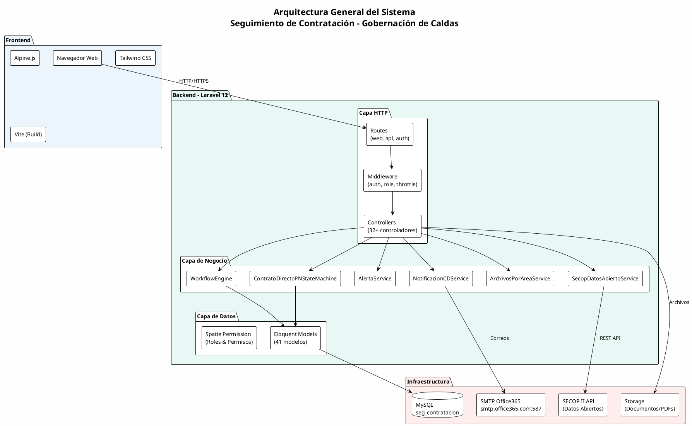
```plantuml
@startuml Arquitectura_General
!theme plain
skinparam backgroundColor #FEFEFE
skinparam componentStyle rectangle

title Arquitectura General del Sistema\nSeguimiento de Contratación – Gobernación de Caldas

package "Frontend" #EBF5FB {
    [Navegador Web] as browser
    [Alpine.js] as alpine
    [Tailwind CSS] as tailwind
    [Vite (Build)] as vite
}

package "Backend – Laravel 12" #E8F8F5 {
    package "Capa HTTP" {
        [Routes\n(web, api, auth)] as routes
        [Middleware\n(auth, role, throttle)] as middleware
        [Controllers\n(32+ controladores)] as controllers
    }
    
    package "Capa de Negocio" {
        [WorkflowEngine] as wfEngine
        [ContratoDirectoPNStateMachine] as stateMachine
        [AlertaService] as alertaService
        [NotificacionCDService] as notifService
        [ArchivosPorAreaService] as archService
        [SecopDatosAbiertoService] as secopService
    }
    
    package "Capa de Datos" {
        [Eloquent Models\n(41 modelos)] as models
        [Spatie Permission\n(Roles & Permisos)] as spatie
    }
}

package "Infraestructura" #FDEDEC {
    database "MySQL\nseg_contratacion" as db
    [SMTP Office365\nsmtp.office365.com:587] as smtp
    [SECOP II API\n(Datos Abiertos)] as secopApi
    [Storage\n(Documentos/PDFs)] as storage
}

browser --> routes : HTTP/HTTPS
routes --> middleware
middleware --> controllers
controllers --> wfEngine
controllers --> stateMachine
controllers --> alertaService
controllers --> notifService
controllers --> archService
controllers --> secopService
wfEngine --> models
stateMachine --> models
models --> db
notifService --> smtp : Correos
secopService --> secopApi : REST API
controllers --> storage : Archivos

@enduml
```

---

## 2. Modelo Entidad-Relación

### 2.1 Núcleo del Sistema (Procesos y Workflow)

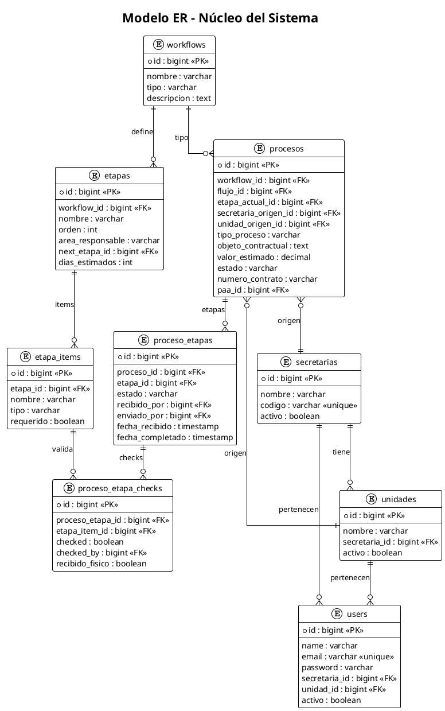
```plantuml
@startuml ER_Nucleo
!theme plain
skinparam linetype ortho

title Modelo ER – Núcleo del Sistema

entity "users" as users {
    * id : bigint <<PK>>
    --
    name : varchar
    email : varchar <<unique>>
    password : varchar
    secretaria_id : bigint <<FK>>
    unidad_id : bigint <<FK>>
    activo : boolean
}

entity "secretarias" as sec {
    * id : bigint <<PK>>
    --
    nombre : varchar
    codigo : varchar <<unique>>
    activo : boolean
}

entity "unidades" as uni {
    * id : bigint <<PK>>
    --
    nombre : varchar
    secretaria_id : bigint <<FK>>
    activo : boolean
}

entity "workflows" as wf {
    * id : bigint <<PK>>
    --
    nombre : varchar
    tipo : varchar
    descripcion : text
}

entity "etapas" as etapas {
    * id : bigint <<PK>>
    --
    workflow_id : bigint <<FK>>
    nombre : varchar
    orden : int
    area_responsable : varchar
    next_etapa_id : bigint <<FK>>
    dias_estimados : int
}

entity "procesos" as proc {
    * id : bigint <<PK>>
    --
    workflow_id : bigint <<FK>>
    flujo_id : bigint <<FK>>
    etapa_actual_id : bigint <<FK>>
    secretaria_origen_id : bigint <<FK>>
    unidad_origen_id : bigint <<FK>>
    tipo_proceso : varchar
    objeto_contractual : text
    valor_estimado : decimal
    estado : varchar
    numero_contrato : varchar
    paa_id : bigint <<FK>>
}

entity "proceso_etapas" as pe {
    * id : bigint <<PK>>
    --
    proceso_id : bigint <<FK>>
    etapa_id : bigint <<FK>>
    estado : varchar
    recibido_por : bigint <<FK>>
    enviado_por : bigint <<FK>>
    fecha_recibido : timestamp
    fecha_completado : timestamp
}

entity "etapa_items" as ei {
    * id : bigint <<PK>>
    --
    etapa_id : bigint <<FK>>
    nombre : varchar
    tipo : varchar
    requerido : boolean
}

entity "proceso_etapa_checks" as pec {
    * id : bigint <<PK>>
    --
    proceso_etapa_id : bigint <<FK>>
    etapa_item_id : bigint <<FK>>
    checked : boolean
    checked_by : bigint <<FK>>
    recibido_fisico : boolean
}

sec ||--o{ uni : tiene
sec ||--o{ users : pertenecen
uni ||--o{ users : pertenecen
wf ||--o{ etapas : define
wf ||--o{ proc : tipo
proc }o--|| sec : origen
proc }o--|| uni : origen
proc ||--o{ pe : etapas
etapas ||--o{ ei : items
pe ||--o{ pec : checks
ei ||--o{ pec : valida

@enduml
```

### 2.2 Gestión Documental

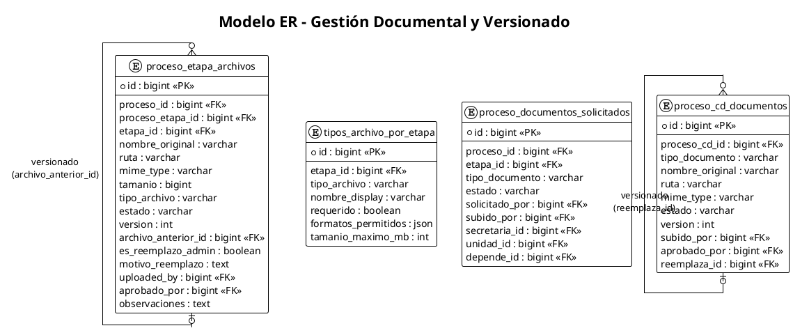
```plantuml
@startuml ER_Documentos
!theme plain
skinparam linetype ortho

title Modelo ER – Gestión Documental y Versionado

entity "proceso_etapa_archivos" as pea {
    * id : bigint <<PK>>
    --
    proceso_id : bigint <<FK>>
    proceso_etapa_id : bigint <<FK>>
    etapa_id : bigint <<FK>>
    nombre_original : varchar
    ruta : varchar
    mime_type : varchar
    tamanio : bigint
    tipo_archivo : varchar
    estado : varchar
    version : int
    archivo_anterior_id : bigint <<FK>>
    es_reemplazo_admin : boolean
    motivo_reemplazo : text
    uploaded_by : bigint <<FK>>
    aprobado_por : bigint <<FK>>
    observaciones : text
}

entity "tipos_archivo_por_etapa" as tae {
    * id : bigint <<PK>>
    --
    etapa_id : bigint <<FK>>
    tipo_archivo : varchar
    nombre_display : varchar
    requerido : boolean
    formatos_permitidos : json
    tamanio_maximo_mb : int
}

entity "proceso_documentos_solicitados" as pds {
    * id : bigint <<PK>>
    --
    proceso_id : bigint <<FK>>
    etapa_id : bigint <<FK>>
    tipo_documento : varchar
    estado : varchar
    solicitado_por : bigint <<FK>>
    subido_por : bigint <<FK>>
    secretaria_id : bigint <<FK>>
    unidad_id : bigint <<FK>>
    depende_id : bigint <<FK>>
}

entity "proceso_cd_documentos" as pcd {
    * id : bigint <<PK>>
    --
    proceso_cd_id : bigint <<FK>>
    tipo_documento : varchar
    nombre_original : varchar
    ruta : varchar
    mime_type : varchar
    estado : varchar
    version : int
    subido_por : bigint <<FK>>
    aprobado_por : bigint <<FK>>
    reemplaza_id : bigint <<FK>>
}

pea }o--o| pea : "versionado\n(archivo_anterior_id)"
pcd }o--o| pcd : "versionado\n(reemplaza_id)"

@enduml
```

### 2.3 Motor de Flujos Configurable

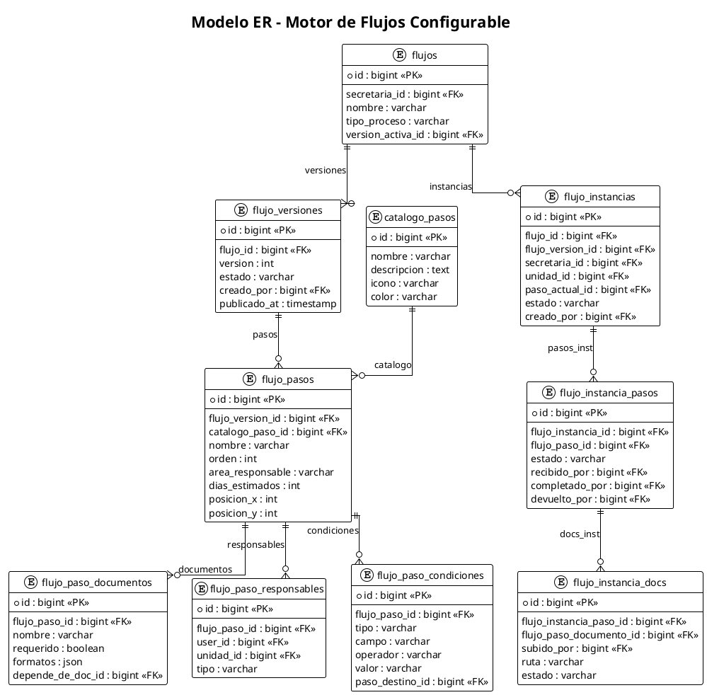
```plantuml
@startuml ER_Motor_Flujos
!theme plain
skinparam linetype ortho

title Modelo ER – Motor de Flujos Configurable

entity "flujos" as fl {
    * id : bigint <<PK>>
    --
    secretaria_id : bigint <<FK>>
    nombre : varchar
    tipo_proceso : varchar
    version_activa_id : bigint <<FK>>
}

entity "flujo_versiones" as fv {
    * id : bigint <<PK>>
    --
    flujo_id : bigint <<FK>>
    version : int
    estado : varchar
    creado_por : bigint <<FK>>
    publicado_at : timestamp
}

entity "flujo_pasos" as fp {
    * id : bigint <<PK>>
    --
    flujo_version_id : bigint <<FK>>
    catalogo_paso_id : bigint <<FK>>
    nombre : varchar
    orden : int
    area_responsable : varchar
    dias_estimados : int
    posicion_x : int
    posicion_y : int
}

entity "catalogo_pasos" as cp {
    * id : bigint <<PK>>
    --
    nombre : varchar
    descripcion : text
    icono : varchar
    color : varchar
}

entity "flujo_paso_documentos" as fpd {
    * id : bigint <<PK>>
    --
    flujo_paso_id : bigint <<FK>>
    nombre : varchar
    requerido : boolean
    formatos : json
    depende_de_doc_id : bigint <<FK>>
}

entity "flujo_paso_responsables" as fpr {
    * id : bigint <<PK>>
    --
    flujo_paso_id : bigint <<FK>>
    user_id : bigint <<FK>>
    unidad_id : bigint <<FK>>
    tipo : varchar
}

entity "flujo_paso_condiciones" as fpc {
    * id : bigint <<PK>>
    --
    flujo_paso_id : bigint <<FK>>
    tipo : varchar
    campo : varchar
    operador : varchar
    valor : varchar
    paso_destino_id : bigint <<FK>>
}

entity "flujo_instancias" as fi {
    * id : bigint <<PK>>
    --
    flujo_id : bigint <<FK>>
    flujo_version_id : bigint <<FK>>
    secretaria_id : bigint <<FK>>
    unidad_id : bigint <<FK>>
    paso_actual_id : bigint <<FK>>
    estado : varchar
    creado_por : bigint <<FK>>
}

entity "flujo_instancia_pasos" as fip {
    * id : bigint <<PK>>
    --
    flujo_instancia_id : bigint <<FK>>
    flujo_paso_id : bigint <<FK>>
    estado : varchar
    recibido_por : bigint <<FK>>
    completado_por : bigint <<FK>>
    devuelto_por : bigint <<FK>>
}

entity "flujo_instancia_docs" as fid {
    * id : bigint <<PK>>
    --
    flujo_instancia_paso_id : bigint <<FK>>
    flujo_paso_documento_id : bigint <<FK>>
    subido_por : bigint <<FK>>
    ruta : varchar
    estado : varchar
}

fl ||--o{ fv : versiones
fv ||--o{ fp : pasos
cp ||--o{ fp : catalogo
fp ||--o{ fpd : documentos
fp ||--o{ fpr : responsables
fp ||--o{ fpc : condiciones
fl ||--o{ fi : instancias
fi ||--o{ fip : pasos_inst
fip ||--o{ fid : docs_inst

@enduml
```

### 2.4 Contratación Directa

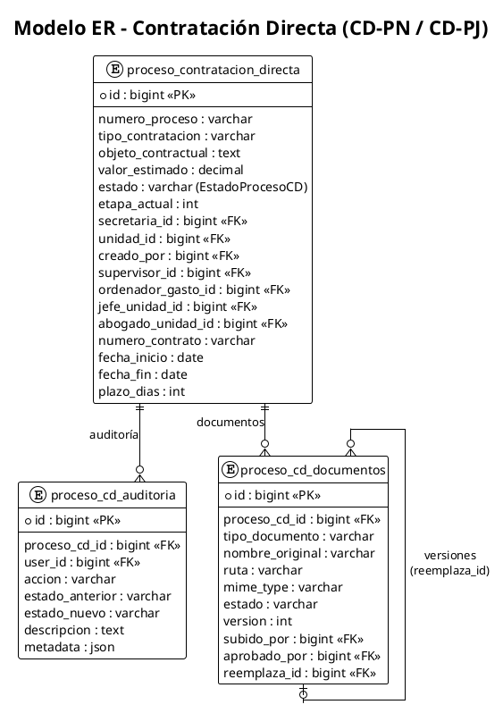
```plantuml
@startuml ER_Contratacion_Directa
!theme plain
skinparam linetype ortho

title Modelo ER – Contratación Directa (CD-PN / CD-PJ)

entity "proceso_contratacion_directa" as pcd {
    * id : bigint <<PK>>
    --
    numero_proceso : varchar
    tipo_contratacion : varchar
    objeto_contractual : text
    valor_estimado : decimal
    estado : varchar (EstadoProcesoCD)
    etapa_actual : int
    secretaria_id : bigint <<FK>>
    unidad_id : bigint <<FK>>
    creado_por : bigint <<FK>>
    supervisor_id : bigint <<FK>>
    ordenador_gasto_id : bigint <<FK>>
    jefe_unidad_id : bigint <<FK>>
    abogado_unidad_id : bigint <<FK>>
    numero_contrato : varchar
    fecha_inicio : date
    fecha_fin : date
    plazo_dias : int
}

entity "proceso_cd_auditoria" as pcda {
    * id : bigint <<PK>>
    --
    proceso_cd_id : bigint <<FK>>
    user_id : bigint <<FK>>
    accion : varchar
    estado_anterior : varchar
    estado_nuevo : varchar
    descripcion : text
    metadata : json
}

entity "proceso_cd_documentos" as pcdd {
    * id : bigint <<PK>>
    --
    proceso_cd_id : bigint <<FK>>
    tipo_documento : varchar
    nombre_original : varchar
    ruta : varchar
    mime_type : varchar
    estado : varchar
    version : int
    subido_por : bigint <<FK>>
    aprobado_por : bigint <<FK>>
    reemplaza_id : bigint <<FK>>
}

pcd ||--o{ pcda : auditoría
pcd ||--o{ pcdd : documentos
pcdd }o--o| pcdd : "versiones\n(reemplaza_id)"

@enduml
```

### 2.5 Alertas y Auditoría

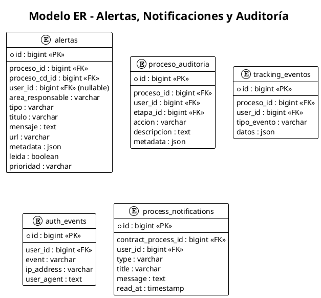
```plantuml
@startuml ER_Alertas_Auditoria
!theme plain
skinparam linetype ortho

title Modelo ER – Alertas, Notificaciones y Auditoría

entity "alertas" as al {
    * id : bigint <<PK>>
    --
    proceso_id : bigint <<FK>>
    proceso_cd_id : bigint <<FK>>
    user_id : bigint <<FK>> (nullable)
    area_responsable : varchar
    tipo : varchar
    titulo : varchar
    mensaje : text
    url : varchar
    metadata : json
    leida : boolean
    prioridad : varchar
}

entity "proceso_auditoria" as pa {
    * id : bigint <<PK>>
    --
    proceso_id : bigint <<FK>>
    user_id : bigint <<FK>>
    etapa_id : bigint <<FK>>
    accion : varchar
    descripcion : text
    metadata : json
}

entity "tracking_eventos" as te {
    * id : bigint <<PK>>
    --
    proceso_id : bigint <<FK>>
    user_id : bigint <<FK>>
    tipo_evento : varchar
    datos : json
}

entity "auth_events" as ae {
    * id : bigint <<PK>>
    --
    user_id : bigint <<FK>>
    event : varchar
    ip_address : varchar
    user_agent : text
}

entity "process_notifications" as pn {
    * id : bigint <<PK>>
    --
    contract_process_id : bigint <<FK>>
    user_id : bigint <<FK>>
    type : varchar
    title : varchar
    message : text
    read_at : timestamp
}

@enduml
```

---

## 3. Flujo de Contratación Directa – Persona Natural (CD-PN)

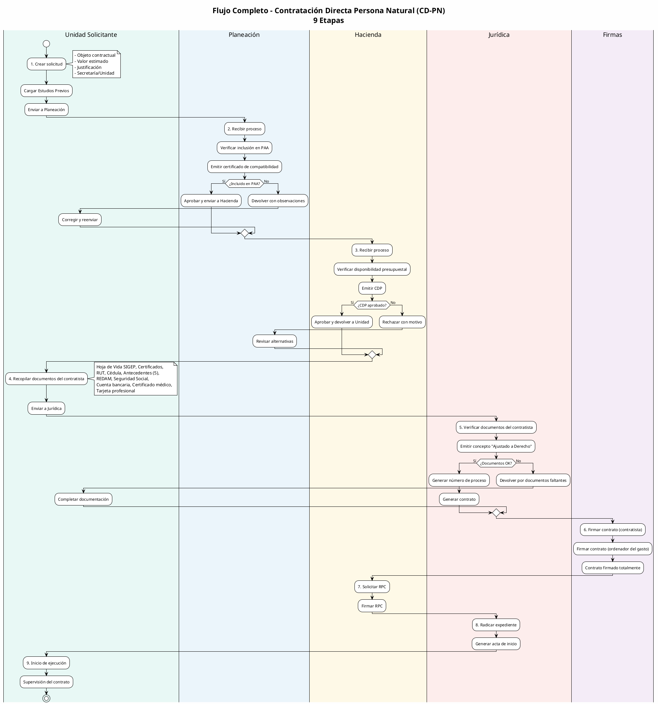
```plantuml
@startuml Flujo_CD_PN
!theme plain
skinparam backgroundColor #FEFEFE

title Flujo Completo – Contratación Directa Persona Natural (CD-PN)\n9 Etapas

|#E8F8F5| Unidad Solicitante |
start
:1. Crear solicitud;
note right
  - Objeto contractual
  - Valor estimado
  - Justificación
  - Secretaría/Unidad
end note
:Cargar Estudios Previos;
:Enviar a Planeación;

|#EBF5FB| Planeación |
:2. Recibir proceso;
:Verificar inclusión en PAA;
:Emitir certificado de compatibilidad;
if (¿Incluido en PAA?) then (Sí)
    :Aprobar y enviar a Hacienda;
else (No)
    :Devolver con observaciones;
    |#E8F8F5| Unidad Solicitante |
    :Corregir y reenviar;
    |#EBF5FB| Planeación |
endif

|#FEF9E7| Hacienda |
:3. Recibir proceso;
:Verificar disponibilidad presupuestal;
:Emitir CDP;
if (¿CDP aprobado?) then (Sí)
    :Aprobar y devolver a Unidad;
else (No)
    :Rechazar con motivo;
    |#EBF5FB| Planeación |
    :Revisar alternativas;
    |#FEF9E7| Hacienda |
endif

|#E8F8F5| Unidad Solicitante |
:4. Recopilar documentos del contratista;
note right
  Hoja de Vida SIGEP, Certificados,
  RUT, Cédula, Antecedentes (5),
  REDAM, Seguridad Social,
  Cuenta bancaria, Certificado médico,
  Tarjeta profesional
end note
:Enviar a Jurídica;

|#FDEDEC| Jurídica |
:5. Verificar documentos del contratista;
:Emitir concepto "Ajustado a Derecho";
if (¿Documentos OK?) then (Sí)
    :Generar número de proceso;
    :Generar contrato;
else (No)
    :Devolver por documentos faltantes;
    |#E8F8F5| Unidad Solicitante |
    :Completar documentación;
    |#FDEDEC| Jurídica |
endif

|#F4ECF7| Firmas |
:6. Firmar contrato (contratista);
:Firmar contrato (ordenador del gasto);
:Contrato firmado totalmente;

|#FEF9E7| Hacienda |
:7. Solicitar RPC;
:Firmar RPC;

|#FDEDEC| Jurídica |
:8. Radicar expediente;
:Generar acta de inicio;

|#E8F8F5| Unidad Solicitante |
:9. Inicio de ejecución;
:Supervisión del contrato;
stop

@enduml
```

---

## 4. Flujo de Contratación Directa – Persona Jurídica (CD-PJ)

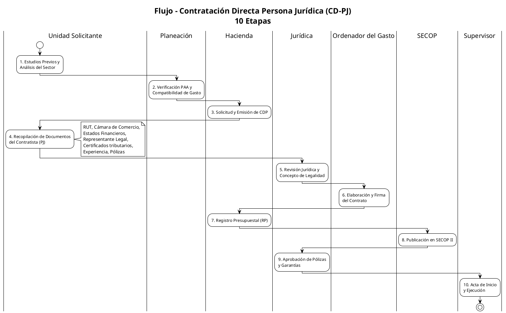
```plantuml
@startuml Flujo_CD_PJ
!theme plain

title Flujo – Contratación Directa Persona Jurídica (CD-PJ)\n10 Etapas

|Unidad Solicitante|
start
:1. Estudios Previos y\nAnálisis del Sector;

|Planeación|
:2. Verificación PAA y\nCompatibilidad de Gasto;

|Hacienda|
:3. Solicitud y Emisión de CDP;

|Unidad Solicitante|
:4. Recopilación de Documentos\ndel Contratista (PJ);
note right
  RUT, Cámara de Comercio,
  Estados Financieros,
  Representante Legal,
  Certificados tributarios,
  Experiencia, Pólizas
end note

|Jurídica|
:5. Revisión Jurídica y\nConcepto de Legalidad;

|Ordenador del Gasto|
:6. Elaboración y Firma\ndel Contrato;

|Hacienda|
:7. Registro Presupuestal (RP);

|SECOP|
:8. Publicación en SECOP II;

|Jurídica|
:9. Aprobación de Pólizas\ny Garantías;

|Supervisor|
:10. Acta de Inicio\ny Ejecución;
stop

@enduml
```

---

## 5. Motor de Flujos Configurable

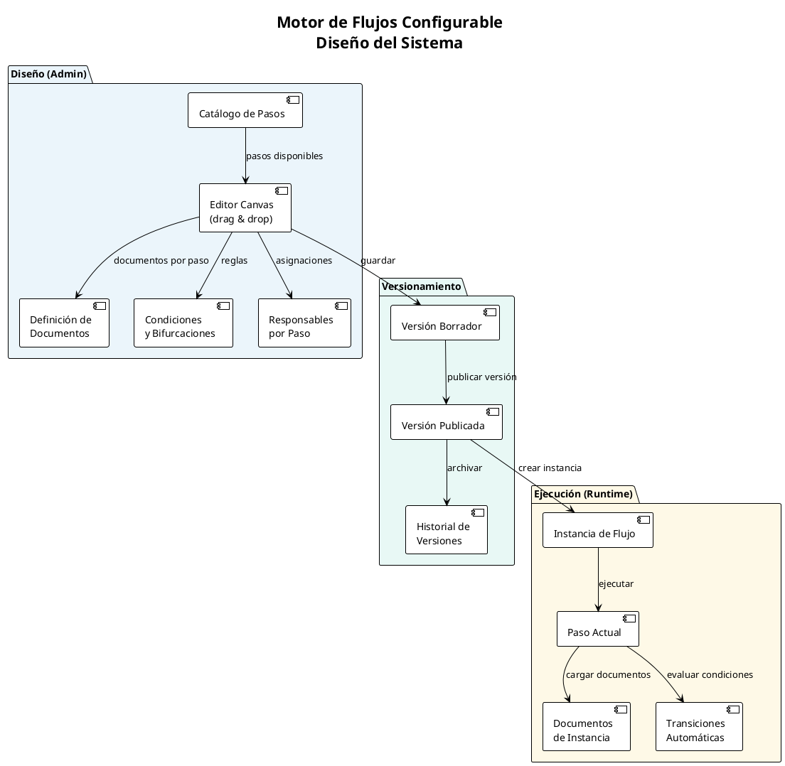
```plantuml
@startuml Motor_Flujos
!theme plain

title Motor de Flujos Configurable\nDiseño del Sistema

package "Diseño (Admin)" #EBF5FB {
    [Catálogo de Pasos] as cat
    [Editor Canvas\n(drag & drop)] as canvas
    [Definición de\nDocumentos] as docs
    [Condiciones\ny Bifurcaciones] as cond
    [Responsables\npor Paso] as resp
}

package "Versionamiento" #E8F8F5 {
    [Versión Borrador] as draft
    [Versión Publicada] as published
    [Historial de\nVersiones] as history
}

package "Ejecución (Runtime)" #FEF9E7 {
    [Instancia de Flujo] as instance
    [Paso Actual] as current
    [Documentos\nde Instancia] as instDocs
    [Transiciones\nAutomáticas] as trans
}

cat --> canvas : pasos disponibles
canvas --> docs : documentos por paso
canvas --> cond : reglas
canvas --> resp : asignaciones
canvas --> draft : guardar
draft --> published : publicar versión
published --> history : archivar
published --> instance : crear instancia
instance --> current : ejecutar
current --> instDocs : cargar documentos
current --> trans : evaluar condiciones

@enduml
```

---

## 6. Roles y Permisos

```plantuml
@startuml Roles_Permisos
!theme plain

title Sistema de Roles y Permisos\n(Spatie Laravel Permission)

rectangle "Roles del Sistema" {
    usecase "admin" as r1 #E8F8F5
    usecase "admin_general" as r2 #E8F8F5
    usecase "admin_unidad" as r3 #E8F8F5
    usecase "unidad_solicitante" as r4 #EBF5FB
    usecase "planeacion" as r5 #FEF9E7
    usecase "hacienda" as r6 #FEF9E7
    usecase "juridica" as r7 #FDEDEC
    usecase "secop" as r8 #F4ECF7
    usecase "profesional_contratacion" as r9 #FEF9E7
    usecase "revisor_juridico" as r10 #FDEDEC
    usecase "gobernador" as r11 #E8DAEF
    usecase "consulta" as r12 #F2F3F4
    usecase "compras" as r13 #FEF9E7
    usecase "talento_humano" as r14 #FEF9E7
    usecase "rentas" as r15 #FEF9E7
    usecase "contabilidad" as r16 #FEF9E7
    usecase "inversiones_publicas" as r17 #FEF9E7
    usecase "presupuesto" as r18 #FEF9E7
    usecase "radicacion" as r19 #FEF9E7
}

rectangle "Accesos por Rol" #FAFAFA {
    rectangle "CRUD Completo\n(Usuarios, Roles,\nSecretarías, Unidades,\nFlujos, Guías)" as full
    rectangle "Crear Procesos\ny Cargar Documentos" as create
    rectangle "Verificar PAA\ny Aprobar" as paa
    rectangle "Emitir CDP/RP" as cdp
    rectangle "Revisión Legal\ny Contratos" as legal
    rectangle "Publicar SECOP\ny Cerrar" as secopAccess
    rectangle "Solo Consulta\ny Reportes" as readonly
    rectangle "Gestión Documental\nÁrea Específica" as docArea
}

r1 --> full
r2 --> full
r4 --> create
r5 --> paa
r6 --> cdp
r7 --> legal
r8 --> secopAccess
r11 --> readonly
r12 --> readonly
r13 --> docArea
r14 --> docArea
r15 --> docArea
r16 --> docArea

@enduml
```

---

## 7. Sistema de Notificaciones y Alertas

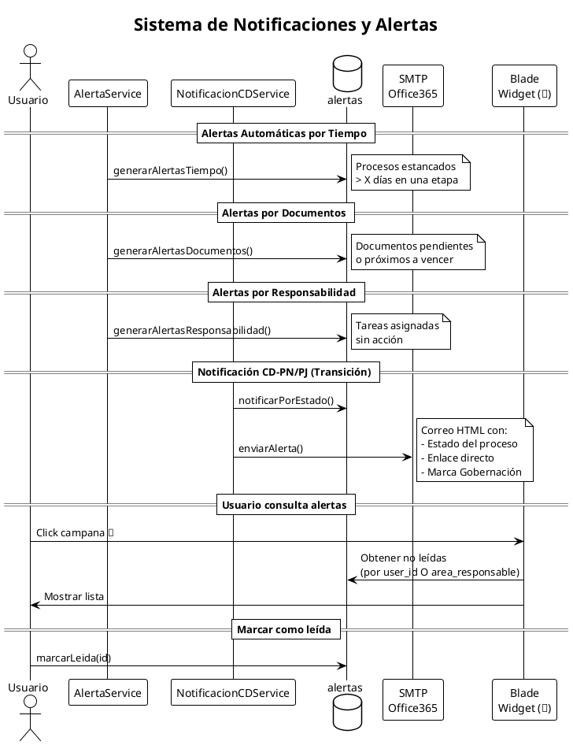
```plantuml
@startuml Notificaciones
!theme plain

title Sistema de Notificaciones y Alertas

actor "Usuario" as user
participant "AlertaService" as alertaSvc
participant "NotificacionCDService" as notifSvc
database "alertas" as alertaDB
participant "SMTP\nOffice365" as smtp
participant "Blade\nWidget (🔔)" as widget

== Alertas Automáticas por Tiempo ==
alertaSvc -> alertaDB : generarAlertasTiempo()
note right: Procesos estancados\n> X días en una etapa

== Alertas por Documentos ==
alertaSvc -> alertaDB : generarAlertasDocumentos()
note right: Documentos pendientes\no próximos a vencer

== Alertas por Responsabilidad ==
alertaSvc -> alertaDB : generarAlertasResponsabilidad()
note right: Tareas asignadas\nsin acción

== Notificación CD-PN/PJ (Transición) ==
notifSvc -> alertaDB : notificarPorEstado()
notifSvc -> smtp : enviarAlerta()
note right
  Correo HTML con:
  - Estado del proceso
  - Enlace directo
  - Marca Gobernación
end note

== Usuario consulta alertas ==
user -> widget : Click campana 🔔
widget -> alertaDB : Obtener no leídas\n(por user_id O area_responsable)
widget -> user : Mostrar lista

== Marcar como leída ==
user -> alertaDB : marcarLeida(id)

@enduml
```

---

## 8. Gestión Documental y Versionado

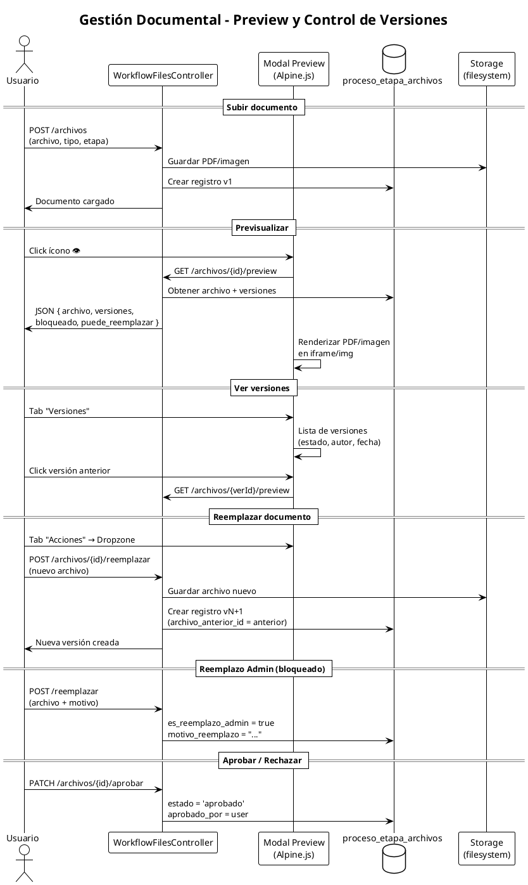
```plantuml
@startuml Gestion_Documental
!theme plain

title Gestión Documental – Preview y Control de Versiones

actor "Usuario" as user
participant "WorkflowFilesController" as ctrl
participant "Modal Preview\n(Alpine.js)" as modal
database "proceso_etapa_archivos" as archivoDB
participant "Storage\n(filesystem)" as storage

== Subir documento ==
user -> ctrl : POST /archivos\n(archivo, tipo, etapa)
ctrl -> storage : Guardar PDF/imagen
ctrl -> archivoDB : Crear registro v1
ctrl -> user : Documento cargado

== Previsualizar ==
user -> modal : Click ícono 👁️
modal -> ctrl : GET /archivos/{id}/preview
ctrl -> archivoDB : Obtener archivo + versiones
ctrl -> user : JSON { archivo, versiones,\nbloqueado, puede_reemplazar }
modal -> modal : Renderizar PDF/imagen\nen iframe/img

== Ver versiones ==
user -> modal : Tab "Versiones"
modal -> modal : Lista de versiones\n(estado, autor, fecha)
user -> modal : Click versión anterior
modal -> ctrl : GET /archivos/{verId}/preview

== Reemplazar documento ==
user -> modal : Tab "Acciones" → Dropzone
user -> ctrl : POST /archivos/{id}/reemplazar\n(nuevo archivo)
ctrl -> storage : Guardar archivo nuevo
ctrl -> archivoDB : Crear registro vN+1\n(archivo_anterior_id = anterior)
ctrl -> user : Nueva versión creada

== Reemplazo Admin (bloqueado) ==
user -> ctrl : POST /reemplazar\n(archivo + motivo)
ctrl -> archivoDB : es_reemplazo_admin = true\nmotivo_reemplazo = "..."

== Aprobar / Rechazar ==
user -> ctrl : PATCH /archivos/{id}/aprobar
ctrl -> archivoDB : estado = 'aprobado'\naprobado_por = user

@enduml
```

---

## 9. Flujo de Restablecimiento de Contraseña

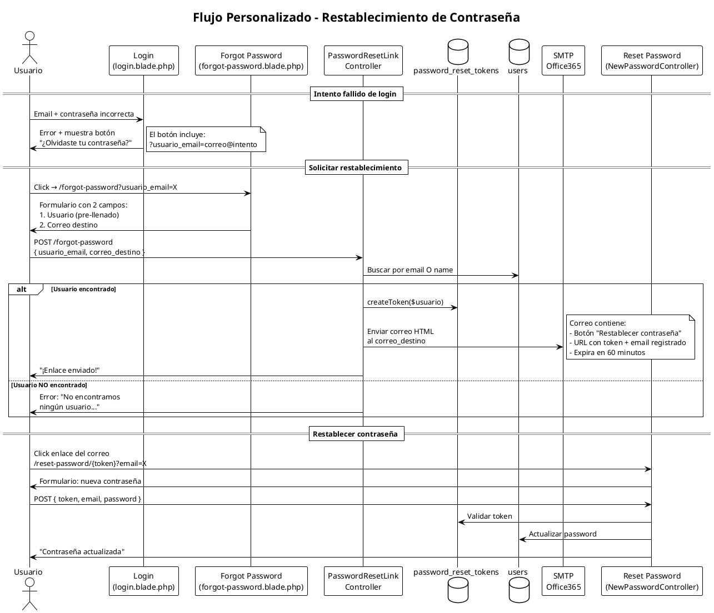
```plantuml
@startuml Reset_Password
!theme plain

title Flujo Personalizado – Restablecimiento de Contraseña

actor "Usuario" as user
participant "Login\n(login.blade.php)" as login
participant "Forgot Password\n(forgot-password.blade.php)" as forgot
participant "PasswordResetLink\nController" as ctrl
database "password_reset_tokens" as tokens
database "users" as users
participant "SMTP\nOffice365" as smtp
participant "Reset Password\n(NewPasswordController)" as reset

== Intento fallido de login ==
user -> login : Email + contraseña incorrecta
login -> user : Error + muestra botón\n"¿Olvidaste tu contraseña?"
note right
  El botón incluye:
  ?usuario_email=correo@intento
end note

== Solicitar restablecimiento ==
user -> forgot : Click → /forgot-password?usuario_email=X
forgot -> user : Formulario con 2 campos:\n1. Usuario (pre-llenado)\n2. Correo destino

user -> ctrl : POST /forgot-password\n{ usuario_email, correo_destino }
ctrl -> users : Buscar por email O name
alt Usuario encontrado
    ctrl -> tokens : createToken($usuario)
    ctrl -> smtp : Enviar correo HTML\nal correo_destino
    note right
      Correo contiene:
      - Botón "Restablecer contraseña"
      - URL con token + email registrado
      - Expira en 60 minutos
    end note
    ctrl -> user : "¡Enlace enviado!"
else Usuario NO encontrado
    ctrl -> user : Error: "No encontramos\nningún usuario..."
end

== Restablecer contraseña ==
user -> reset : Click enlace del correo\n/reset-password/{token}?email=X
reset -> user : Formulario: nueva contraseña
user -> reset : POST { token, email, password }
reset -> tokens : Validar token
reset -> users : Actualizar password
reset -> user : "Contraseña actualizada"

@enduml
```

---

## 10. Arquitectura de Controladores

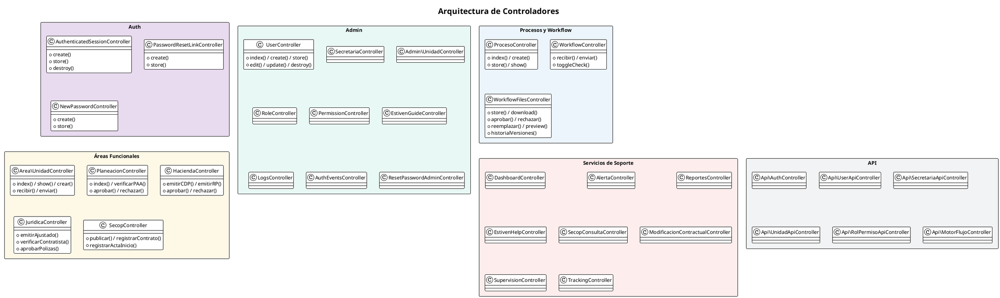
```plantuml
@startuml Controladores
!theme plain
skinparam packageStyle rectangle

title Arquitectura de Controladores

package "Auth" #E8DAEF {
    class AuthenticatedSessionController {
        +create()
        +store()
        +destroy()
    }
    class PasswordResetLinkController {
        +create()
        +store()
    }
    class NewPasswordController {
        +create()
        +store()
    }
}

package "Admin" #E8F8F5 {
    class UserController {
        +index() / create() / store()
        +edit() / update() / destroy()
    }
    class SecretariaController
    class "Admin\\UnidadController" as AdminUnidad
    class RoleController
    class PermissionController
    class EstivenGuideController
    class LogsController
    class AuthEventsController
    class ResetPasswordAdminController
}

package "Procesos y Workflow" #EBF5FB {
    class ProcesoController {
        +index() / create()
        +store() / show()
    }
    class WorkflowController {
        +recibir() / enviar()
        +toggleCheck()
    }
    class WorkflowFilesController {
        +store() / download()
        +aprobar() / rechazar()
        +reemplazar() / preview()
        +historialVersiones()
    }
}

package "Áreas Funcionales" #FEF9E7 {
    class "Area\\UnidadController" as AreaUnidad {
        +index() / show() / crear()
        +recibir() / enviar()
    }
    class PlaneacionController {
        +index() / verificarPAA()
        +aprobar() / rechazar()
    }
    class HaciendaController {
        +emitirCDP() / emitirRP()
        +aprobar() / rechazar()
    }
    class JuridicaController {
        +emitirAjustado()
        +verificarContratista()
        +aprobarPolizas()
    }
    class SecopController {
        +publicar() / registrarContrato()
        +registrarActaInicio()
    }
}

package "Servicios de Soporte" #FDEDEC {
    class DashboardController
    class AlertaController
    class ReportesController
    class EstivenHelpController
    class SecopConsultaController
    class ModificacionContractualController
    class SupervisionController
    class TrackingController
}

package "API" #F2F3F4 {
    class "Api\\AuthController" as ApiAuth
    class "Api\\UserApiController" as ApiUser
    class "Api\\SecretariaApiController" as ApiSec
    class "Api\\UnidadApiController" as ApiUni
    class "Api\\RolPermisoApiController" as ApiRol
    class "Api\\MotorFlujoController" as ApiMotor
}

@enduml
```

---

## 11. Diagrama de Casos de Uso

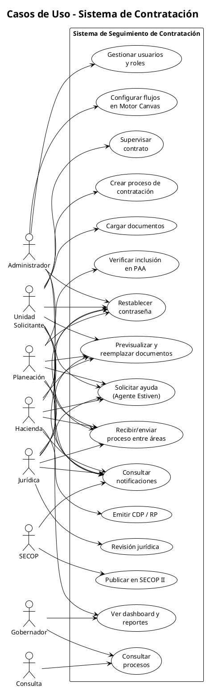
```plantuml
@startuml Casos_Uso
!theme plain
left to right direction

title Casos de Uso – Sistema de Contratación

actor "Administrador" as admin
actor "Unidad\nSolicitante" as unidad
actor "Planeación" as plan
actor "Hacienda" as hac
actor "Jurídica" as jur
actor "SECOP" as secop
actor "Gobernador" as gob
actor "Consulta" as cons

rectangle "Sistema de Seguimiento de Contratación" {
    usecase "Gestionar usuarios\ny roles" as UC1
    usecase "Crear proceso de\ncontratación" as UC2
    usecase "Cargar documentos" as UC3
    usecase "Verificar inclusión\nen PAA" as UC4
    usecase "Emitir CDP / RP" as UC5
    usecase "Revisión jurídica" as UC6
    usecase "Publicar en SECOP II" as UC7
    usecase "Ver dashboard y\nreportes" as UC8
    usecase "Recibir/enviar\nproceso entre áreas" as UC9
    usecase "Previsualizar y\nreemplazar documentos" as UC10
    usecase "Configurar flujos\nen Motor Canvas" as UC11
    usecase "Restablecer\ncontraseña" as UC12
    usecase "Consultar\nnotificaciones" as UC13
    usecase "Solicitar ayuda\n(Agente Estiven)" as UC14
    usecase "Supervisar\ncontrato" as UC15
    usecase "Consultar\nprocesos" as UC16
}

admin --> UC1
admin --> UC11
admin --> UC8
unidad --> UC2
unidad --> UC3
unidad --> UC9
unidad --> UC15
plan --> UC4
plan --> UC9
hac --> UC5
hac --> UC9
jur --> UC6
jur --> UC9
secop --> UC7
gob --> UC8
gob --> UC16
cons --> UC16

unidad --> UC10
plan --> UC10
hac --> UC10
jur --> UC10

admin --> UC12
unidad --> UC12
plan --> UC12
hac --> UC12
jur --> UC12

admin --> UC13
unidad --> UC13
plan --> UC13
hac --> UC13
jur --> UC13
secop --> UC13

unidad --> UC14
plan --> UC14
hac --> UC14
jur --> UC14

@enduml
```

---

## 12. Diagrama de Despliegue

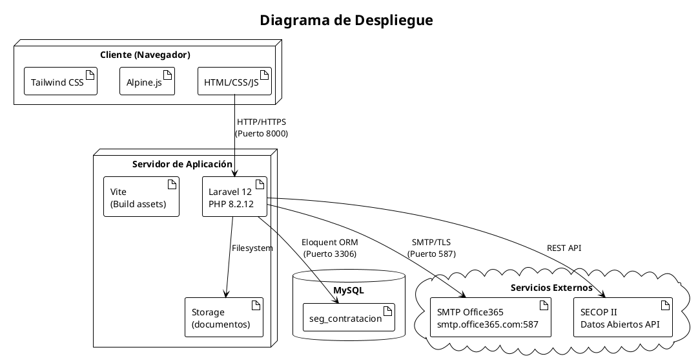
```plantuml
@startuml Despliegue
!theme plain

title Diagrama de Despliegue

node "Servidor de Aplicación" {
    artifact "Laravel 12\nPHP 8.2.12" as app
    artifact "Vite\n(Build assets)" as vite
    artifact "Storage\n(documentos)" as storage
}

node "Cliente (Navegador)" {
    artifact "HTML/CSS/JS" as frontend
    artifact "Alpine.js" as alpine
    artifact "Tailwind CSS" as tw
}

database "MySQL" {
    artifact "seg_contratacion" as db
}

cloud "Servicios Externos" {
    artifact "SMTP Office365\nsmtp.office365.com:587" as smtp
    artifact "SECOP II\nDatos Abiertos API" as secop
}

frontend --> app : HTTP/HTTPS\n(Puerto 8000)
app --> db : Eloquent ORM\n(Puerto 3306)
app --> smtp : SMTP/TLS\n(Puerto 587)
app --> secop : REST API
app --> storage : Filesystem

@enduml
```

---

## 13. Diagrama de Secuencia – Crear Proceso

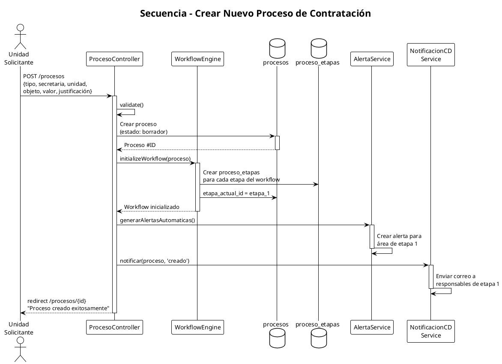
```plantuml
@startuml Secuencia_Crear_Proceso
!theme plain

title Secuencia – Crear Nuevo Proceso de Contratación

actor "Unidad\nSolicitante" as user
participant "ProcesoController" as ctrl
participant "WorkflowEngine" as engine
database "procesos" as procDB
database "proceso_etapas" as peDB
participant "AlertaService" as alertas
participant "NotificacionCD\nService" as notif

user -> ctrl : POST /procesos\n{tipo, secretaria, unidad,\nobjeto, valor, justificación}
activate ctrl

ctrl -> ctrl : validate()
ctrl -> procDB : Crear proceso\n(estado: borrador)
activate procDB
procDB --> ctrl : Proceso #ID
deactivate procDB

ctrl -> engine : initializeWorkflow(proceso)
activate engine
engine -> peDB : Crear proceso_etapas\npara cada etapa del workflow
engine -> procDB : etapa_actual_id = etapa_1
engine --> ctrl : Workflow inicializado
deactivate engine

ctrl -> alertas : generarAlertasAutomaticas()
activate alertas
alertas -> alertas : Crear alerta para\nárea de etapa 1
deactivate alertas

ctrl -> notif : notificar(proceso, 'creado')
activate notif
notif -> notif : Enviar correo a\nresponsables de etapa 1
deactivate notif

ctrl --> user : redirect /procesos/{id}\n"Proceso creado exitosamente"
deactivate ctrl

@enduml
```

---

## 14. Diagrama de Secuencia – Subir y Aprobar Documento

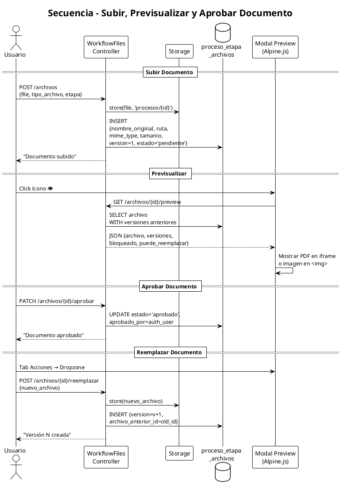
```plantuml
@startuml Secuencia_Documento
!theme plain

title Secuencia – Subir, Previsualizar y Aprobar Documento

actor "Usuario" as user
participant "WorkflowFiles\nController" as ctrl
participant "Storage" as storage
database "proceso_etapa\n_archivos" as archDB
participant "Modal Preview\n(Alpine.js)" as modal

== Subir Documento ==
user -> ctrl : POST /archivos\n{file, tipo_archivo, etapa}
ctrl -> storage : store(file, 'procesos/{id}')
ctrl -> archDB : INSERT\n{nombre_original, ruta,\nmime_type, tamanio,\nversion=1, estado='pendiente'}
ctrl --> user : "Documento subido"

== Previsualizar ==
user -> modal : Click ícono 👁️
modal -> ctrl : GET /archivos/{id}/preview
ctrl -> archDB : SELECT archivo\nWITH versiones anteriores
ctrl --> modal : JSON {archivo, versiones,\nbloqueado, puede_reemplazar}
modal -> modal : Mostrar PDF en iframe\no imagen en <img>

== Aprobar Documento ==
user -> ctrl : PATCH /archivos/{id}/aprobar
ctrl -> archDB : UPDATE estado='aprobado',\naprobado_por=auth_user
ctrl --> user : "Documento aprobado"

== Reemplazar Documento ==
user -> modal : Tab Acciones → Dropzone
user -> ctrl : POST /archivos/{id}/reemplazar\n{nuevo_archivo}
ctrl -> storage : store(nuevo_archivo)
ctrl -> archDB : INSERT {version=v+1,\narchivo_anterior_id=old_id}
ctrl --> user : "Versión N creada"

@enduml
```

---

## 15. Diagrama de Estados – Proceso CD-PN

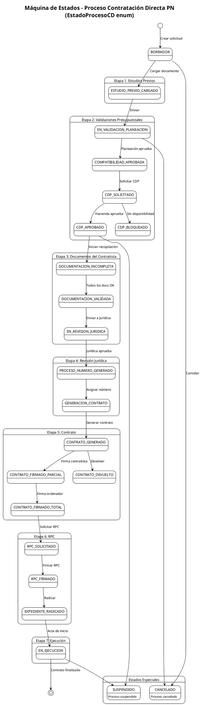
```plantuml
@startuml Estados_CDPN
!theme plain

title Máquina de Estados – Proceso Contratación Directa PN\n(EstadoProcesoCD enum)

[*] --> BORRADOR : Crear solicitud

state "Etapa 1: Estudios Previos" as e1 {
    BORRADOR --> ESTUDIO_PREVIO_CARGADO : Cargar documento
}

state "Etapa 2: Validaciones Presupuestales" as e2 {
    ESTUDIO_PREVIO_CARGADO --> EN_VALIDACION_PLANEACION : Enviar
    EN_VALIDACION_PLANEACION --> COMPATIBILIDAD_APROBADA : Planeación aprueba
    COMPATIBILIDAD_APROBADA --> CDP_SOLICITADO : Solicitar CDP
    CDP_SOLICITADO --> CDP_APROBADO : Hacienda aprueba
    CDP_SOLICITADO --> CDP_BLOQUEADO : Sin disponibilidad
}

state "Etapa 3: Documentos del Contratista" as e3 {
    CDP_APROBADO --> DOCUMENTACION_INCOMPLETA : Iniciar recopilación
    DOCUMENTACION_INCOMPLETA --> DOCUMENTACION_VALIDADA : Todos los docs OK
    DOCUMENTACION_VALIDADA --> EN_REVISION_JURIDICA : Enviar a Jurídica
}

state "Etapa 4: Revisión Jurídica" as e4 {
    EN_REVISION_JURIDICA --> PROCESO_NUMERO_GENERADO : Jurídica aprueba
    PROCESO_NUMERO_GENERADO --> GENERACION_CONTRATO : Asignar número
}

state "Etapa 5: Contrato" as e5 {
    GENERACION_CONTRATO --> CONTRATO_GENERADO : Generar contrato
    CONTRATO_GENERADO --> CONTRATO_FIRMADO_PARCIAL : Firma contratista
    CONTRATO_FIRMADO_PARCIAL --> CONTRATO_FIRMADO_TOTAL : Firma ordenador
    CONTRATO_GENERADO --> CONTRATO_DEVUELTO : Devolver
}

state "Etapa 6: RPC" as e6 {
    CONTRATO_FIRMADO_TOTAL --> RPC_SOLICITADO : Solicitar RPC
    RPC_SOLICITADO --> RPC_FIRMADO : Firmar RPC
    RPC_FIRMADO --> EXPEDIENTE_RADICADO : Radicar
}

state "Etapa 7: Ejecución" as e7 {
    EXPEDIENTE_RADICADO --> EN_EJECUCION : Acta de inicio
}

EN_EJECUCION --> [*] : Contrato finalizado

state "Estados Especiales" as esp {
    CANCELADO : Proceso cancelado
    SUSPENDIDO : Proceso suspendido
}

BORRADOR --> CANCELADO : Cancelar
EN_VALIDACION_PLANEACION --> CANCELADO
CDP_APROBADO --> SUSPENDIDO
EN_EJECUCION --> SUSPENDIDO

@enduml
```

---

## 16. Agente Estiven – Asistente de Ayuda

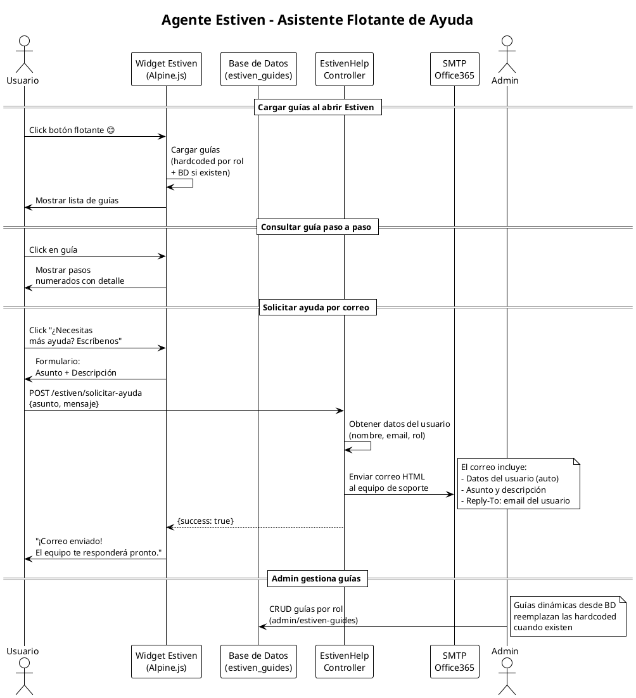
```plantuml
@startuml Agente_Estiven
!theme plain

title Agente Estiven – Asistente Flotante de Ayuda

actor "Usuario" as user
participant "Widget Estiven\n(Alpine.js)" as widget
participant "Base de Datos\n(estiven_guides)" as db
participant "EstivenHelp\nController" as ctrl
participant "SMTP\nOffice365" as smtp

== Cargar guías al abrir Estiven ==
user -> widget : Click botón flotante 😊
widget -> widget : Cargar guías\n(hardcoded por rol\n+ BD si existen)
widget -> user : Mostrar lista de guías

== Consultar guía paso a paso ==
user -> widget : Click en guía
widget -> user : Mostrar pasos\nnumerados con detalle

== Solicitar ayuda por correo ==
user -> widget : Click "¿Necesitas\nmás ayuda? Escríbenos"
widget -> user : Formulario:\nAsunto + Descripción

user -> ctrl : POST /estiven/solicitar-ayuda\n{asunto, mensaje}
ctrl -> ctrl : Obtener datos del usuario\n(nombre, email, rol)
ctrl -> smtp : Enviar correo HTML\nal equipo de soporte
note right
  El correo incluye:
  - Datos del usuario (auto)
  - Asunto y descripción
  - Reply-To: email del usuario
end note
ctrl --> widget : {success: true}
widget -> user : "¡Correo enviado!\nEl equipo te responderá pronto."

== Admin gestiona guías ==
actor "Admin" as admin
admin -> db : CRUD guías por rol\n(admin/estiven-guides)
note right
  Guías dinámicas desde BD
  reemplazan las hardcoded
  cuando existen
end note

@enduml
```

---

## Resumen de Componentes del Sistema

```plantuml
@startuml Resumen_Componentes
!theme plain
skinparam componentStyle rectangle

title Resumen de Componentes Principales

package "Módulos del Sistema" {
    [Autenticación\ny Autorización] as auth
    [Gestión de Usuarios\nRoles y Permisos] as users
    [Secretarías\ny Unidades] as orgs
    [Procesos de\nContratación] as procs
    [Workflow por Etapas\n(9 etapas)] as wf
    [Motor de Flujos\nConfigurable] as motor
    [Gestión Documental\ny Versionado] as docs
    [Contratación Directa\nPN y PJ] as cd
    [Plan Anual de\nAdquisiciones (PAA)] as paa
    [Notificaciones\ny Alertas] as alerts
    [Dashboard y\nReportes] as dash
    [Integración\nSECOP II] as secop
    [Supervisión de\nContratos] as sup
    [Modificaciones\nContractuales] as mod
    [Auditoría y\nLogs] as audit
    [Agente Estiven\n(Ayuda)] as estiven
    [API REST] as api
    [Correo SMTP\n(Office365)] as mail
}

auth --> users
users --> orgs
orgs --> procs
procs --> wf
procs --> motor
wf --> docs
cd --> docs
procs --> paa
wf --> alerts
cd --> alerts
alerts --> mail
procs --> dash
procs --> secop
procs --> sup
procs --> mod
procs --> audit
estiven --> mail

@enduml
```

---

## Estadísticas del Sistema

| Métrica | Valor |
|---------|-------|
| **Modelos Eloquent** | 41 |
| **Controladores** | 32+ |
| **Métodos públicos** | 150+ endpoints |
| **Servicios** | 7 clases |
| **Enums** | 5 (con 50+ estados) |
| **Migraciones** | 43 |
| **Rutas Web** | 80+ |
| **Rutas API** | 40+ |
| **Roles** | 19 |
| **Etapas CD-PN** | 9 |
| **Etapas CD-PJ** | 10 |
| **Tipos de Documento** | 30+ |

---

> **Generado automáticamente** para el Sistema de Seguimiento de Documentos de Contratación  
> Gobernación de Caldas – Marzo 2026
