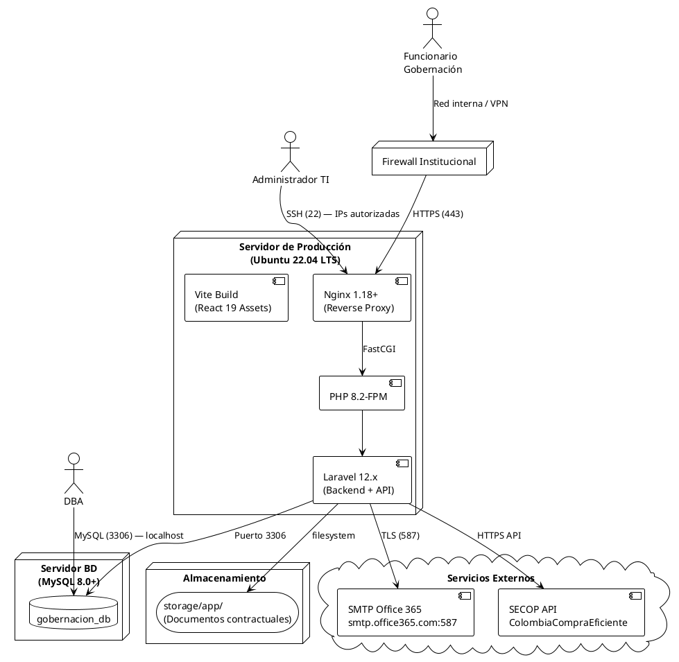
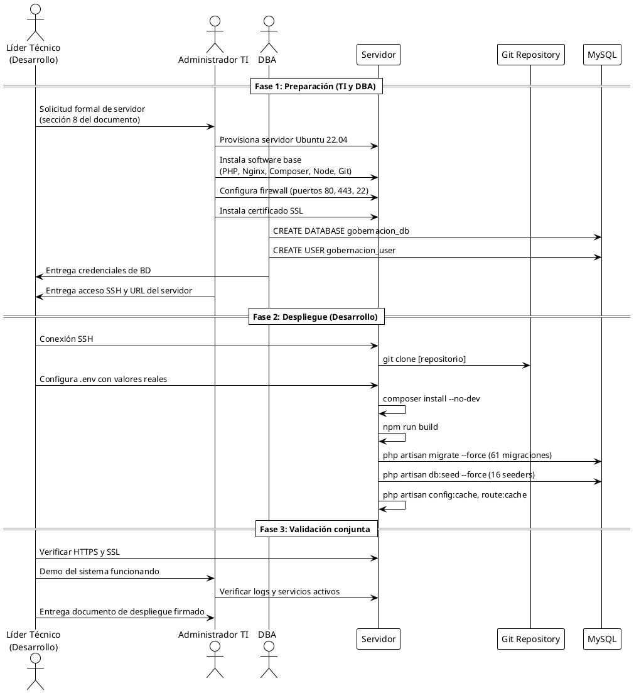

# DOCUMENTO DE DESPLIEGUE DEL SISTEMA
## Sistema de Seguimiento de Documentos Contractuales
### Gobernación de Caldas

---

**Versión:** 2.0
**Fecha:** Abril 2026
**Estado:** Producción
**Clasificación:** Interno – Técnico / Institucional

---

## HISTORIAL DE VERSIONES

| Versión | Fecha | Descripción | Autor |
|---------|-------|-------------|-------|
| 1.0 | Abr 2026 | Versión inicial del documento de despliegue | Equipo de Desarrollo |
| 2.0 | Abr 2026 | Incorporación de modelo institucional, roles, restricciones y estrategias alternativas de despliegue | Equipo de Desarrollo |

---

## TABLA DE CONTENIDO

1. Introducción
2. Descripción General del Despliegue
3. **Modelo de Infraestructura de Despliegue** *(nuevo)*
4. **Arquitectura Institucional de Red** *(nuevo)*
5. **Responsabilidades por Rol** *(nuevo)*
6. **Políticas Institucionales y Restricciones** *(nuevo)*
7. Requisitos Previos
8. **Requerimientos al Área de TI** *(nuevo)*
9. Configuración del Entorno
10. Despliegue del Sistema *(ajustado: manual + coordinado con TI)*
11. **Estrategias de Despliegue Alternativo** *(nuevo)*
12. Configuraciones Posteriores al Despliegue
13. Validación del Despliegue
14. Manejo de Errores
15. Respaldo y Recuperación
16. Actualizaciones del Sistema
17. Seguridad en Despliegue
18. Consideraciones de Producción
19. **Riesgos y Dependencias** *(nuevo)*
20. Contactos y Soporte
21. Anexos

---

## 1. INTRODUCCIÓN

### 1.1 Objetivo del documento

> **Nota técnica:** Este documento fue construido a partir del análisis exhaustivo del código fuente, migraciones de base de datos, archivos de configuración (`.env`, `vite.config.js`, `playwright.config.js`, `composer.json`, `package.json`) y la arquitectura real del sistema. Cada sección refleja fielmente los componentes tecnológicos implementados en el proyecto.

El presente documento describe el proceso completo de despliegue del **Sistema de Seguimiento de Documentos Contractuales** de la Gobernación de Caldas. Su propósito es proveer una guía que permita coordinar, planificar y ejecutar la instalación, configuración y puesta en producción del sistema de forma exitosa, reproducible y alineada con las políticas institucionales.

Este documento está diseñado para ser comprensible tanto por el **equipo técnico de desarrollo** como por el **área de TI de la Gobernación**, y sirve como referencia oficial ante procesos de auditoría técnica, migración de infraestructura o incorporación de nuevo personal técnico.

**El despliegue de este sistema no asume control total del servidor**. Por el contrario, reconoce que en un entorno gubernamental real el servidor, la red, la seguridad y los accesos son responsabilidad del área de Tecnologías de la Información (TI) de la Gobernación. El equipo de desarrollo actúa como proveedor del artefacto de software y coordinador técnico.

### 1.2 Alcance

El presente documento abarca:

- El modelo de infraestructura y las opciones de despliegue en entorno gubernamental.
- Los roles institucionales y sus responsabilidades en el proceso de despliegue.
- Las políticas, restricciones y requerimientos dirigidos al área de TI.
- El proceso de preparación del entorno de servidor (producción y desarrollo).
- La instalación y configuración del backend desarrollado en **Laravel 12.x** (PHP 8.2+).
- La instalación, compilación y publicación del frontend desarrollado con **Vite + React 19 + Tailwind CSS**.
- La configuración de la base de datos **MySQL 8.0+** con sus migraciones, seeders y datos iniciales.
- Las configuraciones de seguridad, variables de entorno, puertos, red y accesos.
- Los procedimientos de validación post-despliegue, respaldo, recuperación y actualización.
- La identificación de riesgos y estrategias de mitigación.

**No incluye:**

- Administración interna del sistema por parte de usuarios finales (ver Manual de Usuario).
- Decisiones de infraestructura que son competencia exclusiva del área de TI.

### 1.3 Audiencia del documento

| Rol | Relevancia | Secciones clave |
|-----|-----------|----------------|
| Director de TI / Jefe de Infraestructura | Alta – Valida el modelo y aprueba recursos | 3, 4, 5, 6, 8 |
| Administrador de Infraestructura / DevOps | Alta – Ejecuta el despliegue completo | 7, 9, 10, 11 |
| DBA (Administrador de Base de Datos) | Alta – Creación y gestión de BD | 8, 9.3, 10.3 |
| Equipo de Desarrollo | Alta – Coordinación técnica y entrega del artefacto | Todo |
| Soporte TI de la Gobernación | Media – Operación y mantenimiento | 14, 15, 16 |
| Auditor técnico / Auditor de sistemas | Media – Validación de prácticas y cumplimiento | 4, 6, 17, 19 |
| Oficial de Seguridad Informática | Media – Validación de controles | 4, 6, 17 |

---

## 2. DESCRIPCIÓN GENERAL DEL DESPLIEGUE

### 2.1 Entornos del sistema

El sistema contempla tres entornos de operación diferenciados, cuya habilitación debe ser coordinada con el área de TI:

| Entorno | Propósito | BD | Debug | URL típica |
|---------|-----------|-----|-------|------------|
| **Desarrollo** | Desarrollo y pruebas locales del equipo de desarrollo | SQLite / MySQL local | `true` | `http://localhost:8000` |
| **QA / Pruebas** | Validación funcional antes de pasar a producción | MySQL | `false` | `http://qa.gobernacioncaldas.gov.co` |
| **Producción** | Operación oficial del sistema | MySQL 8.0+ | `false` | `https://sistemas.gobernacioncaldas.gov.co` |

> **Nota:** La separación de entornos se infiere del análisis de los archivos `.env`, `.env.example` y la configuración de `playwright.config.js` que define `baseURL: 'http://localhost:8000'` para pruebas, y las referencias a MySQL en producción vs SQLite en desarrollo presentes en `config/database.php`.

### 2.2 Arquitectura de despliegue

El sistema sigue una arquitectura **LAMP moderna** con separación de responsabilidades:

```
┌─────────────────────────────────────────────────────────────────┐
│               USUARIO FINAL (Funcionario Gobernación)            │
└──────────────────────────┬──────────────────────────────────────┘
                           │ HTTPS (443) — Red Interna / VPN
                           ▼
┌─────────────────────────────────────────────────────────────────┐
│              FIREWALL INSTITUCIONAL (Área de TI)                 │
│         Controla acceso y puertos habilitados                    │
└──────────────────────────┬──────────────────────────────────────┘
                           │
                           ▼
┌─────────────────────────────────────────────────────────────────┐
│              SERVIDOR WEB (Nginx / Apache)                        │
│         Reverse Proxy → Laravel public/index.php                 │
│         (Servidor asignado por área de TI)                       │
└──────────────────────────┬──────────────────────────────────────┘
                           │
                 ┌─────────┴────────┐
                 │                  │
                 ▼                  ▼
┌──────────────────────┐  ┌──────────────────────┐
│   BACKEND            │  │   FRONTEND            │
│   Laravel 12.x       │  │   Vite Build          │
│   PHP 8.2+           │  │   React 19            │
│   Puerto: 8000       │  │   Blade Templates     │
└──────────┬───────────┘  └──────────────────────┘
           │
           ▼
┌──────────────────────┐
│   BASE DE DATOS      │
│   MySQL 8.0+         │
│   Puerto: 3306       │
│   (Solo localhost)   │
└──────────────────────┘
           │
           ▼
┌──────────────────────┐
│   ALMACENAMIENTO     │
│   storage/app/       │
│   (Documentos cont.) │
└──────────────────────┘
```

### 2.3 Componentes a desplegar

| Componente | Tecnología | Versión | Descripción |
|-----------|-----------|---------|-------------|
| Backend API & MVC | Laravel | 12.x | Lógica de negocio, API REST, vistas Blade |
| Motor de Flujos | Laravel + React Flow | 12.10.1 | Motor configurable de flujos de trabajo |
| Motor de Dashboards | React + Recharts | 19.2.4 / 2.12.7 | Dashboard dinámico con widgets configurables |
| Base de Datos | MySQL | 8.0+ | 61 migraciones, 16 seeders |
| Assets Frontend | Vite + Tailwind | 7.0.7 / 3.x | CSS y JS compilados |
| Permisos y Roles | Spatie Permission | 6.24 | RBAC completo |
| Correo electrónico | SMTP Office 365 | - | Notificaciones y alertas |

---

## 3. MODELO DE INFRAESTRUCTURA DE DESPLIEGUE

Esta sección define los posibles modelos de infraestructura sobre los cuales se puede desplegar el sistema, teniendo en cuenta las condiciones reales de una entidad gubernamental como la Gobernación de Caldas.

### 3.1 Infraestructura On-Premise (Servidores de la Gobernación)

**Descripción:** El sistema se instala en un servidor físico o virtual ubicado en el datacenter o sala de servidores de la Gobernación de Caldas, administrado directamente por el área de TI institucional.

| Aspecto | Detalle |
|---------|---------|
| **Proveedor del servidor** | Área de Tecnologías de la Información (TI) de la Gobernación |
| **Tipo de servidor** | Físico (rack o torre) o virtualizado (VMware, Hyper-V) |
| **Sistema operativo** | Ubuntu Server 22.04 LTS o Windows Server 2019/2022 |
| **Gestión** | Administrada por TI institucional |
| **Conectividad** | Red interna de la Gobernación (intranet) |
| **Acceso externo** | A través de VPN institucional o zona desmilitarizada (DMZ) |

**Ventajas:**
- Control total sobre los datos (requisito frecuente en entidades de gobierno).
- Cumplimiento con políticas de soberanía de datos del Estado colombiano.
- Sin costos recurrentes de nube.

**Restricciones típicas:**
- El equipo de desarrollo **no tendrá acceso directo al servidor** en producción. El despliegue se coordina con el administrador de infraestructura de TI.
- Toda instalación de software debe ser aprobada y ejecutada por TI.
- El acceso SSH o RDP es restringido a IPs autorizadas.
- Las actualizaciones de sistema operativo y seguridad son responsabilidad de TI.

> **Escenario más probable para la Gobernación de Caldas:** Infraestructura On-Premise en datacenter institucional.

---

### 3.2 Infraestructura en la Nube (AWS, Azure, Google Cloud)

**Descripción:** El sistema se despliega en una instancia de servidor en la nube, contratada por la Gobernación o por el proveedor del sistema.

| Aspecto | Detalle |
|---------|---------|
| **Proveedor del servidor** | AWS, Microsoft Azure, Google Cloud o equivalente |
| **Tipo de servidor** | Máquina virtual (EC2, Azure VM, Compute Engine) |
| **Sistema operativo** | Ubuntu Server 22.04 LTS (recomendado) |
| **Gestión** | Compartida entre TI y el proveedor cloud |
| **Conectividad** | Internet público con restricciones por grupos de seguridad |

**Consideraciones institucionales:**
- En Colombia, el uso de infraestructura cloud por entidades públicas debe estar amparado en contrato y cumplir la política de Gobierno Digital del MinTIC.
- Los datos contractuales sensibles deben cumplir la Ley 1581 de 2012 (Protección de Datos Personales).
- Se requiere autorización expresa de la Secretaría Jurídica o instancia competente.

---

### 3.3 Modelo Híbrido

**Descripción:** Combinación de infraestructura on-premise para datos y procesamiento principal, con servicios cloud complementarios (correo, CDN, backups).

| Componente | Ubicación |
|-----------|-----------|
| Aplicación y base de datos | On-Premise (Gobernación) |
| Correo institucional (Office 365) | Nube (Microsoft 365) |
| CDN / Proxy (opcional) | Cloudflare como capa de acceso |
| Backups de respaldo externo | NAS institucional o almacenamiento cloud secundario |

Este modelo es habitual en entidades gubernamentales que ya cuentan con Office 365 y desean mantener los datos en sus propios servidores.

---

### 3.4 Restricciones institucionales comunes

| Restricción | Impacto en el despliegue |
|-------------|--------------------------|
| Firewall de perímetro | Los puertos 80, 443 deben ser habilitados por TI |
| Intranet cerrada | El acceso externo puede requerir VPN |
| VPN institucional | Los usuarios remotos acceden a través de cliente VPN |
| Dominios `.gov.co` | El dominio del sistema debe registrarse en TI |
| Proxy corporativo | Las peticiones salientes (SMTP, SECOP API) pasan por el proxy |
| Antivirus corporativo | Puede interferir con la ejecución de scripts de despliegue |

---

## 4. ARQUITECTURA INSTITUCIONAL DE RED

Esta sección describe el flujo real de acceso al sistema dentro de la red institucional de la Gobernación.

### 4.1 Flujo de acceso de usuarios

```
[Funcionario]
     │
     │  (PC conectado a red interna / WiFi institucional)
     ▼
[Switch de Red LAN]
     │
     │  (Segmento de red interna)
     ▼
[Firewall Perimetral / UTM]
     │  Regla: Permitir TCP 443 hacia IP del servidor del sistema
     │  Bloquear: Puertos no autorizados
     ▼
[Servidor del Sistema]
     │  Nginx escucha en 443 (HTTPS)
     │  Redirige HTTP → HTTPS
     ▼
[Aplicación Laravel + React]
     │
     ├──▶ [MySQL — Solo localhost:3306]
     │
     └──▶ [Servicios externos — A través del proxy corporativo]
              │
              ├──▶ smtp.office365.com:587  (Correo institucional)
              └──▶ API SECOP (Colombia Compra Eficiente)
```

### 4.2 HTTPS obligatorio

El sistema **requiere HTTPS** en producción por las siguientes razones:

- Protección de credenciales de usuario en tránsito.
- Cumplimiento de la directiva técnica del MinTIC (Modelo de Seguridad y Privacidad de la Información — MSPI).
- Requerimiento técnico del sistema: `SESSION_SECURE_COOKIE=true` en Laravel.
- Obligatoriedad para el uso de cookies de sesión en navegadores modernos.

**Responsable de proveer el certificado SSL:** Área de TI de la Gobernación.
**Tipo de certificado recomendado:** Certificado TLS/SSL emitido por una CA reconocida (Let's Encrypt, DigiCert, o certificado institucional del MinTIC).

### 4.3 Proxy inverso (Reverse Proxy)

Se recomienda configurar **Nginx como proxy inverso** entre el cliente y la aplicación Laravel:

```
Cliente HTTPS → Nginx (443) → PHP-FPM → Laravel Application
```

Esto permite:
- Gestión centralizada de certificados SSL.
- Compresión Gzip de respuestas.
- Control de tamaño máximo de archivos subidos (documentos contractuales: hasta 50 MB).
- Headers de seguridad HTTP.
- Rate limiting (límite de peticiones por IP).

**En caso de que TI gestione un balanceador de carga o proxy institucional preexistente**, el servidor del sistema puede configurarse para escuchar solo en la red interna y recibir tráfico únicamente del proxy institucional.

### 4.4 Segmentación de red

| Segmento | Descripción | Acceso al sistema |
|---------|-------------|------------------|
| Red LAN interna | PCs de funcionarios de la Gobernación | Acceso directo vía HTTPS |
| Red WiFi institucional | Dispositivos móviles y portátiles | Acceso vía HTTPS (misma red) |
| Red externa / Internet | Usuarios fuera de la Gobernación | Solo vía VPN institucional |
| Red de servidores (DMZ) | Zona donde reside el servidor | Aislada de LAN de usuarios |
| Red de gestión | Acceso SSH para administradores | Solo IPs de TI autorizadas |

### 4.5 Acceso interno vs externo

| Tipo de acceso | Método | Responsable de habilitación |
|---------------|--------|----------------------------|
| Funcionarios en sede | Red LAN → HTTPS | Automático si firewall permite puerto 443 |
| Funcionarios remotos | VPN → Red LAN → HTTPS | TI debe proveer cliente VPN y credenciales |
| Administradores de sistema | SSH (puerto 22) restringido por IP | TI habilita acceso SSH |
| DBA | Acceso MySQL solo localhost | DBA accede vía SSH tunnel o desde el servidor |

---

## 5. RESPONSABILIDADES POR ROL

El despliegue exitoso del sistema requiere la coordinación de múltiples actores institucionales. A continuación se definen claramente las responsabilidades de cada uno.

### 5.1 Área de TI — Infraestructura y Red

El área de TI es responsable de proveer y mantener la infraestructura necesaria para el funcionamiento del sistema.

| Responsabilidad | Descripción |
|----------------|-------------|
| Provisión del servidor | Asignar servidor físico o virtual con las especificaciones requeridas (ver sección 8) |
| Sistema operativo | Instalar y mantener actualizado el SO (Ubuntu 22.04 LTS o equivalente) |
| Configuración de red | Habilitar puertos 80 y 443 en el firewall para el servidor del sistema |
| Acceso SSH | Proveer acceso SSH al administrador designado para el despliegue |
| Dominio interno | Configurar el dominio `.gov.co` o subdominio interno que apuntará al servidor |
| Certificado SSL | Instalar el certificado TLS/SSL en el servidor o proveerlo al equipo de desarrollo |
| Seguridad de red | Asegurar que el servidor esté protegido por firewall y no exponga puertos innecesarios |
| Conectividad a servicios externos | Habilitar salida a `smtp.office365.com:587` y a la API de SECOP |
| Monitoreo de infraestructura | Monitorear uptime del servidor y recursos (CPU, RAM, disco) |
| Actualizaciones de SO | Aplicar parches de seguridad del sistema operativo |

### 5.2 DBA — Administrador de Base de Datos

| Responsabilidad | Descripción |
|----------------|-------------|
| Instalación de MySQL | Instalar y configurar MySQL 8.0+ en el servidor |
| Creación de base de datos | Crear la base de datos `gobernacion_db` con la codificación correcta |
| Creación de usuario de BD | Crear el usuario de aplicación con permisos mínimos necesarios |
| Proveer credenciales | Entregar credenciales de BD al equipo de desarrollo para el `.env` de producción |
| Configuración de backups | Coordinar con el script de backup proporcionado por desarrollo |
| Tuning de BD | Ajustar configuraciones de rendimiento de MySQL según carga |
| Monitoreo de BD | Monitorear espacio en disco, rendimiento de queries y conexiones |

### 5.3 Equipo de Desarrollo — Entrega y Despliegue del Artefacto

| Responsabilidad | Descripción |
|----------------|-------------|
| Proveer el código fuente | Entregar acceso al repositorio Git o paquete de build |
| Ejecutar el despliegue | Instalar dependencias, configurar `.env`, ejecutar migraciones y seeders |
| Configuración de la aplicación | Configurar variables de entorno con los datos provistos por TI y DBA |
| Compilación del frontend | Ejecutar `npm run build` para generar los assets de producción |
| Documentación técnica | Proveer este documento y el manual de usuario |
| Validación post-despliegue | Verificar el correcto funcionamiento de todas las funcionalidades |
| Soporte durante el despliegue | Resolver problemas técnicos que surjan durante la instalación |
| Capacitación | Capacitar al administrador de TI en el proceso de actualización |

### 5.4 Soporte Técnico — Operación Continua

| Responsabilidad | Descripción |
|----------------|-------------|
| Atención de incidentes | Recibir y gestionar reportes de errores de los usuarios |
| Escalamiento | Escalar al equipo de desarrollo los errores que no sean de infraestructura |
| Monitoreo de aplicación | Revisar logs de Laravel y Nginx periódicamente |
| Ejecución de backups | Verificar que los scripts de backup se ejecuten correctamente |
| Control de accesos | Crear y gestionar usuarios del sistema según solicitudes de las secretarías |
| Aplicación de actualizaciones | Ejecutar el script de actualización cuando el equipo de desarrollo libere versiones |

---

## 6. POLÍTICAS INSTITUCIONALES Y RESTRICCIONES

En entornos gubernamentales como la Gobernación de Caldas, el despliegue de sistemas de información está sujeto a restricciones institucionales que el equipo de desarrollo debe conocer y respetar.

### 6.1 Restricciones de acceso al servidor

| Restricción | Descripción | Implicación para el despliegue |
|-------------|-------------|-------------------------------|
| Sin acceso root directo | El equipo de desarrollo no tendrá acceso root. Se trabaja con un usuario con permisos `sudo` limitados | Los comandos que requieren `sudo` deben ser ejecutados por el administrador de TI |
| Acceso SSH restringido | Solo IPs autorizadas pueden conectarse por SSH | El desarrollador que ejecute el despliegue debe proveer su IP a TI para ser autorizada |
| Sin instalación libre de software | Todo software que se instale en el servidor debe ser aprobado por TI | La lista de software requerido (sección 8) debe ser aprobada previamente |
| Contraseñas bajo política institucional | Las contraseñas deben cumplir la política de seguridad de la Gobernación | Las contraseñas del `.env` deben ajustarse a la política |

### 6.2 Control de puertos y firewall

El firewall institucional controla el tráfico de red. Los puertos que el sistema necesita son:

| Puerto | Protocolo | Dirección | Justificación |
|--------|-----------|-----------|---------------|
| 443 | TCP/HTTPS | Entrada (usuarios → servidor) | Acceso de funcionarios a la aplicación |
| 80 | TCP/HTTP | Entrada (redirect) | Redirección automática a HTTPS |
| 22 | TCP/SSH | Entrada restringida | Administración del servidor (solo IPs de TI) |
| 587 | TCP/TLS | Salida (servidor → Office 365) | Envío de notificaciones por correo |
| 3306 | TCP | Solo localhost | MySQL no debe estar expuesto a la red |

> **Solicitud a TI:** Habilitar los puertos 80, 443 de entrada y 587 de salida en el firewall perimetral para el servidor del sistema. El puerto 3306 debe permanecer cerrado externamente.

### 6.3 Instalación de software

El equipo de desarrollo solicitará al área de TI la instalación de los siguientes paquetes. **Esta solicitud debe gestionarse con suficiente anticipación** (mínimo 5 días hábiles antes de la fecha de despliegue):

- PHP 8.2 y sus extensiones
- Composer 2.x
- Node.js 18 LTS y npm
- Nginx o Apache (servidor web)
- MySQL 8.0+ (si no existe)
- Git 2.x
- OpenSSL (usualmente ya instalado)

### 6.4 Uso de dominios internos (.gov.co)

El sistema debe ser accesible bajo un dominio institucional. Las opciones son:

| Opción | Ejemplo | Responsable |
|--------|---------|-------------|
| Subdominio en dominio existente | `sistemas.gobernacioncaldas.gov.co` | TI configura DNS interno |
| Dominio dedicado | `contractual.caldas.gov.co` | TI gestiona con el proveedor DNS |
| IP interna (sin dominio) | `http://192.168.X.X` | Solo para entornos temporales |

> **Recomendación:** Coordinar con TI el registro del subdominio `sistemas.gobernacioncaldas.gov.co` que ya está referenciado en la configuración del sistema.

### 6.5 Herramientas institucionales obligatorias

Si la Gobernación cuenta con herramientas institucionales de las siguientes categorías, el despliegue debe integrarse con ellas:

| Herramienta | Uso en el sistema |
|-------------|------------------|
| Antivirus corporativo | Debe excluir las carpetas de la aplicación de escaneos en tiempo real que puedan afectar rendimiento |
| Sistema de backup institucional | Los scripts de backup del sistema pueden coordinarse con el sistema centralizado |
| Herramienta de monitoreo (Zabbix, Nagios) | Se puede exponer un endpoint `/api/health` para monitoreo |
| Gestión de logs (SIEM) | Los logs de Laravel y Nginx pueden enviarse al SIEM institucional si existe |

### 6.6 Cumplimiento normativo

El sistema y su despliegue deben cumplir:

| Norma | Aplicación |
|-------|-----------|
| Ley 594 de 2000 (Ley General de Archivos) | Conservación de documentos contractuales por mínimo 5 años |
| Ley 1581 de 2012 (Protección de Datos Personales) | Datos de contratistas y funcionarios deben estar protegidos |
| MSPI — MinTIC (Modelo de Seguridad y Privacidad) | HTTPS obligatorio, control de accesos, logs de auditoría |
| Política de Gobierno Digital | Estándares de interoperabilidad y accesibilidad |
| Decreto 2106 de 2019 | Eficiencia administrativa y digitalización de trámites |

---

## 7. REQUISITOS PREVIOS

### 7.1 Requisitos de hardware

#### Servidor de Producción

| Componente | Mínimo | Recomendado |
|-----------|--------|-------------|
| CPU | 2 núcleos @ 2.0 GHz | 4 núcleos @ 2.5 GHz |
| RAM | 4 GB | 8 GB |
| Almacenamiento | 40 GB SSD | 100 GB SSD |
| Red | 100 Mbps | 1 Gbps |
| SO | Ubuntu 22.04 LTS / CentOS 8 / Windows Server 2019 | Ubuntu 22.04 LTS |

> **Contexto de dimensionamiento:** Los requisitos consideran hasta 50 usuarios concurrentes, la gestión de documentos contractuales almacenados en `storage/app/`, y la ejecución de 550+ rutas web y 166 rutas API del sistema.

### 7.2 Requisitos de software

| Software | Versión mínima | Propósito |
|---------|----------------|-----------|
| PHP | 8.2+ | Ejecución del backend Laravel |
| Composer | 2.x | Gestor de dependencias PHP |
| Node.js | 18.x LTS | Compilación del frontend |
| npm | 9.x+ | Gestor de paquetes frontend |
| MySQL | 8.0+ | Base de datos de producción |
| Nginx o Apache | 1.18+ / 2.4+ | Servidor web |
| Git | 2.x | Control de versiones |
| OpenSSL | 1.1.1+ | Certificados TLS/HTTPS |

#### Extensiones PHP requeridas

```
php8.2-cli
php8.2-fpm
php8.2-mysql
php8.2-mbstring
php8.2-xml
php8.2-bcmath
php8.2-curl
php8.2-zip
php8.2-intl
php8.2-gd
php8.2-fileinfo
php8.2-tokenizer
php8.2-pdo
```

### 7.3 Accesos necesarios

| Acceso | Descripción | Responsable de proveer |
|--------|-------------|----------------------|
| SSH al servidor | Acceso con usuario `sudo` para ejecutar la instalación | Área de TI |
| Credenciales MySQL | Usuario con permisos `CREATE DATABASE` | DBA |
| Repositorio Git | Acceso de lectura al repositorio fuente | Líder Técnico / Desarrollo |
| SMTP Office 365 | Credenciales de la cuenta de correo institucional | TI Gobernación |
| Certificado SSL | Certificado TLS para el dominio de producción | Administrador de Red / TI |

### 7.4 Dependencias externas

| Dependencia | Tipo | Impacto si no disponible |
|------------|------|--------------------------|
| SMTP Office 365 (`smtp.office365.com:587`) | Servicio de correo | Las alertas y notificaciones por email no se enviarán |
| SECOP API (Colombia Compra Eficiente) | Integración gobierno | No se publicarán procesos automáticamente en SECOP |
| Servidor NTP | Sincronización de tiempo | Posibles inconsistencias en timestamps de auditoría |

---

## 8. REQUERIMIENTOS AL ÁREA DE TI

Esta sección consolida en un formato de lista de verificación todo lo que el equipo de desarrollo necesita que el **área de TI de la Gobernación provea** antes de iniciar el despliegue en producción.

> **Instrucción:** Este listado debe ser revisado y completado por el área de TI en coordinación con el líder técnico del proyecto, con al menos **10 días hábiles de anticipación** a la fecha programada de despliegue.

### 8.1 Lista de entregables de TI

#### Infraestructura de servidor

```
[ ] Servidor físico o virtual provisionado con:
    [ ] Sistema operativo: Ubuntu Server 22.04 LTS (preferido) o Windows Server 2019
    [ ] CPU: mínimo 2 núcleos (recomendado 4)
    [ ] RAM: mínimo 4 GB (recomendado 8 GB)
    [ ] Disco: mínimo 40 GB SSD disponibles para la aplicación
    [ ] Conectividad a la red interna de la Gobernación
    [ ] Acceso a Internet saliente (para SMTP y SECOP API)
```

#### Acceso administrativo

```
[ ] Acceso SSH habilitado con usuario que tenga permisos sudo
    [ ] Puerto 22 abierto solo para IPs autorizadas del equipo de despliegue
    [ ] Credenciales de acceso SSH entregadas al responsable del despliegue
    (Alternativa Windows Server: acceso RDP con usuario administrador)
```

#### Red y firewall

```
[ ] Puerto 80 (HTTP) habilitado de entrada al servidor desde la red interna
[ ] Puerto 443 (HTTPS) habilitado de entrada al servidor desde la red interna
[ ] Puerto 587 (SMTP TLS) habilitado de salida hacia smtp.office365.com
[ ] Puerto 3306 (MySQL) BLOQUEADO externamente (solo localhost)
[ ] Salida HTTPS habilitada hacia los servicios de SECOP API
[ ] (Opcional) Acceso desde Internet vía VPN institucional configurado
```

#### Dominio y certificado SSL

```
[ ] Subdominio configurado en DNS interno:
    sistemas.gobernacioncaldas.gov.co → IP del servidor
[ ] Certificado SSL/TLS instalado o provisto para el dominio:
    [ ] Archivo del certificado (.crt o .pem)
    [ ] Llave privada del certificado (.key)
    [ ] Cadena de certificación / CA intermedia (si aplica)
```

#### Base de datos

```
[ ] MySQL 8.0+ instalado en el servidor (o servidor MySQL separado)
[ ] Acceso a MySQL habilitado para el equipo de desarrollo (para el despliegue inicial)
[ ] (Alternativa) DBA disponible para ejecutar los scripts SQL bajo supervisión del equipo de desarrollo
```

#### Software base del servidor

```
[ ] Aprobación para instalar el siguiente software:
    [ ] PHP 8.2 y extensiones requeridas
    [ ] Composer 2.x
    [ ] Node.js 18 LTS
    [ ] Nginx 1.18+ (o Apache 2.4+)
    [ ] Git 2.x
    (Alternativa: TI instala el software con asistencia remota del equipo de desarrollo)
```

#### Correo institucional

```
[ ] Cuenta de correo institucional para el sistema:
    Ejemplo: sistema.contractual@gobernaciondecaldas.gov.co
[ ] Credenciales SMTP de la cuenta (servidor, puerto, usuario, contraseña)
[ ] Confirmación de que el puerto 587 hacia smtp.office365.com está habilitado
```

### 8.2 Cronograma de coordinación sugerido

| Actividad | Responsable | Anticipación recomendada |
|-----------|-------------|--------------------------|
| Aprobación del documento de despliegue | Director de TI + Líder Técnico | 15 días hábiles antes |
| Provisión del servidor | Área de TI | 10 días hábiles antes |
| Instalación de software base | TI (con asistencia de Desarrollo) | 7 días hábiles antes |
| Configuración de red y firewall | Área de TI | 7 días hábiles antes |
| Configuración de dominio y SSL | Área de TI | 5 días hábiles antes |
| Creación de base de datos | DBA | 5 días hábiles antes |
| Ejecución del despliegue | Desarrollo (coordinado con TI) | Fecha acordada |
| Validación y pruebas | Desarrollo + TI + Usuario piloto | 1-2 días post-despliegue |
| Pase a producción oficial | Líder Técnico + Director de TI | Tras validación exitosa |

---

## 9. CONFIGURACIÓN DEL ENTORNO

Esta sección describe los pasos técnicos de configuración. **En entornos institucionales**, estos pasos se coordinan con el área de TI: algunos los ejecuta TI directamente, otros los ejecuta el equipo de desarrollo con los accesos provistos por TI.

### 9.1 Instalación de herramientas necesarias

#### En Ubuntu 22.04 LTS (producción recomendada)

> **Coordinación con TI:** Esta instalación puede ser ejecutada por TI con base en este listado, o por el equipo de desarrollo con acceso SSH provisto por TI.

```bash
# Actualización del sistema
sudo apt update && sudo apt upgrade -y

# Instalación de PHP 8.2 y extensiones
sudo add-apt-repository ppa:ondrej/php -y
sudo apt install -y php8.2 php8.2-cli php8.2-fpm php8.2-mysql \
    php8.2-mbstring php8.2-xml php8.2-bcmath php8.2-curl \
    php8.2-zip php8.2-intl php8.2-gd php8.2-fileinfo

# Composer
curl -sS https://getcomposer.org/installer | php
sudo mv composer.phar /usr/local/bin/composer
composer --version   # Verificar: Composer 2.x

# Node.js 18 LTS
curl -fsSL https://deb.nodesource.com/setup_18.x | sudo -E bash -
sudo apt install -y nodejs
node --version   # Verificar: v18.x.x
npm --version    # Verificar: 9.x.x

# MySQL 8.0
sudo apt install -y mysql-server
sudo mysql_secure_installation

# Nginx
sudo apt install -y nginx

# Git
sudo apt install -y git
```

#### En Windows Server 2019 (alternativa)

- Instalar XAMPP 8.2+ (PHP, MySQL, Apache incluidos)
- Instalar Composer desde getcomposer.org
- Instalar Node.js 18 LTS desde nodejs.org
- Configurar variables de entorno PATH para php, composer, node, npm, git

### 9.2 Configuración del servidor web

#### Configuración de Nginx (producción)

```nginx
server {
    listen 80;
    listen [::]:80;
    server_name sistemas.gobernacioncaldas.gov.co;
    return 301 https://$server_name$request_uri;
}

server {
    listen 443 ssl http2;
    listen [::]:443 ssl http2;
    server_name sistemas.gobernacioncaldas.gov.co;

    # Certificado SSL — provisto por área de TI
    ssl_certificate /etc/ssl/certs/gobernacion.crt;
    ssl_certificate_key /etc/ssl/private/gobernacion.key;
    ssl_protocols TLSv1.2 TLSv1.3;
    ssl_prefer_server_ciphers on;

    # Raíz del proyecto
    root /var/www/SeguimientoDocumentosGobernacion/public;
    index index.php index.html;

    # Logs
    access_log /var/log/nginx/gobernacion_access.log;
    error_log /var/log/nginx/gobernacion_error.log;

    # Headers de seguridad
    add_header X-Frame-Options "SAMEORIGIN";
    add_header X-Content-Type-Options "nosniff";
    add_header X-XSS-Protection "1; mode=block";
    add_header Referrer-Policy "strict-origin-when-cross-origin";
    add_header Strict-Transport-Security "max-age=31536000; includeSubDomains";

    # Manejo de rutas Laravel
    location / {
        try_files $uri $uri/ /index.php?$query_string;
    }

    # PHP-FPM
    location ~ \.php$ {
        fastcgi_pass unix:/var/run/php/php8.2-fpm.sock;
        fastcgi_param SCRIPT_FILENAME $realpath_root$fastcgi_script_name;
        include fastcgi_params;
    }

    # Seguridad: ocultar archivos sensibles
    location ~ /\.(?!well-known).* {
        deny all;
    }

    # Tamaño máximo de upload (documentos contractuales)
    client_max_body_size 50M;
}
```

#### Configuración de Apache (alternativa)

```apache
<VirtualHost *:443>
    ServerName sistemas.gobernacioncaldas.gov.co
    DocumentRoot /var/www/SeguimientoDocumentosGobernacion/public

    SSLEngine on
    SSLCertificateFile /etc/ssl/certs/gobernacion.crt
    SSLCertificateKeyFile /etc/ssl/private/gobernacion.key

    <Directory /var/www/SeguimientoDocumentosGobernacion/public>
        AllowOverride All
        Require all granted
    </Directory>

    php_value upload_max_filesize 50M
    php_value post_max_size 50M
</VirtualHost>
```

### 9.3 Configuración de base de datos

> **Coordinación con DBA:** Este bloque SQL puede ser ejecutado directamente por el DBA, o por el equipo de desarrollo con acceso temporal provisto por el DBA. Las credenciales resultantes deben entregarse al equipo de desarrollo para configurar el archivo `.env`.

```sql
-- Crear base de datos
CREATE DATABASE gobernacion_db
  CHARACTER SET utf8mb4
  COLLATE utf8mb4_unicode_ci;

-- Crear usuario de aplicación (con permisos mínimos, NO usar root)
CREATE USER 'gobernacion_user'@'localhost'
  IDENTIFIED BY 'Contraseña_Segura_2026!';

-- Otorgar permisos necesarios
GRANT SELECT, INSERT, UPDATE, DELETE, CREATE, ALTER, DROP, INDEX,
      REFERENCES, LOCK TABLES
  ON gobernacion_db.*
  TO 'gobernacion_user'@'localhost';

FLUSH PRIVILEGES;
```

```sql
-- Verificar configuración
SHOW DATABASES;
SELECT user, host FROM mysql.user;
SHOW GRANTS FOR 'gobernacion_user'@'localhost';
```

> **Nota de seguridad:** Se crea un usuario de base de datos con permisos mínimos (no `root`). Nunca se debe usar el usuario `root` de MySQL para la aplicación en producción.

### 9.4 Configuración de variables de entorno

> **Coordinación:** El archivo `.env` será configurado por el equipo de desarrollo con los valores reales provistos por TI (dominio, SSL) y DBA (credenciales de BD). Este archivo **nunca debe subirse al repositorio Git**.

```env
# =============================================
# CONFIGURACIÓN GENERAL
# =============================================
APP_NAME="Sistema Seguimiento Documentos Gobernación de Caldas"
APP_ENV=production
APP_KEY=                          # GENERAR con: php artisan key:generate
APP_DEBUG=false
APP_URL=https://sistemas.gobernacioncaldas.gov.co

APP_LOCALE=es
APP_TIMEZONE=America/Bogota

# =============================================
# BASE DE DATOS
# =============================================
DB_CONNECTION=mysql
DB_HOST=127.0.0.1
DB_PORT=3306
DB_DATABASE=gobernacion_db
DB_USERNAME=gobernacion_user
DB_PASSWORD=Contraseña_Segura_2026!
DB_CHARSET=utf8mb4
DB_COLLATION=utf8mb4_unicode_ci

# =============================================
# CACHÉ Y SESIÓN
# =============================================
CACHE_DRIVER=file
SESSION_DRIVER=file
SESSION_LIFETIME=120
SESSION_SECURE_COOKIE=true        # Requiere HTTPS — no modificar en producción

# =============================================
# CORREO ELECTRÓNICO (SMTP Office 365)
# =============================================
MAIL_MAILER=smtp
MAIL_HOST=smtp.office365.com
MAIL_PORT=587
MAIL_USERNAME=correo@gobernaciondecaldas.gov.co
MAIL_PASSWORD=Contraseña_SMTP
MAIL_ENCRYPTION=tls
MAIL_FROM_ADDRESS="correo@gobernaciondecaldas.gov.co"
MAIL_FROM_NAME="Sistema Contractual - Gobernación de Caldas"

# =============================================
# ALMACENAMIENTO
# =============================================
FILESYSTEM_DISK=local

# =============================================
# VITE (Frontend Build)
# =============================================
VITE_APP_NAME="${APP_NAME}"
```

### 9.5 Configuración de puertos y red

| Puerto | Protocolo | Servicio | Acceso | Quién habilita |
|--------|-----------|---------|--------|---------------|
| 80 | TCP | HTTP → Redirect a HTTPS | Red interna | Área de TI |
| 443 | TCP | HTTPS (Nginx/Apache) | Red interna | Área de TI |
| 3306 | TCP | MySQL | Solo localhost | Bloqueado por TI |
| 587 | TCP | SMTP Office 365 (saliente) | Solo servidor → office365.com | Área de TI |
| 22 | TCP | SSH | Solo IPs de administración | Área de TI |

**Reglas de firewall (UFW en Ubuntu) — ejecutadas por TI o con permisos sudo:**

```bash
sudo ufw allow 80/tcp
sudo ufw allow 443/tcp
sudo ufw allow 22/tcp
sudo ufw deny 3306/tcp        # MySQL no expuesto externamente
sudo ufw enable
sudo ufw status
```

---

## 10. DESPLIEGUE DEL SISTEMA

El despliegue puede ejecutarse bajo dos enfoques según las condiciones institucionales disponibles.

---

### ENFOQUE A: Despliegue Manual Coordinado con TI

Este es el enfoque estándar. El equipo de desarrollo ejecuta el despliegue de forma coordinada con el área de TI, con acceso SSH provisto por TI al servidor institucional.

#### 10.1 Despliegue del Backend

##### 10.1.1 Preparación del código

> **Coordinación:** El equipo de desarrollo clona el repositorio en el directorio designado por TI. TI habrá habilitado el acceso SSH y Git al servidor previamente.

```bash
# Clonar el repositorio en el directorio asignado por TI
cd /var/www
git clone https://[usuario]@[repositorio]/SeguimientoDocumentosGobernacion.git
cd SeguimientoDocumentosGobernacion

# Verificar rama de producción
git checkout main
git log --oneline -5

# Ajustar permisos para el servidor web
sudo chown -R www-data:www-data /var/www/SeguimientoDocumentosGobernacion
sudo chmod -R 755 /var/www/SeguimientoDocumentosGobernacion
sudo chmod -R 775 storage bootstrap/cache
```

##### 10.1.2 Instalación de dependencias

```bash
# Instalar dependencias PHP (sin devDependencies en producción)
composer install --optimize-autoloader --no-dev

# Verificar dependencias críticas instaladas
composer show | grep -E "laravel/framework|spatie/laravel-permission"
# laravel/framework    v12.x.x
# spatie/laravel-permission  v6.24.x
```

##### 10.1.3 Configuración del entorno

```bash
# Copiar plantilla y configurar con valores reales de producción
cp .env.example .env
nano .env    # Editar con los valores provistos por TI y DBA (ver sección 9.4)

# Generar clave de aplicación (OBLIGATORIO — único por instalación)
php artisan key:generate
# Resultado esperado: Application key set successfully.

# Verificar la clave generada
grep APP_KEY .env
# APP_KEY=base64:XXXXXXXXXXXXXXXXXXXXXXXXXXXXXXXXXXXXXX
```

##### 10.1.4 Optimización y activación

```bash
# Optimización para producción
php artisan config:cache     # Cachear configuración
php artisan route:cache      # Cachear rutas (550 rutas web + 166 API)
php artisan view:cache       # Cachear vistas Blade
php artisan event:cache      # Cachear listeners

# Crear enlace simbólico para storage público
php artisan storage:link
# Output: The [public/storage] link has been connected to [storage/app/public].

# Verificar estado de la aplicación
php artisan about
```

```bash
# Configurar y activar PHP-FPM como servicio del sistema
sudo systemctl enable php8.2-fpm
sudo systemctl start php8.2-fpm
sudo systemctl status php8.2-fpm

# Recargar configuración de Nginx
sudo systemctl reload nginx
```

#### 10.2 Despliegue del Frontend

##### 10.2.1 Descripción

El frontend está integrado en el mismo repositorio Laravel. Los archivos fuente se encuentran en `resources/js/` y `resources/css/`. Componentes principales:

- `resources/js/motor-flujos.jsx` — Motor de flujos visual (React Flow)
- `resources/js/dashboard-motor.jsx` — Motor de dashboards dinámico
- `resources/js/dashboard-builder.jsx` — Constructor de dashboards BI
- `resources/js/app.js` — Punto de entrada principal
- `resources/js/bootstrap.js` — Configuración Axios + Bootstrap

##### 10.2.2 Instalación y compilación

```bash
# Instalar dependencias Node.js
npm install

# Verificar dependencias críticas
npm list react @xyflow/react recharts
# react@19.2.4
# @xyflow/react@12.10.1
# recharts@2.12.7

# Build para producción (minificación + tree-shaking)
npm run build

# Verificar resultado de compilación
ls -la public/build/assets/
# app-[hash].css
# app-[hash].js
# motor-flujos-[hash].js
# dashboard-motor-[hash].js
```

##### 10.2.3 Publicación

Los archivos compilados quedan en `public/build/` y son servidos directamente por Nginx/Apache. No se requiere paso adicional de publicación.

```bash
# Verificar archivos compilados
ls -la public/build/
# manifest.json  — mapa de hashes de versión
# assets/        — archivos CSS y JS minificados
```

#### 10.3 Configuración de Base de Datos

##### 10.3.1 Ejecución de migraciones

> **Coordinación con DBA:** Las migraciones crean todas las tablas en la base de datos provista por el DBA. El equipo de desarrollo ejecuta este paso con las credenciales entregadas por el DBA.

```bash
# Ejecutar las 61 migraciones en orden
php artisan migrate --force

# Salida esperada:
# INFO  Running migrations.
# 2024_01_01_000000_create_users_table .............. DONE
# ... (59 migraciones adicionales)

# Verificar estado de migraciones
php artisan migrate:status
```

##### 10.3.2 Carga inicial de datos

```bash
# Ejecutar los 16 seeders con datos base del sistema
php artisan db:seed --force

# Seeders incluidos:
# 1. RolesAndPermissionsSeeder     — Roles y permisos base del RBAC
# 2. AdminUserSeeder               — Usuario administrador inicial
# 3. SecretariasUnidadesSeeder     — Dependencias y unidades de la Gobernación
# 4. MotorFlujosSeeder             — Flujos base (CDPN, CDPJ, etc.)
# 5. DashboardTemplatesProductionSeeder — Plantillas de dashboard iniciales
# ... (11 seeders adicionales)

# Verificar datos cargados
php artisan tinker
> App\Models\User::count()           # Debe ser >= 1
> App\Models\Role::all()->pluck('name')
> App\Models\Secretaria::count()
```

---

### ENFOQUE B: Despliegue con Restricciones Institucionales

Cuando el área de TI no puede proveer acceso SSH directo al servidor, o cuando las políticas institucionales restringen la ejecución de comandos, se coordina el despliegue de la siguiente manera:

#### 10.4 Despliegue en modo supervisado

```
1. El equipo de desarrollo prepara el artefacto completo (build listo).
2. El administrador de TI copia los archivos al servidor vía protocolo seguro (SFTP, SCP).
3. El equipo de desarrollo guía al administrador de TI paso a paso vía sesión compartida
   (Meet, Teams) o con un script documentado.
4. El DBA ejecuta los scripts SQL de creación de BD bajo la supervisión del desarrollador.
5. El equipo de desarrollo valida remotamente el resultado accediendo a la URL del sistema.
```

#### 10.5 Despliegue por entrega de paquete

Si el servidor no tiene acceso a Internet o Git, se entrega un paquete listo para despliegue:

```bash
# En el equipo de desarrollo (fuera del servidor):
# 1. Compilar el frontend
npm run build

# 2. Instalar dependencias de producción
composer install --optimize-autoloader --no-dev

# 3. Empaquetar todo (excluyendo node_modules y .git)
tar -czf sistema_gobernacion_v2.0.tar.gz \
  --exclude='.git' \
  --exclude='node_modules' \
  --exclude='.env' \
  .

# 4. Transferir al servidor vía SCP o SFTP (coordinar con TI)
scp sistema_gobernacion_v2.0.tar.gz usuario@servidor:/tmp/

# En el servidor (ejecutado por TI o desarrollador con acceso SSH):
cd /var/www
tar -xzf /tmp/sistema_gobernacion_v2.0.tar.gz
# Luego configurar .env, ejecutar migraciones y seeders
```

---

## 11. ESTRATEGIAS DE DESPLIEGUE ALTERNATIVO

Cuando las restricciones institucionales impidan el despliegue tradicional, se pueden evaluar las siguientes alternativas en coordinación con el área de TI.

### 11.1 Despliegue con Contenedores Docker

Si el servidor de la Gobernación tiene Docker instalado (o si TI puede instalarlo), se puede empaquetar toda la aplicación en contenedores.

**Ventajas:**
- Aísla el sistema de la configuración del servidor.
- No requiere instalar PHP, Node.js ni Nginx directamente en el servidor.
- Facilita la portabilidad entre servidores.

**Estructura de contenedores:**

```yaml
# docker-compose.yml (simplificado)
services:
  app:
    image: php:8.2-fpm
    volumes:
      - .:/var/www/html
    environment:
      - APP_ENV=production

  nginx:
    image: nginx:1.18
    ports:
      - "443:443"
      - "80:80"
    volumes:
      - ./nginx.conf:/etc/nginx/conf.d/default.conf
      - ./ssl:/etc/ssl

  mysql:
    image: mysql:8.0
    environment:
      MYSQL_DATABASE: gobernacion_db
      MYSQL_USER: gobernacion_user
      MYSQL_PASSWORD: Contraseña_Segura_2026!
    volumes:
      - mysql_data:/var/lib/mysql
```

> **Coordinación con TI:** Solicitar aprobación para instalar Docker Engine en el servidor. Docker está disponible para Ubuntu 22.04 LTS sin repositorios adicionales.

### 11.2 CI/CD Institucional

Si la Gobernación cuenta con una plataforma de integración/entrega continua (Jenkins, GitLab CI, Azure DevOps), el despliegue puede automatizarse:

```
Commit al repositorio → Pipeline CI/CD → Build automático → Despliegue al servidor
```

**Pipeline básico sugerido:**

```yaml
# Ejemplo para GitLab CI / GitHub Actions
stages:
  - build
  - test
  - deploy

build:
  script:
    - composer install --no-dev --optimize-autoloader
    - npm install && npm run build

deploy:
  script:
    - php artisan config:cache
    - php artisan route:cache
    - php artisan migrate --force
  only:
    - main
```

### 11.3 Cloudflare como Proxy/CDN (Solo capa de acceso)

**Importante:** Cloudflare se usa **únicamente como capa de proxy y CDN**, no como hosting del sistema. El sistema sigue corriendo en el servidor de la Gobernación.

**Beneficios:**
- Protección DDoS adicional.
- Caché de assets estáticos (JS, CSS, imágenes).
- HTTPS gratuito con certificado de Cloudflare.
- Ocultamiento de la IP real del servidor.

**Flujo:**
```
Usuario → Cloudflare (CDN/Proxy) → Servidor Gobernación (origen)
```

> **Coordinación con TI:** La configuración de Cloudflare requiere acceso al panel DNS del dominio gobernacioncaldas.gov.co. TI debe evaluar si esto es compatible con las políticas de seguridad institucional.

### 11.4 Servidor de Staging como puente

Si no hay acceso directo al servidor de producción:

```
1. Despliegue en servidor de staging/pruebas (QA).
2. Validación completa en staging.
3. TI realiza la transferencia del artefacto validado a producción.
4. Equipo de desarrollo apoya remotamente la activación final.
```

---

## 12. CONFIGURACIONES POSTERIORES AL DESPLIEGUE

### 12.1 Creación de usuarios iniciales

El seeder `AdminUserSeeder` crea el usuario administrador con credenciales temporales. **Cambiarlas es obligatorio antes de entregar el sistema a los usuarios.**

```
URL: https://sistemas.gobernacioncaldas.gov.co/login
Email temporal: admin@gobernacion.gov.co
Contraseña temporal: Admin123! (CAMBIAR INMEDIATAMENTE)
```

**Pasos para cambiar credenciales:**
1. Ingresar con credenciales temporales.
2. Ir a Panel de Administración → Gestión de Usuarios.
3. Editar el usuario "Administrador del Sistema".
4. Actualizar email institucional y contraseña segura.
5. Guardar cambios.

### 12.2 Configuración de roles

Los roles se crean automáticamente mediante el `RolesAndPermissionsSeeder`. Los roles base del sistema son:

| Rol | Descripción |
|-----|-------------|
| `super-admin` | Acceso total al sistema |
| `admin` | Administración de usuarios y configuración |
| `gobernador` | Rol de alta dirección |
| `secretario` | Jefe de secretaría |
| `jefe-unidad` | Jefe de unidad operativa |
| `profesional-senior` | Profesional con experiencia |
| `profesional-junior` | Profesional en formación |
| `abogado` | Área jurídica |
| `contador` | Área contable |
| `secop` | Encargado de publicación en SECOP |
| `planeacion` | Área de Planeación |
| `hacienda` | Área de Hacienda |
| `juridica` | Área Jurídica |

### 12.3 Parametrización inicial del sistema

Verificar y configurar en el panel de administración:

1. **Secretarías:** Confirmar que las secretarías de la Gobernación estén correctamente registradas.
   - Ir a: `Administración → Secretarías`
   - El seeder `SecretariasUnidadesSeeder` precarga los datos base.

2. **Unidades:** Verificar las unidades de cada secretaría.
   - Ir a: `Administración → Unidades`

3. **Configuración de correo:** Verificar que el sistema puede enviar correos.
   ```bash
   php artisan tinker
   > Mail::raw('Prueba de correo del sistema', function($msg) {
   >   $msg->to('admin@gobernacion.gov.co')->subject('Test');
   > });
   ```

### 12.4 Configuración de flujos base

El `MotorFlujosSeeder` precarga el flujo base de **Contratación Directa – Persona Natural (CDPN)** con sus 9 etapas. Para verificar:

1. Ir a: `Administración → Motor de Flujos`
2. Verificar que el flujo "CDPN" aparece en estado "Publicado".
3. Para crear nuevos flujos, usar el constructor visual disponible en el mismo módulo.

### 12.5 Verificación de funcionalidades

Checklist post-despliegue:

```
[ ] Login funciona con credenciales del administrador
[ ] Dashboard carga indicadores correctamente
[ ] Se puede crear un proceso nuevo (tipo CDPN)
[ ] La carga de documentos funciona en storage/app/
[ ] El motor de flujos muestra el flujo base
[ ] Las alertas se generan al avanzar etapas
[ ] Los reportes se generan sin errores
[ ] El correo institucional envía notificaciones
[ ] Los roles y permisos están correctamente asignados
[ ] La auditoría registra acciones en proceso_auditorias
[ ] El certificado SSL es válido (sin advertencias en el navegador)
[ ] El acceso desde la red interna funciona correctamente
```

---

## 13. VALIDACIÓN DEL DESPLIEGUE

### 13.1 Pruebas básicas del sistema

#### Prueba de conectividad

```bash
# Verificar respuesta HTTP
curl -I https://sistemas.gobernacioncaldas.gov.co
# HTTP/2 200 — correcto
# o
# HTTP/2 302 (redirect a login) — también correcto

# Verificar certificado SSL
curl -v https://sistemas.gobernacioncaldas.gov.co 2>&1 | grep "SSL certificate"
```

#### Prueba de autenticación

```bash
curl -X POST https://sistemas.gobernacioncaldas.gov.co/api/auth/login \
  -H "Content-Type: application/json" \
  -d '{"email": "admin@gobernacion.gov.co", "password": "Admin123!"}' \
  -c cookies.txt
```

#### Prueba de la API

```bash
# Verificar endpoint de secretarías (requiere autenticación)
curl https://sistemas.gobernacioncaldas.gov.co/api/secretarias \
  -b cookies.txt \
  -H "X-CSRF-TOKEN: $(cat cookies.txt | grep XSRF | awk '{print $7}')"
```

### 13.2 Verificación de servicios

```bash
# Estado de PHP-FPM
sudo systemctl status php8.2-fpm
# ● php8.2-fpm.service - Active: active (running)

# Estado de Nginx
sudo systemctl status nginx
# ● nginx.service - Active: active (running)

# Estado de MySQL
sudo systemctl status mysql
# ● mysql.service - Active: active (running)

# Verificar procesos en escucha
sudo ss -tlnp | grep -E '80|443|3306'
```

### 13.3 Validación de accesos

```bash
# Verificar que los roles protegen correctamente las rutas
curl -I https://sistemas.gobernacioncaldas.gov.co/panel-principal
# Debe retornar: HTTP/2 302 → /login

# Verificar que rutas de API requieren autenticación
curl https://sistemas.gobernacioncaldas.gov.co/api/usuarios
# Debe retornar: {"message": "Unauthenticated."}
```

### 13.4 Validación de base de datos

```sql
USE gobernacion_db;
SHOW TABLES;
-- Debe mostrar las 61+ tablas del sistema

SELECT COUNT(*) FROM roles;         -- >= 13 roles
SELECT COUNT(*) FROM permissions;   -- >= 50 permisos
SELECT COUNT(*) FROM users;         -- >= 1 usuario admin
SELECT COUNT(*) FROM secretarias;   -- Número de secretarías de la Gobernación
SELECT COUNT(*) FROM flujos;        -- >= 1 flujo (CDPN)
```

---

## 14. MANEJO DE ERRORES

### 14.1 Errores comunes

| Error | Causa probable | Solución |
|-------|---------------|----------|
| `500 Internal Server Error` | `.env` no configurado o `APP_KEY` faltante | Sección 14.2.1 |
| `SQLSTATE[HY000]` | Credenciales de BD incorrectas | Sección 14.2.2 |
| `Class not found` | `composer install` no ejecutado | Sección 14.2.3 |
| `Permission denied` en storage | Permisos incorrectos en carpeta storage/ | Sección 14.2.4 |
| `Vite manifest not found` | `npm run build` no ejecutado | Sección 14.2.5 |
| `419 Page Expired` | Token CSRF inválido o cookie expirada | Sección 14.2.6 |
| Correo no enviado | Configuración SMTP incorrecta o puerto 587 bloqueado | Sección 14.2.7 |
| SSL inválido | Certificado vencido o ruta incorrecta | Verificar con TI |
| `Connection refused` port 3306 | MySQL no corriendo o firewall bloqueando | Verificar con DBA |

### 14.2 Soluciones

#### 14.2.1 Error 500 / APP_KEY

```bash
ls -la .env
php artisan key:generate
php artisan config:clear
php artisan cache:clear
```

#### 14.2.2 Error de conexión a base de datos

```bash
php artisan tinker
> DB::connection()->getPdo()
# Si falla: revisar DB_HOST, DB_PORT, DB_DATABASE, DB_USERNAME, DB_PASSWORD en .env

mysql -u gobernacion_user -p gobernacion_db
```

#### 14.2.3 Class not found

```bash
composer install --optimize-autoloader
composer dump-autoload
```

#### 14.2.4 Permission denied en storage

```bash
sudo chown -R www-data:www-data storage bootstrap/cache
sudo chmod -R 775 storage bootstrap/cache
```

#### 14.2.5 Vite manifest not found

```bash
npm install
npm run build
# Verificar: public/build/manifest.json debe existir
```

#### 14.2.6 Error 419 CSRF

```bash
rm -rf storage/framework/sessions/*
# Agregar en .env:
SESSION_DOMAIN=sistemas.gobernacioncaldas.gov.co
```

#### 14.2.7 Correo no enviado

```bash
php artisan tinker
> config('mail')
> Mail::raw('Test', fn($m) => $m->to('test@test.com')->subject('Test'));

# Verificar conectividad al servidor SMTP (si el firewall lo permite)
telnet smtp.office365.com 587
# Si falla: coordinar con TI para habilitar salida al puerto 587
```

### 14.3 Logs del sistema

```bash
# Log principal de Laravel
tail -f storage/logs/laravel.log

# Log de Nginx
tail -f /var/log/nginx/gobernacion_error.log

# Log de PHP-FPM
tail -f /var/log/php8.2-fpm.log

# Log de MySQL
tail -f /var/log/mysql/error.log

# Filtrar errores críticos
grep -i "error\|exception\|critical" storage/logs/laravel.log | tail -50
```

---

## 15. RESPALDO Y RECUPERACIÓN

### 15.1 Estrategia de backups

> **Marco legal:** La estrategia de respaldo debe cumplir la Ley 594 de 2000 (Ley General de Archivos) que establece una retención mínima de documentos contractuales de **5 años** para entidades del Estado colombiano.

| Tipo | Frecuencia | Retención | Almacenamiento |
|------|-----------|-----------|----------------|
| Base de datos (completo) | Diario (11:00 PM) | 30 días en servidor + 1 año en NAS/nube | `/backups/db/` |
| Archivos de documentos (`storage/app/`) | Diario | 90 días en servidor + permanente en NAS | `/backups/files/` |
| Código fuente | Continuo (Git) | Permanente | Repositorio Git |
| Configuración (`.env`) | Semanal | Manual seguro | Gestor de secretos o bóveda TI |

> **Coordinación con TI:** Los backups deben coordinarse con el sistema de respaldo institucional de la Gobernación. TI puede integrar los scripts aquí descritos con su infraestructura de backup existente.

### 15.2 Procedimiento de respaldo

#### Backup de base de datos

```bash
#!/bin/bash
# Script: backup_db.sh
# Ejecutar vía cron: 0 23 * * * /opt/scripts/backup_db.sh

FECHA=$(date +%Y%m%d_%H%M%S)
BACKUP_DIR="/backups/db"
DB_NAME="gobernacion_db"
DB_USER="gobernacion_user"
DB_PASS="Contraseña_Segura_2026!"

mkdir -p $BACKUP_DIR

mysqldump -u$DB_USER -p$DB_PASS \
  --single-transaction \
  --routines \
  --triggers \
  $DB_NAME | gzip > "$BACKUP_DIR/gobernacion_$FECHA.sql.gz"

find $BACKUP_DIR -name "*.sql.gz" -mtime +30 -delete

echo "Backup completado: gobernacion_$FECHA.sql.gz"
```

#### Backup de archivos de documentos

```bash
#!/bin/bash
# Script: backup_files.sh
# Ejecutar vía cron: 0 22 * * * /opt/scripts/backup_files.sh

FECHA=$(date +%Y%m%d)
SOURCE="/var/www/SeguimientoDocumentosGobernacion/storage/app"
DEST="/backups/files"

mkdir -p $DEST

tar -czf "$DEST/documentos_$FECHA.tar.gz" $SOURCE

find $DEST -name "*.tar.gz" -mtime +90 -delete
echo "Backup de archivos completado: documentos_$FECHA.tar.gz"
```

#### Configurar cron

```bash
sudo crontab -e
# Agregar:
0 23 * * * /opt/scripts/backup_db.sh >> /var/log/backup_db.log 2>&1
0 22 * * * /opt/scripts/backup_files.sh >> /var/log/backup_files.log 2>&1
```

### 15.3 Restauración del sistema

#### Restaurar base de datos

```bash
# 1. Verificar backup disponible
ls -la /backups/db/ | tail -5

# 2. Restaurar (PRECAUCIÓN: reemplaza datos actuales — coordinar con DBA)
gunzip < /backups/db/gobernacion_20260407_230000.sql.gz | \
  mysql -u gobernacion_user -p gobernacion_db

# 3. Verificar integridad
mysql -u gobernacion_user -p gobernacion_db -e "
  SELECT COUNT(*) as users FROM users;
  SELECT COUNT(*) as procesos FROM procesos;
  SELECT COUNT(*) as documentos FROM procesos_etapa_archivos;
"
```

#### Restaurar archivos de documentos

```bash
tar -xzf /backups/files/documentos_20260407.tar.gz \
  -C /var/www/SeguimientoDocumentosGobernacion/

sudo chown -R www-data:www-data storage/
sudo chmod -R 775 storage/
```

---

## 16. ACTUALIZACIONES DEL SISTEMA

### 16.1 Proceso de actualización

> **Coordinación:** Toda actualización en producción debe ser coordinada con el área de TI con al menos 3 días hábiles de anticipación. Se recomienda programar actualizaciones en horarios de baja concurrencia (fuera de las 8:00 AM – 6:00 PM).

```bash
#!/bin/bash
# Script completo de actualización — ejecutado por Desarrollo con acceso SSH

# 1. Modo mantenimiento (muestra página amigable a usuarios)
php artisan down --message="Actualización del sistema en proceso. Regresamos en 10 minutos." \
  --secret="token_secreto_mantenimiento"

# 2. Backup previo a la actualización (obligatorio)
/opt/scripts/backup_db.sh
/opt/scripts/backup_files.sh

# 3. Obtener nueva versión del código
git fetch origin
git pull origin main

# 4. Actualizar dependencias PHP
composer install --optimize-autoloader --no-dev

# 5. Actualizar dependencias Node y recompilar frontend
npm install
npm run build

# 6. Ejecutar migraciones nuevas (si existen)
php artisan migrate --force

# 7. Limpiar y regenerar cachés
php artisan config:cache
php artisan route:cache
php artisan view:cache
php artisan event:cache

# 8. Reiniciar PHP-FPM para limpiar OPcache
sudo systemctl reload php8.2-fpm

# 9. Salir del modo mantenimiento
php artisan up

echo "Actualización completada exitosamente."
```

### 16.2 Versionamiento

El sistema usa versionamiento semántico (`MAJOR.MINOR.PATCH`):

| Tipo | Cuándo | Ejemplo |
|------|--------|---------|
| MAJOR | Cambios incompatibles (reestructura de BD, cambio de tecnología) | 1.0 → 2.0 |
| MINOR | Nuevas funcionalidades sin romper lo existente | 1.0 → 1.1 |
| PATCH | Corrección de errores o mejoras menores | 1.0.0 → 1.0.1 |

### 16.3 Despliegue de nuevas versiones

Para cada nueva versión:

1. Crear tag en Git: `git tag -a v1.1.0 -m "Release 1.1.0 - Nueva funcionalidad X"`
2. Actualizar `CHANGELOG.md` con los cambios.
3. Coordinar con TI la ventana de mantenimiento.
4. Ejecutar el script de actualización (sección 16.1).
5. Notificar a usuarios del cambio.

---

## 17. SEGURIDAD EN DESPLIEGUE

### 17.1 Configuración de accesos

```bash
# Permisos correctos para producción
find /var/www/SeguimientoDocumentosGobernacion -type f -exec chmod 644 {} \;
find /var/www/SeguimientoDocumentosGobernacion -type d -exec chmod 755 {} \;
chmod -R 775 storage bootstrap/cache

# El archivo .env NO debe ser legible por otros usuarios
chmod 640 .env
chown www-data:www-data .env
```

### 17.2 Manejo de credenciales

- El archivo `.env` está en `.gitignore` y **nunca debe subirse al repositorio**.
- Las credenciales reales de producción deben guardarse en el gestor de secretos de TI o en bóveda segura.
- Rotar las contraseñas de base de datos y SMTP cada 90 días.
- Las credenciales del admin inicial deben cambiarse en el primer acceso.

### 17.3 Protección de archivos sensibles

```bash
# Verificar que archivos sensibles NO son accesibles desde web
curl -I https://sistemas.gobernacioncaldas.gov.co/.env
# HTTP/2 403 — CORRECTO

curl -I https://sistemas.gobernacioncaldas.gov.co/storage/logs/laravel.log
# HTTP/2 403 — CORRECTO
```

### 17.4 Headers de seguridad HTTP (Nginx)

```nginx
add_header X-Frame-Options "SAMEORIGIN";
add_header X-Content-Type-Options "nosniff";
add_header X-XSS-Protection "1; mode=block";
add_header Referrer-Policy "strict-origin-when-cross-origin";
add_header Content-Security-Policy "default-src 'self'; script-src 'self' 'unsafe-inline';";
add_header Strict-Transport-Security "max-age=31536000; includeSubDomains";
```

### 17.5 Buenas prácticas

| Práctica | Estado | Descripción |
|---------|--------|-------------|
| HTTPS obligatorio | Requerido | Redirigir todo HTTP a HTTPS |
| `APP_DEBUG=false` en producción | Requerido | Evita exposición de stack traces |
| Tokens CSRF | Nativo Laravel | Protege formularios POST |
| Hash de contraseñas | bcrypt (nativo) | Implementado en Laravel |
| Logs de auditoría | Implementado | Tabla `proceso_auditorias` |
| Sesiones seguras | Requerido | `SESSION_SECURE_COOKIE=true` |
| Rate limiting | Configurar en Nginx | Máx. 100 req/min por IP |
| Usuario BD sin root | Requerido | Usuario `gobernacion_user` con permisos mínimos |

---

## 18. CONSIDERACIONES DE PRODUCCIÓN

### 18.1 Rendimiento

```bash
# Habilitar OPcache de PHP (en /etc/php/8.2/fpm/conf.d/10-opcache.ini)
opcache.enable=1
opcache.memory_consumption=256
opcache.max_accelerated_files=20000
opcache.validate_timestamps=0  # Solo en producción

# Cachear configuración, rutas y vistas de Laravel
php artisan config:cache
php artisan route:cache
php artisan view:cache

# Habilitar compresión Gzip en Nginx
gzip on;
gzip_types text/plain application/javascript text/css application/json;
gzip_min_length 1000;

# Cache de assets estáticos (Nginx)
location ~* \.(js|css|png|jpg|jpeg|gif|ico|svg|woff|woff2)$ {
    expires 1y;
    add_header Cache-Control "public, immutable";
}
```

### 18.2 Escalabilidad

| Escenario | Solución coordinada con TI |
|----------|---------------------------|
| Alta concurrencia de usuarios | Solicitar a TI escalar verticalmente el servidor (más RAM/CPU) o configurar múltiples workers PHP-FPM |
| Volumen elevado de documentos | Coordinar con TI migración de `storage/app/` a almacenamiento de red (NAS) o MinIO |
| Lentitud en reportes | Agregar índices a tablas `procesos`, `flujo_instancias`; usar caché Redis |
| Alta demanda de BD | Solicitar a DBA configuración de réplica de lectura MySQL |

### 18.3 Disponibilidad

| Medida | Implementación | Responsable |
|--------|---------------|-------------|
| Monitoreo de uptime | Zabbix institucional o UptimeRobot | TI |
| Health check endpoint | `GET /api/health` | Desarrollo (si se implementa) |
| Modo mantenimiento | `php artisan down/up` | Desarrollo |
| Logs centralizados | Laravel Log → syslog → SIEM institucional | TI + Desarrollo |
| Alertas de sistema | Monit o supervisord para PHP-FPM | TI |

---

## 19. RIESGOS Y DEPENDENCIAS

Esta sección identifica los riesgos reales del proceso de despliegue en un entorno gubernamental, junto con estrategias de mitigación.

### 19.1 Matriz de riesgos

| ID | Riesgo | Probabilidad | Impacto | Estrategia de mitigación |
|----|--------|-------------|---------|--------------------------|
| R01 | Retraso en asignación del servidor por parte de TI | Alta | Alto | Iniciar la solicitud del servidor con al menos 15 días hábiles de anticipación. Incluir en el cronograma oficial del proyecto. |
| R02 | Servidor sin las especificaciones requeridas | Media | Alto | Documentar y formalizar los requerimientos de hardware (sección 8) en un acta firmada por TI antes del despliegue. |
| R03 | Bloqueo de puertos en el firewall institucional | Alta | Alto | Solicitar formalmente la habilitación de puertos (sección 6.2) con justificación técnica y tiempo suficiente. |
| R04 | Certificado SSL no disponible o vencido | Media | Alto | Coordinar con TI la gestión del certificado con al menos 10 días de anticipación. Como alternativa temporal, usar Let's Encrypt. |
| R05 | Restricción de acceso SSH para el equipo de desarrollo | Media | Alto | Preparar el Enfoque B de despliegue (sección 10.4) como alternativa documentada. |
| R06 | DBA no disponible en la fecha de despliegue | Media | Alto | Acordar con DBA la disponibilidad con anticipación. Documentar los scripts SQL para que otro perfil autorizado los pueda ejecutar. |
| R07 | Puerto 587 bloqueado (SMTP Office 365) | Alta | Medio | Verificar conectividad al puerto 587 en fase de preparación. Coordinar con TI la excepción en el firewall. El sistema funciona sin correo, pero se perderán notificaciones. |
| R08 | Incompatibilidad entre versión de PHP del servidor y la requerida | Media | Alto | Verificar la versión de PHP instalada antes del despliegue. Si es inferior a 8.2, solicitar a TI la actualización. |
| R09 | Pérdida de datos durante la migración | Baja | Crítico | Ejecutar backup completo antes de cualquier migración. Nunca ejecutar `migrate:fresh` en producción. |
| R10 | Acceso no autorizado durante el despliegue | Baja | Alto | Activar modo mantenimiento (`php artisan down`) durante el despliegue. Restringir acceso al servidor solo a IPs autorizadas. |
| R11 | Antivirus corporativo bloqueando scripts de instalación | Media | Medio | Coordinar con TI la exclusión temporal de la carpeta de instalación del antivirus durante el despliegue. |
| R12 | Cambio de políticas institucionales que afecten el sistema | Baja | Medio | Documentar todos los accesos y configuraciones. Mantener este documento actualizado en cada cambio. |

### 19.2 Dependencias críticas

| Dependencia | Tipo | Equipo responsable | Impacto si falla |
|-------------|------|-------------------|-----------------|
| Servidor institucional asignado | Infraestructura | TI Gobernación | Despliegue imposible |
| MySQL 8.0+ instalado y disponible | Base de datos | DBA / TI | Despliegue imposible |
| Certificado SSL | Red / Seguridad | TI Gobernación | HTTPS no funciona |
| Dominio configurado en DNS | Red | TI Gobernación | Sistema inaccesible |
| Puerto 443 habilitado en firewall | Red | TI Gobernación | Sistema inaccesible |
| Credenciales SMTP Office 365 | Correo | TI / Administración | Notificaciones no enviadas |
| API SECOP disponible | Externo | Colombia Compra Eficiente | Sin integración SECOP |
| Repositorio Git accesible | Código | Equipo de Desarrollo | Sin fuente de código |

### 19.3 Plan de contingencia

| Situación | Contingencia |
|-----------|-------------|
| Servidor no disponible en fecha programada | Solicitar prórroga formal. Usar servidor de desarrollo como QA mientras se espera el de producción. |
| MySQL no instalado a tiempo | Usar SQLite temporalmente para validar el despliegue. Migrar a MySQL cuando esté disponible. |
| Sin acceso SSH | Activar Enfoque B (despliegue supervisado) o entrega de paquete. |
| Firewall bloquea puertos necesarios | Desplegar en ambiente interno sin exposición a usuarios. Operar en modo reducido mientras TI habilita los puertos. |
| SMTP no disponible | El sistema funciona sin correo. Los usuarios pueden acceder al sistema pero no recibirán notificaciones automáticas. |

---

## 20. CONTACTOS Y SOPORTE

| Rol | Nombre | Contacto | Responsabilidad |
|-----|--------|----------|----------------|
| Líder Técnico del Proyecto | Por definir | correo@gobernacioncaldas.gov.co | Arquitectura, código y coordinación del despliegue |
| Administrador de Infraestructura TI | Por definir | ti@gobernacioncaldas.gov.co | Servidor, red y seguridad |
| DBA | Por definir | dba@gobernacioncaldas.gov.co | Base de datos MySQL |
| Soporte TI Gobernación | Mesa de Ayuda | soporte@gobernacioncaldas.gov.co | Incidentes operativos de usuario |
| Oficial de Seguridad Informática | Por definir | seguridad@gobernacioncaldas.gov.co | Validación de controles de seguridad |

**Horario de soporte técnico:** Lunes a Viernes, 8:00 AM – 6:00 PM (hora Colombia)

**Para incidentes críticos en producción:** Escalar al Líder Técnico y al Administrador de Infraestructura TI de forma inmediata.

---

## 21. ANEXOS

### 21.1 Scripts

#### Script completo de instalación desde cero (Ubuntu 22.04 LTS)

```bash
#!/bin/bash
# install.sh — Instalación completa en Ubuntu 22.04
# PRERREQUISITO: Servidor provisto por TI con acceso SSH sudo

set -e  # Salir si cualquier comando falla

echo "=== INSTALACIÓN SISTEMA GOBERNACIÓN DE CALDAS ==="
echo "=== Versión 2.0 — Abril 2026 ==="

# Variables (ajustar con valores reales provistos por TI y DBA)
APP_DIR="/var/www/SeguimientoDocumentosGobernacion"
DB_NAME="gobernacion_db"
DB_USER="gobernacion_user"
DB_PASS="Contraseña_Segura_2026!"

# 1. PHP 8.2
sudo add-apt-repository ppa:ondrej/php -y && sudo apt update
sudo apt install -y php8.2 php8.2-{cli,fpm,mysql,mbstring,xml,bcmath,curl,zip,intl,gd}

# 2. Composer
curl -sS https://getcomposer.org/installer | php && sudo mv composer.phar /usr/local/bin/composer

# 3. Node.js 18
curl -fsSL https://deb.nodesource.com/setup_18.x | sudo -E bash -
sudo apt install -y nodejs

# 4. MySQL (si no está instalado — coordinar con DBA)
# sudo apt install -y mysql-server
# mysql -e "CREATE DATABASE $DB_NAME CHARACTER SET utf8mb4 COLLATE utf8mb4_unicode_ci;"
# mysql -e "CREATE USER '$DB_USER'@'localhost' IDENTIFIED BY '$DB_PASS';"
# mysql -e "GRANT SELECT,INSERT,UPDATE,DELETE,CREATE,ALTER,DROP,INDEX,REFERENCES,LOCK TABLES ON $DB_NAME.* TO '$DB_USER'@'localhost'; FLUSH PRIVILEGES;"

# 5. Nginx
sudo apt install -y nginx

# 6. Clonar y configurar (reemplazar [REPO_URL] con URL real del repositorio)
cd /var/www
git clone [REPO_URL] SeguimientoDocumentosGobernacion
cd $APP_DIR

cp .env.example .env
# IMPORTANTE: Editar .env con los valores reales de producción antes de continuar

echo ">>> PAUSA: Editar el archivo .env con los valores de producción"
echo ">>> Presionar Enter para continuar cuando el .env esté configurado..."
read

composer install --optimize-autoloader --no-dev
php artisan key:generate
npm install && npm run build
php artisan migrate --force
php artisan db:seed --force
php artisan storage:link
php artisan config:cache && php artisan route:cache && php artisan view:cache

sudo chown -R www-data:www-data $APP_DIR
sudo chmod -R 775 storage bootstrap/cache

echo "=== INSTALACIÓN COMPLETADA ==="
echo "=== Verificar acceso en: https://sistemas.gobernacioncaldas.gov.co ==="
```

### 21.2 Lista de verificación final (Checklist de despliegue)

```
PRE-DESPLIEGUE — Área de TI
[ ] Servidor provisto con especificaciones requeridas
[ ] Sistema operativo instalado y actualizado
[ ] Puertos 80 y 443 habilitados en firewall
[ ] Puerto 587 saliente habilitado
[ ] Dominio DNS configurado
[ ] Certificado SSL instalado
[ ] Acceso SSH provisto al equipo de desarrollo
[ ] MySQL instalado y credenciales entregadas
[ ] Software base aprobado e instalado (PHP, Composer, Node, Nginx, Git)

DESPLIEGUE — Equipo de Desarrollo
[ ] Código clonado desde repositorio
[ ] Archivo .env configurado con valores de producción
[ ] Dependencias PHP instaladas (composer install --no-dev)
[ ] Frontend compilado (npm run build)
[ ] APP_KEY generado (php artisan key:generate)
[ ] Migraciones ejecutadas (61 migraciones)
[ ] Seeders ejecutados (16 seeders)
[ ] Enlace de storage creado (php artisan storage:link)
[ ] Cachés generados (config, route, view)
[ ] Permisos de carpetas configurados

POST-DESPLIEGUE — Validación conjunta
[ ] Aplicación accesible por HTTPS sin advertencias SSL
[ ] Login funciona con credenciales del admin
[ ] Credenciales temporales cambiadas
[ ] Roles y secretarías verificados
[ ] Correo de prueba enviado
[ ] Motor de flujos operativo
[ ] Dashboard carga correctamente
[ ] Backups programados verificados
[ ] Acceso desde red interna validado por usuario piloto
[ ] Documento de despliegue entregado a TI y firmado por responsables
```

### 21.3 Diagrama de despliegue (PlantUML)



### 21.4 Diagrama de secuencia de despliegue coordinado



---

*Documento elaborado por el Equipo de Desarrollo del Sistema de Seguimiento de Documentos Contractuales.*
*Gobernación de Caldas — Versión 2.0 — Abril 2026*
*Clasificación: Interno – Técnico / Institucional*
