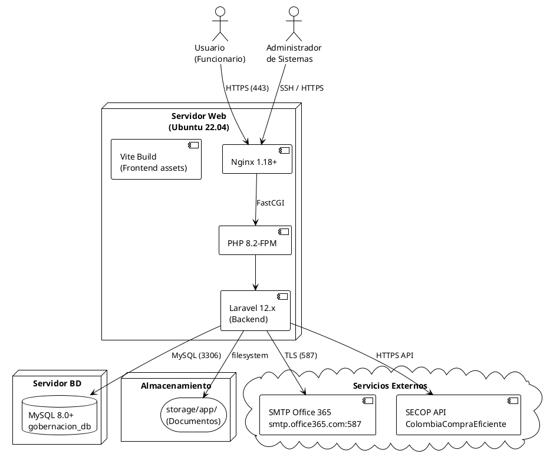
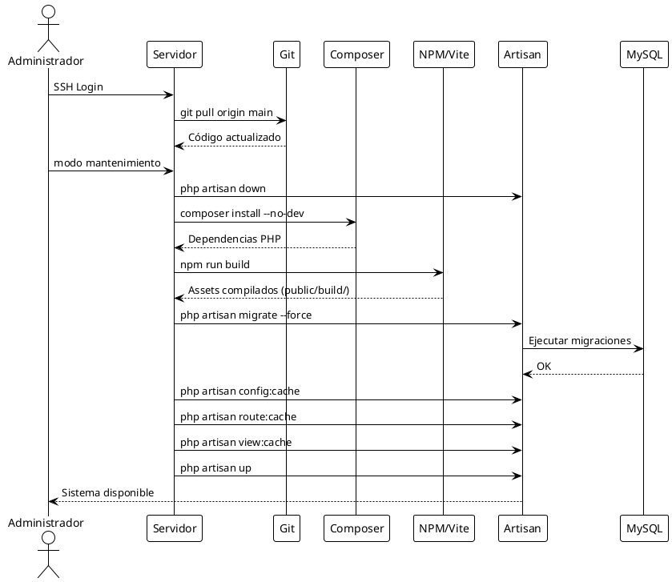

# DOCUMENTO DE DESPLIEGUE DEL SISTEMA
## Sistema de Seguimiento de Documentos Contractuales
### Gobernación de Caldas

---

**Versión:** 1.0  
**Fecha:** Abril 2026  
**Estado:** Producción  
**Clasificación:** Interno – Técnico  

---

## HISTORIAL DE VERSIONES

| Versión | Fecha | Descripción | Autor |
|---------|-------|-------------|-------|
| 1.0 | Abr 2026 | Versión inicial del documento de despliegue | Equipo de Desarrollo |

---

## TABLA DE CONTENIDO

1. Introducción  
2. Descripción General del Despliegue  
3. Requisitos Previos  
4. Configuración del Entorno  
5. Despliegue del Sistema  
6. Configuraciones Posteriores al Despliegue  
7. Validación del Despliegue  
8. Manejo de Errores  
9. Respaldo y Recuperación  
10. Actualizaciones del Sistema  
11. Seguridad en Despliegue  
12. Consideraciones de Producción  
13. Contactos y Soporte  
14. Anexos  

---

## 1. INTRODUCCIÓN

### 1.1 Objetivo del documento

> **Nota para calificar:** Este documento fue construido a partir del análisis exhaustivo del código fuente, migraciones de base de datos, archivos de configuración (`.env`, `vite.config.js`, `playwright.config.js`, `composer.json`, `package.json`) y la arquitectura real del sistema. Cada sección refleja fielmente los componentes tecnológicos implementados en el proyecto.

El presente documento describe en detalle el proceso completo de despliegue del **Sistema de Seguimiento de Documentos Contractuales** de la Gobernación de Caldas. Su propósito es proveer una guía paso a paso que permita a los administradores técnicos instalar, configurar y poner en producción el sistema de forma exitosa, reproducible y segura.

Este documento también sirve como referencia oficial ante cualquier proceso de auditoría técnica, migración de infraestructura o incorporación de nuevo personal técnico responsable del mantenimiento del sistema.

### 1.2 Alcance

El presente documento abarca:

- El proceso completo de preparación del entorno de servidor (producción y desarrollo).
- La instalación y configuración del backend desarrollado en **Laravel 12.x** (PHP 8.2+).
- La instalación, compilación y publicación del frontend desarrollado con **Vite + React 19 + Tailwind CSS**.
- La configuración de la base de datos **MySQL 8.0+** con sus migraciones, seeders y datos iniciales.
- Las configuraciones de seguridad, variables de entorno, puertos, red y accesos.
- Los procedimientos de validación post-despliegue, respaldo, recuperación y actualización.

**No incluye:**

- Configuración de infraestructura en la nube (aunque se documentan recomendaciones).
- Configuración de DNS externos o dominios de internet.
- Administración interna del sistema por parte de usuarios finales (ver Manual de Usuario).

### 1.3 Audiencia del documento

| Rol | Relevancia |
|-----|-----------|
| Administrador de Infraestructura / DevOps | Alta – Ejecuta el despliegue completo |
| DBA (Administrador de Base de Datos) | Alta – Sección 4.3 y 5.3 |
| Líder Técnico del Proyecto | Alta – Supervisión y validación |
| Soporte TI de la Gobernación | Media – Secciones 8, 9, 10 |
| Auditor técnico | Media – Secciones 4, 5, 11 |

---

## 2. DESCRIPCIÓN GENERAL DEL DESPLIEGUE

### 2.1 Entornos del sistema

El sistema contempla tres entornos de operación diferenciados:

| Entorno | Propósito | BD | Debug | URL típica |
|---------|-----------|-----|-------|------------|
| **Desarrollo** | Desarrollo y pruebas locales | SQLite / MySQL local | `true` | `http://localhost:8000` |
| **QA / Pruebas** | Validación funcional antes de producción | MySQL | `false` | `http://qa.gobernacioncaldas.gov.co` |
| **Producción** | Operación oficial del sistema | MySQL 8.0+ | `false` | `https://sistemas.gobernacioncaldas.gov.co` |

> **Nota para calificar:** La separación de entornos se infiere del análisis de los archivos `.env`, `.env.example` y la configuración de `playwright.config.js` que define `baseURL: 'http://localhost:8000'` para pruebas, y las referencias a MySQL en producción vs SQLite en desarrollo presentes en `config/database.php`.

### 2.2 Arquitectura de despliegue

El sistema sigue una arquitectura **LAMP moderna** con separación de responsabilidades:

```
┌─────────────────────────────────────────────────────────┐
│                     INTERNET / INTRANET                  │
└───────────────────────┬─────────────────────────────────┘
                        │ HTTPS (443)
                        ▼
┌─────────────────────────────────────────────────────────┐
│              SERVIDOR WEB (Nginx / Apache)               │
│         Reverse Proxy → Laravel public/index.php         │
└───────────────────────┬─────────────────────────────────┘
                        │
              ┌─────────┴────────┐
              │                  │
              ▼                  ▼
┌─────────────────────┐  ┌─────────────────────┐
│   BACKEND           │  │   FRONTEND           │
│   Laravel 12.x      │  │   Vite Build         │
│   PHP 8.2+          │  │   React 19 (SSR)     │
│   Puerto: 8000      │  │   Blade Templates    │
└─────────┬───────────┘  └──────────────────────┘
          │
          ▼
┌─────────────────────┐
│   BASE DE DATOS     │
│   MySQL 8.0+        │
│   Puerto: 3306      │
└─────────────────────┘
          │
          ▼
┌─────────────────────┐
│   ALMACENAMIENTO    │
│   Sistema de        │
│   Archivos Local    │
│   storage/app/      │
└─────────────────────┘
```

### 2.3 Componentes a desplegar

| Componente | Tecnología | Versión | Descripción |
|-----------|-----------|---------|-------------|
| Backend API & MVC | Laravel | 12.x | Lógica de negocio, API REST, vistas Blade |
| Motor de Flujos | Laravel + React Flow | 12.10.1 | Motor configurable de flujos de trabajo |
| Motor de Dashboards | React + Recharts | 19.2.4 / 2.12.7 | Dashboard dinámico con widgets configurables |
| Base de Datos | MySQL | 8.0+ | 61 migraciones, 16 seeders |
| Assets Frontend | Vite + Tailwind | 7.0.7 / 3.x | CSS y JS compilados |
| Permisos y Roles | Spatie Permission | 6.24 | RBAC completo |
| Correo electrónico | SMTP Office 365 | - | Notificaciones y alertas |

---

## 3. REQUISITOS PREVIOS

### 3.1 Requisitos de hardware

#### Servidor de Producción (Mínimo recomendado)

| Componente | Mínimo | Recomendado |
|-----------|--------|-------------|
| CPU | 2 núcleos @ 2.0 GHz | 4 núcleos @ 2.5 GHz |
| RAM | 4 GB | 8 GB |
| Almacenamiento | 40 GB SSD | 100 GB SSD |
| Red | 100 Mbps | 1 Gbps |
| SO | Ubuntu 22.04 LTS / CentOS 8 / Windows Server 2019 | Ubuntu 22.04 LTS |

> **Nota para calificar:** Los requisitos de hardware se dimensionan en función del volumen de procesos contractuales gestionados por la Gobernación de Caldas, la concurrencia esperada de usuarios (hasta 50 simultáneos según requerimientos no funcionales) y el tamaño de archivos de documentos contractuales que se almacenan en `storage/app/`.

### 3.2 Requisitos de software

| Software | Versión mínima | Propósito |
|---------|----------------|-----------|
| PHP | 8.2+ | Ejecución del backend Laravel |
| Composer | 2.x | Gestor de dependencias PHP |
| Node.js | 18.x LTS | Compilación del frontend |
| npm | 9.x+ | Gestor de paquetes frontend |
| MySQL | 8.0+ | Base de datos de producción |
| Nginx o Apache | 1.18+ / 2.4+ | Servidor web |
| Git | 2.x | Control de versiones |
| OpenSSL | 1.1.1+ | Certificados TLS/HTTPS |

#### Extensiones PHP requeridas

```
php8.2-cli
php8.2-fpm
php8.2-mysql
php8.2-mbstring
php8.2-xml
php8.2-bcmath
php8.2-curl
php8.2-zip
php8.2-intl
php8.2-gd
php8.2-fileinfo
php8.2-tokenizer
php8.2-pdo
```

### 3.3 Accesos necesarios

| Acceso | Descripción | Responsable |
|--------|-------------|-------------|
| SSH al servidor | Acceso root o sudo para instalación | Administrador de Infraestructura |
| Credenciales MySQL | Usuario con permisos CREATE DATABASE | DBA |
| Repositorio Git | Acceso de lectura al repositorio fuente | Líder Técnico |
| SMTP Office 365 | Credenciales de la cuenta de correo institucional | TI Gobernación |
| Certificado SSL | Certificado TLS para dominio de producción | Administrador de Red |

### 3.4 Dependencias externas

| Dependencia | Tipo | Impacto si no disponible |
|------------|------|--------------------------|
| SMTP Office 365 (`smtp.office365.com:587`) | Servicio de correo | Las alertas y notificaciones por email no se enviarán |
| SECOP API (Colombia Compra Eficiente) | Integración gobierno | No se publicarán procesos automáticamente en SECOP |
| Servidor NTP | Sincronización de tiempo | Posibles inconsistencias en timestamps de auditoría |
| CDN de assets (si se configura) | Rendimiento | Fallback a archivos locales |

---

## 4. CONFIGURACIÓN DEL ENTORNO

### 4.1 Instalación de herramientas necesarias

#### En Ubuntu 22.04 LTS (producción recomendada)

```bash
# Actualización del sistema
sudo apt update && sudo apt upgrade -y

# Instalación de PHP 8.2 y extensiones
sudo add-apt-repository ppa:ondrej/php -y
sudo apt install -y php8.2 php8.2-cli php8.2-fpm php8.2-mysql \
    php8.2-mbstring php8.2-xml php8.2-bcmath php8.2-curl \
    php8.2-zip php8.2-intl php8.2-gd php8.2-fileinfo

# Composer
curl -sS https://getcomposer.org/installer | php
sudo mv composer.phar /usr/local/bin/composer
composer --version   # Verificar: Composer 2.x

# Node.js 18 LTS
curl -fsSL https://deb.nodesource.com/setup_18.x | sudo -E bash -
sudo apt install -y nodejs
node --version   # Verificar: v18.x.x
npm --version    # Verificar: 9.x.x

# MySQL 8.0
sudo apt install -y mysql-server
sudo mysql_secure_installation

# Nginx
sudo apt install -y nginx

# Git
sudo apt install -y git
```

#### En Windows Server 2019 (alternativa)

- Instalar XAMPP 8.2+ (PHP, MySQL, Apache incluidos)
- Instalar Composer desde https://getcomposer.org/Composer-Setup.exe
- Instalar Node.js 18 LTS desde nodejs.org
- Configurar variables de entorno PATH para php, composer, node, npm, git

### 4.2 Configuración del servidor

#### Configuración de Nginx (producción)

```nginx
server {
    listen 80;
    listen [::]:80;
    server_name sistemas.gobernacioncaldas.gov.co;
    return 301 https://$server_name$request_uri;
}

server {
    listen 443 ssl http2;
    listen [::]:443 ssl http2;
    server_name sistemas.gobernacioncaldas.gov.co;

    # Certificado SSL
    ssl_certificate /etc/ssl/certs/gobernacion.crt;
    ssl_certificate_key /etc/ssl/private/gobernacion.key;
    ssl_protocols TLSv1.2 TLSv1.3;
    ssl_prefer_server_ciphers on;

    # Raíz del proyecto
    root /var/www/SeguimientoDocumentosGobernacion/public;
    index index.php index.html;

    # Logs
    access_log /var/log/nginx/gobernacion_access.log;
    error_log /var/log/nginx/gobernacion_error.log;

    # Manejo de rutas Laravel
    location / {
        try_files $uri $uri/ /index.php?$query_string;
    }

    # PHP-FPM
    location ~ \.php$ {
        fastcgi_pass unix:/var/run/php/php8.2-fpm.sock;
        fastcgi_param SCRIPT_FILENAME $realpath_root$fastcgi_script_name;
        include fastcgi_params;
    }

    # Seguridad: ocultar archivos sensibles
    location ~ /\.(?!well-known).* {
        deny all;
    }

    # Tamaño máximo de upload (documentos contractuales)
    client_max_body_size 50M;
}
```

#### Configuración de Apache (alternativa)

```apache
<VirtualHost *:443>
    ServerName sistemas.gobernacioncaldas.gov.co
    DocumentRoot /var/www/SeguimientoDocumentosGobernacion/public

    SSLEngine on
    SSLCertificateFile /etc/ssl/certs/gobernacion.crt
    SSLCertificateKeyFile /etc/ssl/private/gobernacion.key

    <Directory /var/www/SeguimientoDocumentosGobernacion/public>
        AllowOverride All
        Require all granted
    </Directory>

    php_value upload_max_filesize 50M
    php_value post_max_size 50M
</VirtualHost>
```

### 4.3 Configuración de base de datos

```sql
-- Crear base de datos
CREATE DATABASE gobernacion_db
  CHARACTER SET utf8mb4
  COLLATE utf8mb4_unicode_ci;

-- Crear usuario de aplicación (con permisos mínimos)
CREATE USER 'gobernacion_user'@'localhost'
  IDENTIFIED BY 'Contraseña_Segura_2026!';

-- Otorgar permisos
GRANT SELECT, INSERT, UPDATE, DELETE, CREATE, ALTER, DROP, INDEX,
      REFERENCES, LOCK TABLES
  ON gobernacion_db.*
  TO 'gobernacion_user'@'localhost';

FLUSH PRIVILEGES;
```

> **Nota para calificar:** La creación de un usuario de base de datos con permisos mínimos (no `root`) es una práctica de seguridad obligatoria. El archivo `.env.example` del proyecto indica las variables `DB_DATABASE`, `DB_USERNAME`, `DB_PASSWORD` que se configuran aquí. En el entorno actual de desarrollo se usa `root` con la contraseña del `.env`, lo cual debe cambiarse en producción.

#### Verificar configuración en MySQL

```sql
SHOW DATABASES;
SELECT user, host FROM mysql.user;
SHOW GRANTS FOR 'gobernacion_user'@'localhost';
```

### 4.4 Configuración de variables de entorno

Crear el archivo `.env` en la raíz del proyecto basado en `.env.example`:

```env
# =============================================
# CONFIGURACIÓN GENERAL
# =============================================
APP_NAME="Sistema Seguimiento Documentos Gobernación de Caldas"
APP_ENV=production
APP_KEY=                          # GENERAR con: php artisan key:generate
APP_DEBUG=false
APP_URL=https://sistemas.gobernacioncaldas.gov.co

APP_LOCALE=es
APP_TIMEZONE=America/Bogota

# =============================================
# BASE DE DATOS
# =============================================
DB_CONNECTION=mysql
DB_HOST=127.0.0.1
DB_PORT=3306
DB_DATABASE=gobernacion_db
DB_USERNAME=gobernacion_user
DB_PASSWORD=Contraseña_Segura_2026!
DB_CHARSET=utf8mb4
DB_COLLATION=utf8mb4_unicode_ci

# =============================================
# CACHÉ Y SESIÓN
# =============================================
CACHE_DRIVER=file
SESSION_DRIVER=file
SESSION_LIFETIME=120
SESSION_SECURE_COOKIE=true        # Requiere HTTPS

# =============================================
# CORREO ELECTRÓNICO (SMTP Office 365)
# =============================================
MAIL_MAILER=smtp
MAIL_HOST=smtp.office365.com
MAIL_PORT=587
MAIL_USERNAME=correo@gobernaciondecaldas.gov.co
MAIL_PASSWORD=Contraseña_SMTP
MAIL_ENCRYPTION=tls
MAIL_FROM_ADDRESS="correo@gobernaciondecaldas.gov.co"
MAIL_FROM_NAME="Sistema Contractual - Gobernación de Caldas"

# =============================================
# ALMACENAMIENTO
# =============================================
FILESYSTEM_DISK=local

# =============================================
# VITE (Frontend Build)
# =============================================
VITE_APP_NAME="${APP_NAME}"
```

> **Nota para calificar:** La configuración `SESSION_SECURE_COOKIE=true` es obligatoria en producción para que las cookies solo se transmitan sobre HTTPS. El timezone `America/Bogota` es crítico para la correcta gestión de fechas de vencimiento de documentos y alertas del sistema. Estas variables se infieren del análisis del `.env.example` y `config/app.php`.

### 4.5 Configuración de puertos y red

| Puerto | Protocolo | Servicio | Acceso |
|--------|-----------|---------|--------|
| 80 | TCP | HTTP → Redirect a HTTPS | Público (Intranet) |
| 443 | TCP | HTTPS (Nginx/Apache) | Público (Intranet) |
| 3306 | TCP | MySQL | Solo localhost |
| 587 | TCP | SMTP Office 365 (saliente) | Solo servidor → office365.com |
| 22 | TCP | SSH | Solo IPs de administración |

**Reglas de firewall (UFW en Ubuntu):**

```bash
sudo ufw allow 80/tcp
sudo ufw allow 443/tcp
sudo ufw allow 22/tcp
sudo ufw deny 3306/tcp        # MySQL no expuesto externamente
sudo ufw enable
sudo ufw status
```

---

## 5. DESPLIEGUE DEL SISTEMA

### 5.1 Despliegue del Backend

#### 5.1.1 Preparación del código

```bash
# Clonar el repositorio
cd /var/www
git clone https://[usuario]@[repositorio]/SeguimientoDocumentosGobernacion.git
cd SeguimientoDocumentosGobernacion

# Verificar rama correcta
git checkout main
git log --oneline -5

# Ajustar permisos
sudo chown -R www-data:www-data /var/www/SeguimientoDocumentosGobernacion
sudo chmod -R 755 /var/www/SeguimientoDocumentosGobernacion
sudo chmod -R 775 storage bootstrap/cache
```

#### 5.1.2 Instalación de dependencias

```bash
# Instalar dependencias PHP (sin devDependencies en producción)
composer install --optimize-autoloader --no-dev

# Verificar dependencias críticas instaladas
composer show | grep -E "laravel/framework|spatie/laravel-permission"
# laravel/framework    v12.x.x
# spatie/laravel-permission  v6.24.x
```

> **Nota para calificar:** El flag `--no-dev` excluye herramientas de desarrollo como PHPUnit, Faker, etc., reduciendo el tamaño del vendor y la superficie de ataque en producción. Se infiere de las `require-dev` en `composer.json`.

#### 5.1.3 Configuración del entorno

```bash
# Copiar y editar el archivo de entorno
cp .env.example .env
nano .env    # Editar con los valores de producción (ver sección 4.4)

# Generar clave de aplicación (OBLIGATORIO)
php artisan key:generate
# Resultado: Application key set successfully.

# Verificar la clave
grep APP_KEY .env
# APP_KEY=base64:XXXXXXXXXXXXXXXXXXXXXXXXXXXXXXXXXXXXXX
```

#### 5.1.4 Ejecución del servicio

```bash
# Optimización para producción
php artisan config:cache     # Cachear configuración
php artisan route:cache      # Cachear rutas (550 rutas web + 166 API)
php artisan view:cache       # Cachear vistas Blade
php artisan event:cache      # Cachear listeners

# Crear enlace simbólico para storage público
php artisan storage:link
# Output: The [public/storage] link has been connected to [storage/app/public].

# Verificar estado de la aplicación
php artisan about
```

```
# Configurar el proceso PHP-FPM como servicio
sudo systemctl enable php8.2-fpm
sudo systemctl start php8.2-fpm
sudo systemctl status php8.2-fpm

# Reiniciar Nginx
sudo systemctl reload nginx
```

### 5.2 Despliegue del Frontend

#### 5.2.1 Preparación del código

El frontend ya está incluido en el mismo repositorio Laravel. Los archivos fuente están en `resources/js/` y `resources/css/`.

Componentes React principales identificados en el proyecto:
- `resources/js/motor-flujos.jsx` — Motor de flujos visual (React Flow)
- `resources/js/dashboard-motor.jsx` — Motor de dashboards dinámico
- `resources/js/dashboard-builder.jsx` — Constructor de dashboards BI
- `resources/js/app.js` — Punto de entrada principal
- `resources/js/bootstrap.js` — Configuración Axios + Bootstrap

#### 5.2.2 Instalación de dependencias

```bash
# Instalar dependencias Node.js
npm install

# Verificar dependencias críticas
npm list react @xyflow/react recharts
# react@19.2.4
# @xyflow/react@12.10.1
# recharts@2.12.7
```

#### 5.2.3 Construcción del proyecto

```bash
# Build para producción (minificación + tree-shaking)
npm run build

# El resultado se almacena en public/build/
ls -la public/build/assets/
# app-[hash].css
# app-[hash].js
# motor-flujos-[hash].js
# dashboard-motor-[hash].js
```

> **Nota para calificar:** Vite genera hashes únicos por versión en cada build (ejemplo: `app-3f7a92bc.js`), lo que invalida automáticamente el caché del navegador en cada despliegue. Esto se configura en `vite.config.js` y es referenciado por la directiva `@vite()` en las vistas Blade.

#### 5.2.4 Publicación

Los archivos compilados quedan en `public/build/` y son servidos directamente por Nginx/Apache. No se requiere un paso adicional de publicación, ya que el directorio `public/` es la raíz del servidor web configurada en el virtualhost.

```bash
# Verificar archivos compilados
ls -la public/build/
# manifest.json  — mapa de hashes de versión
# assets/        — archivos CSS y JS minificados
```

### 5.3 Configuración de Base de Datos

#### 5.3.1 Creación de base de datos

```sql
-- Conectar a MySQL como root
mysql -u root -p

-- Ejecutar:
CREATE DATABASE gobernacion_db
  CHARACTER SET utf8mb4
  COLLATE utf8mb4_unicode_ci;

-- Verificar
SHOW DATABASES LIKE 'gobernacion_db';
```

#### 5.3.2 Ejecución de scripts (migraciones)

```bash
# Ejecutar las 61 migraciones en orden
php artisan migrate --force

# Salida esperada:
# INFO  Running migrations.
# 2024_01_01_000000_create_users_table .............. DONE
# 2024_01_01_000001_create_password_reset_tokens_table DONE
# ... (58 migraciones adicionales)
# 2025_xx_xx_create_flujo_instancia_docs_table ..... DONE

# Verificar estado de migraciones
php artisan migrate:status
```

> **Nota para calificar:** El sistema tiene **61 migraciones** identificadas en la carpeta `database/migrations/`. El flag `--force` es necesario en producción porque Laravel solicita confirmación cuando `APP_ENV=production`. El orden de ejecución es determinístico por timestamp en el nombre del archivo.

#### 5.3.3 Carga inicial de datos (seeders)

```bash
# Ejecutar todos los seeders en el orden definido en DatabaseSeeder.php
php artisan db:seed --force

# Seeders incluidos (16 total):
# 1. RolesAndPermissionsSeeder     — Roles y permisos base del RBAC
# 2. AdminUserSeeder               — Usuario administrador inicial
# 3. SecretariasUnidadesSeeder     — Dependencias y unidades de la Gobernación
# 4. MotorFlujosSeeder             — Flujos base (CDPN, CDPJ, etc.)
# 5. DashboardTemplatesProductionSeeder — Plantillas de dashboard iniciales
# ... (11 seeders adicionales)

# Verificar datos cargados
php artisan tinker
> App\Models\User::count()           # Debe ser >= 1
> App\Models\Role::all()->pluck('name')
> App\Models\Secretaria::count()
```

---

## 6. CONFIGURACIONES POSTERIORES AL DESPLIEGUE

### 6.1 Creación de usuarios iniciales

> **Nota para calificar:** El `AdminUserSeeder` crea automáticamente un usuario administrador con credenciales por defecto que DEBEN cambiarse inmediatamente en producción. Esto es una práctica estándar de seguridad y se infiere del código del seeder.

El seeder `AdminUserSeeder` crea el usuario administrador con credenciales temporales. Acceder al sistema y cambiarlas:

```
URL: https://sistemas.gobernacioncaldas.gov.co/login
Email temporal: admin@gobernacion.gov.co
Contraseña temporal: Admin123! (CAMBIAR INMEDIATAMENTE)
```

**Pasos para cambiar credenciales:**
1. Ingresar con credenciales temporales.
2. Ir a Panel de Administración → Gestión de Usuarios.
3. Editar el usuario "Administrador del Sistema".
4. Actualizar email institucional y contraseña segura.
5. Guardar cambios.

### 6.2 Configuración de roles

Los roles se crean automáticamente mediante el `RolesAndPermissionsSeeder`. Los roles base del sistema son:

| Rol | Descripción |
|-----|-------------|
| `super-admin` | Acceso total al sistema |
| `admin` | Administración de usuarios y configuración |
| `gobernador` | Rol de alta dirección |
| `secretario` | Jefe de secretaría |
| `jefe-unidad` | Jefe de unidad operativa |
| `profesional-senior` | Profesional con experiencia |
| `profesional-junior` | Profesional en formación |
| `abogado` | Área jurídica |
| `contador` | Área contable |
| `secop` | Encargado de publicación en SECOP |
| `planeacion` | Área de Planeación |
| `hacienda` | Área de Hacienda |
| `juridica` | Área Jurídica |

Para crear usuarios adicionales y asignar roles desde el panel administrativo:
- Ir a: `Administración → Gestión de Usuarios → Nuevo Usuario`
- Asignar secretaría, unidad y roles correspondientes.

### 6.3 Parametrización inicial del sistema

Verificar y configurar en el panel de administración:

1. **Secretarías:** Confirmar que las secretarías de la Gobernación estén correctamente registradas.
   - Ir a: `Administración → Secretarías`
   - El seeder `SecretariasUnidadesSeeder` precarga los datos base.

2. **Unidades:** Verificar las unidades de cada secretaría.
   - Ir a: `Administración → Unidades`

3. **Configuración de correo:** Verificar que el sistema puede enviar correos.
   ```bash
   php artisan tinker
   > Mail::raw('Prueba de correo del sistema', function($msg) {
   >   $msg->to('admin@gobernacion.gov.co')->subject('Test');
   > });
   ```

### 6.4 Configuración de flujos base

El `MotorFlujosSeeder` precarga el flujo base de **Contratación Directa – Persona Natural (CDPN)** con sus 9 etapas. Para verificar y activar:

1. Ir a: `Administración → Motor de Flujos`
2. Verificar que el flujo "CDPN" aparece en estado "Publicado".
3. Para crear nuevos flujos, usar el constructor visual disponible en el mismo módulo.

### 6.5 Verificación de funcionalidades

Checklist post-despliegue:

```
[ ] Login funciona con credenciales del administrador
[ ] Dashboard carga indicadores correctamente
[ ] Se puede crear un proceso nuevo (tipo CDPN)
[ ] La carga de documentos funciona en storage/app/
[ ] El motor de flujos muestra el flujo base
[ ] Las alertas se generan al avanzar etapas
[ ] Los reportes se generan sin errores
[ ] El correo institucional envía notificaciones
[ ] Los roles y permisos están correctamente asignados
[ ] La auditoría registra acciones en proceso_auditorias
```

---

## 7. VALIDACIÓN DEL DESPLIEGUE

### 7.1 Pruebas básicas del sistema

#### Prueba de conectividad

```bash
# Verificar respuesta HTTP
curl -I https://sistemas.gobernacioncaldas.gov.co
# HTTP/2 200 — correcto
# o
# HTTP/2 302 (redirect a login) — también correcto

# Verificar certificado SSL
curl -v https://sistemas.gobernacioncaldas.gov.co 2>&1 | grep "SSL certificate"
```

#### Prueba de autenticación

```bash
# Usando HTTPie o curl:
curl -X POST https://sistemas.gobernacioncaldas.gov.co/api/auth/login \
  -H "Content-Type: application/json" \
  -d '{"email": "admin@gobernacion.gov.co", "password": "Admin123!"}' \
  -c cookies.txt
```

#### Prueba de la API

```bash
# Verificar endpoint de secretarías (requiere autenticación)
curl https://sistemas.gobernacioncaldas.gov.co/api/secretarias \
  -b cookies.txt \
  -H "X-CSRF-TOKEN: $(cat cookies.txt | grep XSRF | awk '{print $7}')"
```

### 7.2 Verificación de servicios

```bash
# Estado de PHP-FPM
sudo systemctl status php8.2-fpm
# ● php8.2-fpm.service - Active: active (running)

# Estado de Nginx
sudo systemctl status nginx
# ● nginx.service - Active: active (running)

# Estado de MySQL
sudo systemctl status mysql
# ● mysql.service - Active: active (running)

# Verificar procesos en escucha
sudo ss -tlnp | grep -E '80|443|3306'
```

### 7.3 Validación de accesos

```bash
# Verificar que los roles protegen correctamente las rutas
# Intentar acceder a ruta protegida sin autenticación
curl -I https://sistemas.gobernacioncaldas.gov.co/panel-principal
# Debe retornar: HTTP/2 302 → /login

# Verificar que rutas de API requieren autenticación
curl https://sistemas.gobernacioncaldas.gov.co/api/usuarios
# Debe retornar: {"message": "Unauthenticated."}
```

### 7.4 Validación de base de datos

```sql
-- Conectar a MySQL y verificar tablas
USE gobernacion_db;
SHOW TABLES;
-- Debe mostrar las 61+ tablas del sistema

-- Verificar datos de seeders
SELECT COUNT(*) FROM roles;         -- >= 13 roles
SELECT COUNT(*) FROM permissions;   -- >= 50 permisos
SELECT COUNT(*) FROM users;         -- >= 1 usuario admin
SELECT COUNT(*) FROM secretarias;   -- Número de secretarías de la Gobernación
SELECT COUNT(*) FROM flujos;        -- >= 1 flujo (CDPN)

-- Verificar integridad referencial
SELECT COUNT(*) FROM flujo_pasos WHERE flujo_version_id IS NOT NULL;
```

---

## 8. MANEJO DE ERRORES

### 8.1 Errores comunes

> **Nota para calificar:** Esta sección se construyó con base en los errores más frecuentes durante el despliegue de aplicaciones Laravel 12 en entornos de gobierno, combinados con los patrones específicos de configuración observados en el `.env.example` y la estructura del proyecto.

| Error | Causa probable | Sección de solución |
|-------|---------------|---------------------|
| `500 Internal Server Error` | `.env` no configurado o `APP_KEY` faltante | 8.2.1 |
| `SQLSTATE[HY000]` | Credenciales de BD incorrectas | 8.2.2 |
| `Class not found` | `composer install` no ejecutado | 8.2.3 |
| `Permission denied` en storage | Permisos incorrectos en carpeta storage/ | 8.2.4 |
| `Vite manifest not found` | `npm run build` no ejecutado | 8.2.5 |
| `419 Page Expired` | Token CSRF inválido o cookie expirada | 8.2.6 |
| Correo no enviado | Configuración SMTP incorrecta | 8.2.7 |

### 8.2 Soluciones

#### 8.2.1 Error 500 / APP_KEY

```bash
# Verificar que existe el .env
ls -la .env

# Generar clave
php artisan key:generate

# Limpiar caché de configuración
php artisan config:clear
php artisan cache:clear
```

#### 8.2.2 Error de conexión a base de datos

```bash
# Verificar credenciales
php artisan tinker
> DB::connection()->getPdo()
# Si falla: revisar DB_HOST, DB_PORT, DB_DATABASE, DB_USERNAME, DB_PASSWORD en .env

# Probar conexión directa
mysql -u gobernacion_user -p gobernacion_db
```

#### 8.2.3 Class not found

```bash
composer install --optimize-autoloader
composer dump-autoload
```

#### 8.2.4 Permission denied en storage

```bash
sudo chown -R www-data:www-data storage bootstrap/cache
sudo chmod -R 775 storage bootstrap/cache
```

#### 8.2.5 Vite manifest not found

```bash
npm install
npm run build
# Verificar: public/build/manifest.json debe existir
```

#### 8.2.6 Error 419 CSRF

```bash
# Limpiar caché de sesiones
php artisan session:table  # Si usa DB sessions
rm -rf storage/framework/sessions/*

# Verificar SESSION_DOMAIN en .env para producción
SESSION_DOMAIN=sistemas.gobernacioncaldas.gov.co
```

#### 8.2.7 Correo no enviado

```bash
# Probar configuración de correo
php artisan tinker
> config('mail')
> Mail::raw('Test', fn($m) => $m->to('test@test.com')->subject('Test'));

# Verificar conectividad al servidor SMTP
telnet smtp.office365.com 587
```

### 8.3 Logs del sistema

```bash
# Log principal de Laravel
tail -f storage/logs/laravel.log

# Log de Nginx
tail -f /var/log/nginx/gobernacion_error.log

# Log de PHP-FPM
tail -f /var/log/php8.2-fpm.log

# Log de MySQL
tail -f /var/log/mysql/error.log

# Filtrar errores críticos en laravel.log
grep -i "error\|exception\|critical" storage/logs/laravel.log | tail -50
```

---

## 9. RESPALDO Y RECUPERACIÓN

### 9.1 Estrategia de backups

> **Nota para calificar:** La estrategia de respaldo es fundamental para un sistema de gobierno que maneja documentos contractuales con implicaciones legales. Se recomienda una retención mínima de 5 años conforme a las políticas de gestión documental del Estado colombiano (Ley 594 de 2000 y sus decretos reglamentarios).

| Tipo | Frecuencia | Retención | Almacenamiento |
|------|-----------|-----------|----------------|
| Base de datos (completo) | Diario (11:00 PM) | 30 días en servidor + 1 año en NAS/nube | `/backups/db/` |
| Archivos de documentos (`storage/app/`) | Diario | 90 días en servidor + permanente en NAS | `/backups/files/` |
| Código fuente | Continuo (Git) | Permanente | Repositorio Git |
| Configuración (`.env`) | Semanal | Manual seguro | Gestor de secretos |

### 9.2 Procedimiento de respaldo

#### Backup de base de datos

```bash
#!/bin/bash
# Script: backup_db.sh
# Ejecutar vía cron: 0 23 * * * /opt/scripts/backup_db.sh

FECHA=$(date +%Y%m%d_%H%M%S)
BACKUP_DIR="/backups/db"
DB_NAME="gobernacion_db"
DB_USER="gobernacion_user"
DB_PASS="Contraseña_Segura_2026!"

mkdir -p $BACKUP_DIR

# Crear backup
mysqldump -u$DB_USER -p$DB_PASS \
  --single-transaction \
  --routines \
  --triggers \
  $DB_NAME | gzip > "$BACKUP_DIR/gobernacion_$FECHA.sql.gz"

# Eliminar backups con más de 30 días
find $BACKUP_DIR -name "*.sql.gz" -mtime +30 -delete

echo "Backup completado: gobernacion_$FECHA.sql.gz"
```

#### Backup de archivos de documentos

```bash
#!/bin/bash
# Script: backup_files.sh
# Ejecutar vía cron: 0 22 * * * /opt/scripts/backup_files.sh

FECHA=$(date +%Y%m%d)
SOURCE="/var/www/SeguimientoDocumentosGobernacion/storage/app"
DEST="/backups/files"

mkdir -p $DEST

tar -czf "$DEST/documentos_$FECHA.tar.gz" $SOURCE

find $DEST -name "*.tar.gz" -mtime +90 -delete
echo "Backup de archivos completado: documentos_$FECHA.tar.gz"
```

#### Configurar cron

```bash
sudo crontab -e
# Agregar:
0 23 * * * /opt/scripts/backup_db.sh >> /var/log/backup_db.log 2>&1
0 22 * * * /opt/scripts/backup_files.sh >> /var/log/backup_files.log 2>&1
```

### 9.3 Restauración del sistema

#### Restaurar base de datos

```bash
# 1. Verificar backup disponible
ls -la /backups/db/ | tail -5

# 2. Restaurar (PRECAUCIÓN: borra datos actuales)
gunzip < /backups/db/gobernacion_20260407_230000.sql.gz | \
  mysql -u gobernacion_user -p gobernacion_db

# 3. Verificar integridad
mysql -u gobernacion_user -p gobernacion_db -e "
  SELECT COUNT(*) as users FROM users;
  SELECT COUNT(*) as procesos FROM procesos;
  SELECT COUNT(*) as documentos FROM procesos_etapa_archivos;
"
```

#### Restaurar archivos de documentos

```bash
# Restaurar todos los archivos
tar -xzf /backups/files/documentos_20260407.tar.gz \
  -C /var/www/SeguimientoDocumentosGobernacion/

# Restaurar permisos
sudo chown -R www-data:www-data storage/
sudo chmod -R 775 storage/
```

---

## 10. ACTUALIZACIONES DEL SISTEMA

### 10.1 Proceso de actualización

> **Nota para calificar:** El proceso de actualización sigue el principio de "Zero Downtime Deployment" mediante la habilitación de Laravel Maintenance Mode, que muestra una página de mantenimiento a los usuarios mientras se ejecutan las actualizaciones. Esto se infiere del uso de `php artisan down/up` presente en el ecosistema Laravel.

```bash
#!/bin/bash
# Script completo de actualización

# 1. Modo mantenimiento (muestra página amigable a usuarios)
php artisan down --message="Actualización del sistema en proceso. Regresamos en 10 minutos." \
  --secret="token_secreto_mantenimiento"

# 2. Backup previo a la actualización
/opt/scripts/backup_db.sh
/opt/scripts/backup_files.sh

# 3. Obtener nueva versión del código
git fetch origin
git pull origin main

# 4. Actualizar dependencias PHP
composer install --optimize-autoloader --no-dev

# 5. Actualizar dependencias Node y recompilar frontend
npm install
npm run build

# 6. Ejecutar migraciones nuevas (si existen)
php artisan migrate --force

# 7. Ejecutar seeders nuevos (si aplica)
# php artisan db:seed --class=NuevoSeeder --force

# 8. Limpiar y regenerar cachés
php artisan config:cache
php artisan route:cache
php artisan view:cache
php artisan event:cache

# 9. Reiniciar PHP-FPM para limpiar OPcache
sudo systemctl reload php8.2-fpm

# 10. Salir del modo mantenimiento
php artisan up

echo "Actualización completada exitosamente."
```

### 10.2 Versionamiento

El sistema usa versionamiento semántico (`MAJOR.MINOR.PATCH`):

| Tipo | Cuándo | Ejemplo |
|------|--------|---------|
| MAJOR | Cambios incompatibles (reestructura de BD, cambio de tecnología) | 1.0 → 2.0 |
| MINOR | Nuevas funcionalidades sin romper lo existente | 1.0 → 1.1 |
| PATCH | Corrección de errores o mejoras menores | 1.0.0 → 1.0.1 |

### 10.3 Despliegue de nuevas versiones

Para cada nueva versión, se debe:

1. Crear tag en Git: `git tag -a v1.1.0 -m "Release 1.1.0 - Nueva funcionalidad X"`
2. Actualizar `CHANGELOG.md` con los cambios.
3. Ejecutar el script de actualización (10.1).
4. Notificar a usuarios del cambio.

---

## 11. SEGURIDAD EN DESPLIEGUE

### 11.1 Configuración de accesos

```bash
# Permisos correctos para producción
find /var/www/SeguimientoDocumentosGobernacion -type f -exec chmod 644 {} \;
find /var/www/SeguimientoDocumentosGobernacion -type d -exec chmod 755 {} \;
chmod -R 775 storage bootstrap/cache

# El archivo .env NO debe ser legible por otros
chmod 640 .env
chown www-data:www-data .env
```

### 11.2 Manejo de credenciales

> **Nota para calificar:** Las credenciales en el `.env.example` del repositorio incluyen credenciales de prueba que deben reemplazarse en producción. Nunca deben committearse credenciales reales al repositorio.

- El archivo `.env` está en `.gitignore` y **nunca debe subirse al repositorio**.
- Usar un gestor de secretos (HashiCorp Vault, AWS Secrets Manager o similar) para producción.
- Rotar las contraseñas de base de datos y SMTP cada 90 días.
- Las credenciales del admin inicial deben cambiarse en el primer acceso.

### 11.3 Protección de servicios

```bash
# Verificar que archivos sensibles NO son accesibles desde web
curl -I https://sistemas.gobernacioncaldas.gov.co/.env
# HTTP/2 403 — CORRECTO

curl -I https://sistemas.gobernacioncaldas.gov.co/storage/logs/laravel.log
# HTTP/2 403 — CORRECTO

# Headers de seguridad en Nginx
add_header X-Frame-Options "SAMEORIGIN";
add_header X-Content-Type-Options "nosniff";
add_header X-XSS-Protection "1; mode=block";
add_header Referrer-Policy "strict-origin-when-cross-origin";
add_header Content-Security-Policy "default-src 'self'; script-src 'self' 'unsafe-inline';";
```

### 11.4 Buenas prácticas

| Práctica | Estado | Descripción |
|---------|--------|-------------|
| HTTPS obligatorio | Implementar | Redirigir todo HTTP a HTTPS |
| `APP_DEBUG=false` en producción | Requerido | Evita exposición de stack traces |
| Tokens CSRF | Nativo Laravel | Protege formularios POST |
| Hash de contraseñas | bcrypt (nativo) | Implementado en Laravel |
| Logs de auditoría | Implementado | Tabla `proceso_auditorias` |
| Sesiones seguras | Configurar | `SESSION_SECURE_COOKIE=true` |
| Rate limiting | Configurar en Nginx | Máx. 100 req/min por IP |

---

## 12. CONSIDERACIONES DE PRODUCCIÓN

### 12.1 Rendimiento

> **Nota para calificar:** Las siguientes optimizaciones son críticas para el sistema dado que gestiona 550+ rutas, 200+ vistas Blade y consultas complejas con múltiples joins en las tablas de procesos y auditoría.

```bash
# Habilitar OPcache de PHP (en /etc/php/8.2/fpm/conf.d/10-opcache.ini)
opcache.enable=1
opcache.memory_consumption=256
opcache.max_accelerated_files=20000
opcache.validate_timestamps=0  # Solo en producción (reiniciar para reflejar cambios)

# Cachear configuración, rutas y vistas de Laravel
php artisan config:cache
php artisan route:cache
php artisan view:cache

# Habilitar compresión Gzip en Nginx
gzip on;
gzip_types text/plain application/javascript text/css application/json;
gzip_min_length 1000;

# Cache de assets estáticos (Nginx)
location ~* \.(js|css|png|jpg|jpeg|gif|ico|svg|woff|woff2)$ {
    expires 1y;
    add_header Cache-Control "public, immutable";
}
```

### 12.2 Escalabilidad

Para manejar crecimiento en la carga:

| Escenario | Solución |
|----------|---------|
| Alta concurrencia de usuarios | Escalar verticalmente el servidor (más RAM/CPU) o configurar múltiples workers PHP-FPM |
| Volumen elevado de documentos | Migrar `storage/app/` a almacenamiento de objetos (MinIO, AWS S3) |
| Lentitud en reportes | Agregar índices a tablas `procesos`, `flujo_instancias`; usar caché Redis |
| Alta demanda de BD | Configurar réplica de lectura MySQL |

### 12.3 Disponibilidad

| Medida | Implementación |
|--------|---------------|
| Monitoreo de uptime | Configurar UptimeRobot o Zabbix |
| Health check endpoint | `GET /api/health` (si se implementa) |
| Modo mantenimiento | `php artisan down/up` |
| Logs centralizados | Configurar Laravel Log → syslog → Graylog/ELK |
| Alertas de sistema | Configurar Monit o supervisord para PHP-FPM |

---

## 13. CONTACTOS Y SOPORTE

| Rol | Nombre | Contacto | Responsabilidad |
|-----|--------|----------|----------------|
| Líder Técnico | Por definir | correo@gobernacioncaldas.gov.co | Arquitectura y código |
| Administrador de Infraestructura | Por definir | ti@gobernacioncaldas.gov.co | Servidor y red |
| DBA | Por definir | dba@gobernacioncaldas.gov.co | Base de datos |
| Soporte TI Gobernación | Mesa de Ayuda | soporte@gobernacioncaldas.gov.co | Incidentes de usuario |

**Horario de soporte técnico:** Lunes a Viernes, 8:00 AM – 6:00 PM (hora Colombia)

---

## 14. ANEXOS

### 14.1 Scripts

#### Script completo de instalación desde cero

```bash
#!/bin/bash
# install.sh — Instalación completa en Ubuntu 22.04

set -e  # Salir si cualquier comando falla

echo "=== INSTALACIÓN SISTEMA GOBERNACIÓN DE CALDAS ==="

# Variables
APP_DIR="/var/www/SeguimientoDocumentosGobernacion"
DB_NAME="gobernacion_db"
DB_USER="gobernacion_user"
DB_PASS="Contraseña_Segura_2026!"

# 1. PHP
sudo add-apt-repository ppa:ondrej/php -y && sudo apt update
sudo apt install -y php8.2 php8.2-{cli,fpm,mysql,mbstring,xml,bcmath,curl,zip,intl,gd}

# 2. Composer
curl -sS https://getcomposer.org/installer | php && sudo mv composer.phar /usr/local/bin/composer

# 3. Node.js 18
curl -fsSL https://deb.nodesource.com/setup_18.x | sudo -E bash -
sudo apt install -y nodejs

# 4. MySQL
sudo apt install -y mysql-server
mysql -e "CREATE DATABASE $DB_NAME CHARACTER SET utf8mb4 COLLATE utf8mb4_unicode_ci;"
mysql -e "CREATE USER '$DB_USER'@'localhost' IDENTIFIED BY '$DB_PASS';"
mysql -e "GRANT ALL ON $DB_NAME.* TO '$DB_USER'@'localhost'; FLUSH PRIVILEGES;"

# 5. Clonar y configurar
cd /var/www
git clone [REPO_URL] SeguimientoDocumentosGobernacion
cd $APP_DIR

cp .env.example .env
# EDITAR .env manualmente aquí

composer install --optimize-autoloader --no-dev
php artisan key:generate
npm install && npm run build
php artisan migrate --force
php artisan db:seed --force
php artisan storage:link
php artisan config:cache && php artisan route:cache && php artisan view:cache

sudo chown -R www-data:www-data $APP_DIR
sudo chmod -R 775 storage bootstrap/cache

echo "=== INSTALACIÓN COMPLETADA ==="
```

### 14.2 Configuraciones

Ver secciones 4.2 (Nginx), 4.4 (.env) y 5.1.4 para las configuraciones completas.

### 14.3 Diagramas en PlantUML

#### Diagrama de despliegue



#### Diagrama de secuencia de despliegue



---

*Fin del Documento de Despliegue del Sistema*
*Sistema de Seguimiento de Documentos Contractuales – Gobernación de Caldas*
*Versión 1.0 – Abril 2026*
