# Flujo CD-PN: Contratación Directa – Persona Natural

## Gobernación de Caldas – Sistema de Seguimiento de Documentos

> **Fuente:** Proceso real documentado por el equipo de Planeación (Mariana Suárez, Feb 2026).

---

## 🏛️ Regla de Negocio Actual

| Regla | Detalle |
|-------|---------|
| **Quién crea procesos** | Solo la **Secretaría de Planeación** y sus unidades |
| **Demás secretarías** | Participan gestionando documentos pero **NO inician** procesos |
| **Workflows futuros** | MC, SA, LP, CM → comentados para implementación progresiva |

---

## 👥 Actores del Flujo

| Actor | Unidad | Secretaría |
|-------|--------|------------|
| Unidad Solicitante | Jefe de unidad + Abogado adscrito | Sec. Planeación (por ahora) |
| Descentralización | Unidad de Descentralización | Sec. Planeación |
| Compras | Unidad de Compras y Suministros | Sec. General |
| Talento Humano | Jefatura de Gestión del Talento Humano | Sec. General |
| Rentas | Unidad de Rentas | Sec. Hacienda |
| Contabilidad | Unidad de Contabilidad | Sec. Hacienda |
| Inversiones Públicas | Unidad de Regalías e Inversiones Públicas | Sec. Planeación |
| Presupuesto | Unidad de Presupuesto | Sec. Hacienda |
| Jurídica | Oficina de Radicación + Abogado Enlace | Sec. Jurídica |
| SECOP | Apoyo de Estructuración | Sec. Planeación |
| Secretaría Privada | Secretario Privado | Despacho Gobernador |

---

## 📊 Diagrama del Flujo (16 Etapas)

```mermaid
graph TD
    E0["0: Estudio Previo<br/>🏢 Unidad Solicitante"]
    E1["1: Solicitud Documentos Iniciales<br/>🔄 PARALELO<br/>🏢 Descentralización"]
    E2["2: Documentos del Contratista<br/>🔄 PARALELO<br/>👤 Contratista → Abogado"]
    E3["3: Proyección del Contrato<br/>🏢 Abogado Unidad"]
    E4["4: Carpeta Precontractual<br/>📁 35 docs checklist<br/>🏢 Abogado Unidad"]
    E5["5: Radicación Jurídica<br/>📋 SharePoint CD-SP-XX-2026<br/>⚖️ Sec. Jurídica"]
    E6["6: Ajustado a Derecho<br/>✅ Contrato firmado<br/>⚖️ Abogado Enlace"]
    E7["7: Estructuración SECOP II<br/>💻 Planeación"]
    E8["8: Aprobaciones SECOP II<br/>✍️ Jurídica + Contratista + Privado"]
    E9["9: Solicitud RPC<br/>🏢 Descentralización → Hacienda"]
    E10["10: Expedición RPC<br/>💰 Presupuesto / Hacienda"]
    E11["11: Expediente Físico<br/>📂 Abogado Unidad"]
    E12["12: Radicación Expediente<br/>🔢 Número de Contrato<br/>⚖️ Sec. Jurídica"]
    E13["13: Solicitud ARL<br/>🛡️ Unidad Solicitante"]
    E14["14: Acta de Inicio<br/>✍️ Supervisor + Contratista"]
    E15["15: Inicio Ejecución SECOP<br/>🚀 Apoyo Estructuración"]

    E0 --> E1
    E1 --> E2
    E2 --> E3
    E3 --> E4
    E4 --> E5
    E5 --> E6
    E6 --> E7
    E7 --> E8
    E8 --> E9
    E9 --> E10
    E10 --> E11
    E11 --> E12
    E12 --> E13
    E13 --> E14
    E14 --> E15
```



---

## 📋 Detalle de Etapas

### Etapa 0: Estudio Previo y Remisión a Descentralización
- **Responsable:** Jefe de Unidad Solicitante (Sec. Planeación)
- **Rol del sistema:** `unidad_solicitante`
- **Items:** 2
  1. ✅ Estudio previo elaborado (objeto, valor, plazo)
  2. ✅ Remisión a Unidad de Descentralización

### Etapa 1: Solicitud de Documentos Iniciales 🔄 PARALELO
- **Responsable:** Unidad de Descentralización (Sec. Planeación)
- **Rol del sistema:** `planeacion`
- **Items:** 7 (se solicitan en paralelo)

| # | Documento | Responsable | Secretaría | Nota |
|---|-----------|-------------|------------|------|
| 1 | PAA | Compras y Suministros | General | Cargue en SECOP II |
| 2 | No Planta | Talento Humano | General | |
| 3 | Paz y Salvo Rentas | Unidad de Rentas | Hacienda | Requiere cédula contratista |
| 4 | Paz y Salvo Contabilidad | Unidad de Contabilidad | Hacienda | Requiere cédula contratista |
| 5 | **Compatibilidad del Gasto** | Inversiones Públicas | Planeación | ⚠️ PRERREQUISITO para CDP |
| 6 | **CDP** | Presupuesto | Hacienda | ⚠️ Requiere Compatibilidad PRIMERO |
| 7 | SIGEP validado | Oficina Radicación | Jurídica | |

### Etapa 2: Recepción de Documentos del Contratista 🔄 PARALELO
- **Responsable:** Abogado de la Unidad Solicitante (recibe y verifica)
- **Rol del sistema:** `unidad_solicitante`
- **Items:** 21 documentos del contratista
  - Certificados de estudio y experiencia
  - Aceptación de la oferta (Formato Almera)
  - Declaraciones SIGEP II y Ley 2013
  - Cédula, RUT, cuenta bancaria
  - Antecedentes (disciplinarios, fiscales, judiciales, medidas correctivas, delitos sexuales)
  - REDAM, inhabilidades
  - Afiliaciones Salud y Pensión
  - Examen médico
  - Matrícula profesional (si aplica)
  - Situación militar (si aplica)

### Etapa 3: Revisión de Documentos y Proyección del Contrato
- **Responsable:** Abogado adscrito a la Unidad Solicitante
- **Rol del sistema:** `unidad_solicitante`
- **Items:** 8 documentos proyectados
  - Invitación a Presentar Oferta (firma ordenador + supervisor)
  - Solicitud de Contratación y Supervisión (firma ordenador + supervisor)
  - Certificado de Idoneidad (firma ordenador del gasto)
  - Estudios Previos definitivos (firma ordenador + supervisor)
  - Análisis del Sector (**SOLO firma del supervisor**)
  - Aceptación de Oferta (firma del **contratista**)
  - Ficha BPIN y Excepción regla fiscal (opcionales)

### Etapa 4: Compilación de Carpeta Precontractual
- **Responsable:** Abogado adscrito a la Unidad Solicitante
- **Rol del sistema:** `unidad_solicitante`
- **Items:** 35 documentos en checklist completa
- **Nota:** La carpeta debe llevar el nombre del contratista

### Etapa 5: Radicación en Secretaría Jurídica
- **Responsable:** Oficina de Radicación (Sec. Jurídica)
- **Rol del sistema:** `juridica`
- **Items:** 3
  1. Solicitud de contratación en SharePoint
  2. Número de proceso asignado (CD-SP-XX-2026)
  3. Documentos cargados en SharePoint

### Etapa 6: Revisión Jurídica y Ajustado a Derecho
- **Responsable:** Abogado Enlace (Sec. Jurídica)
- **Rol del sistema:** `juridica`
- **Items:** 5
  - Revisión de lista de chequeo (si hay observaciones → devolución)
  - Ajustado a Derecho (firma abogado enlace)
  - Contrato firmado por: **Secretario Privado** + **Contratista** + **Abogado Enlace**

### Etapa 7: Estructuración del Proceso en SECOP II
- **Responsable:** Apoyo de Estructuración SECOP (Sec. Planeación)
- **Rol del sistema:** `secop`
- **Items:** 2

### Etapa 8: Aprobaciones y Firmas en SECOP II
- **Responsable:** Múltiples actores
- **Rol del sistema:** `secop`
- **Secuencia:**
  1. Abogado enlace aprueba creación del proceso
  2. Contratista firma **PRIMERO** en SECOP II
  3. Secretario Privado firma **DESPUÉS**
  4. Se descarga contrato electrónico

### Etapa 9: Solicitud de Registro Presupuestal (RPC)
- **Responsable:** Unidad de Descentralización (Sec. Planeación)
- **Rol del sistema:** `planeacion`
- **Items:** 5

### Etapa 10: Expedición del RPC
- **Responsable:** Unidad de Presupuesto (Sec. Hacienda)
- **Rol del sistema:** `hacienda`
- **Items:** 1 (RPC en físico)

### Etapa 11: Organización del Expediente Contractual Físico
- **Responsable:** Abogado de la Unidad Solicitante
- **Rol del sistema:** `unidad_solicitante`
- **Nota:** Puede avanzarse mientras se expide el RPC

### Etapa 12: Radicación de Expediente y Número de Contrato
- **Responsable:** Oficina de Radicación (Sec. Jurídica)
- **Rol del sistema:** `juridica`
- **Items:** 2 (radicación + número de contrato)

### Etapa 13: Solicitud de ARL
- **Responsable:** Unidad Solicitante (Sec. Planeación)
- **Rol del sistema:** `unidad_solicitante`
- **Prerrequisito:** Número de contrato de etapa anterior

### Etapa 14: Elaboración y Firma del Acta de Inicio
- **Responsable:** Supervisor designado + Contratista
- **Rol del sistema:** `unidad_solicitante`

### Etapa 15: Inicio de Ejecución en SECOP II
- **Responsable:** Apoyo de Estructuración SECOP (Sec. Planeación)
- **Rol del sistema:** `secop`
- **Nota:** Paso final del flujo precontractual

---

## 🗄️ Estadísticas del Flujo

| Métrica | Valor |
|---------|-------|
| Total de etapas | **16** (0 a 15) |
| Total de ítems (checklist) | **102** |
| Etapas paralelas | **2** (Etapa 1 y 2) |
| Tipos de documento | certificado (10), checklist (36), documento (26), documento_contratista (20), formato (4), solicitud (6) |
| Roles del sistema involucrados | `unidad_solicitante`, `planeacion`, `juridica`, `secop`, `hacienda` |

---

## 🔐 Restricción de Creación de Procesos

```php
// ProcesoController.php - create() y store()
// Solo usuarios de la Secretaría de Planeación pueden crear solicitudes

$secretariaPlaneacion = DB::table('secretarias')
    ->where('nombre', 'like', '%Planeación%')
    ->first();

if (!$secretariaPlaneacion || $user->secretaria_id != $secretariaPlaneacion->id) {
    abort(403, 'Solo la Secretaría de Planeación puede crear solicitudes.');
}
```

---

## 📁 Archivos Modificados

### Nuevos/Reescritos
| Archivo | Descripción |
|---------|-------------|
| `database/seeders/WorkflowSeeder.php` | Reescrito completamente con 16 etapas CD-PN |
| `database/migrations/2026_02_18_100001_enhance_workflow_tables_for_cd_pn.php` | Nuevos campos en etapas, etapa_items y procesos |

### Actualizados
| Archivo | Cambios |
|---------|---------|
| `App/Models/Etapa.php` | Fillable: +descripcion, responsable_unidad, responsable_secretaria, es_paralelo, notas |
| `App/Models/EtapaItem.php` | Fillable: +responsable_unidad, responsable_secretaria, notas, tipo_documento |
| `App/Models/Proceso.php` | Fillable: +contratista_*, plazo_ejecucion, numero_proceso_juridica, secretaria_origen_id, unidad_origen_id. Relaciones: +secretariaOrigen(), unidadOrigen() |
| `App/Http/Controllers/ProcesoController.php` | Restricción de Planeación en create()/store(). Validación de datos del contratista. Almacena secretaria_origen_id/unidad_origen_id |
| `database/seeders/TiposArchivoSeeder.php` | Comentadas las referencias a MC, SA, LP, CM |

---

## 🚀 Workflows Pendientes (para implementación futura)

- **MC** – Mínima Cuantía
- **SA** – Selección Abreviada
- **LP** – Licitación Pública
- **CM** – Concurso de Méritos
- **CD_PJ** – Contratación Directa Persona Jurídica (al estilo de Hacienda)

> Los workflows están comentados en el WorkflowSeeder y TiposArchivoSeeder.
> Las secretarías y sus unidades ya existen en el sistema y participan gestionando
> documentos dentro del flujo CD-PN. Cuando se activen los demás workflows,
> se habilitará la creación de procesos desde otras secretarías.
