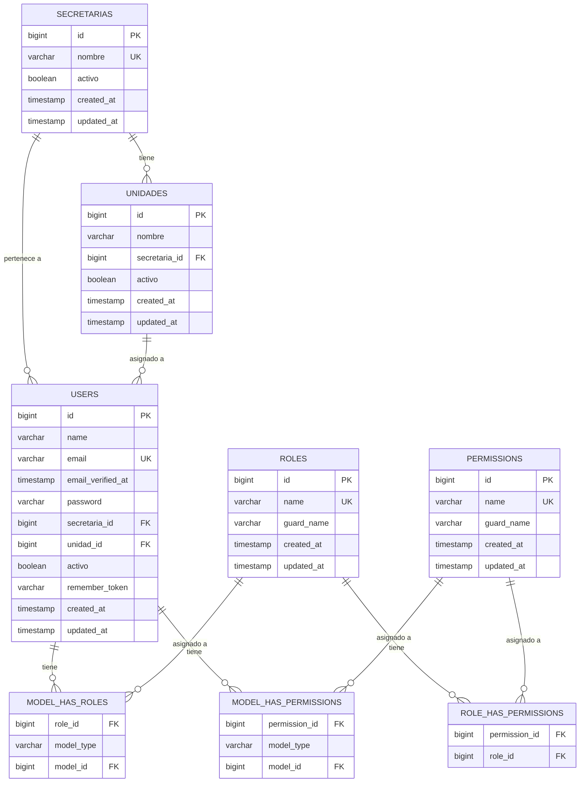

# 📊 Diagrama ER – Módulo de Usuarios, Roles y Permisos

## Sistema de Contratación – Gobernación de Caldas

---

## 🗂️ Diagrama Entidad-Relación (Mermaid)



---

## 🏗️ Estructura Jerárquica

```
Gobernación de Caldas
│
├── Secretaría (15 secretarías)
│   ├── Unidad/Grupo/Jefatura (70 unidades)
│   │   └── Usuarios (asignados a unidad + secretaría)
│   │       └── Roles → Permisos
│   └── Admin Secretaría (nivel secretaría, sin unidad)
│
└── Admin General (sin secretaría, acceso total)
```

---

## 🔐 Roles del Sistema

| Rol | Clave Interna | Permisos |
|-----|---------------|----------|
| **Administrador General** | `admin_general` | **TODOS** (59 permisos) |
| **Administrador** (legacy) | `admin` | **TODOS** (59 permisos) |
| **Admin de Secretaría** | `admin_secretaria` | 20 permisos – gestión dentro de su secretaría |
| **Profesional Contratación** | `profesional_contratacion` | 16 permisos – crear/editar procesos |
| **Revisor Jurídico** | `revisor_juridico` | 17 permisos – aprobar/rechazar |
| **Consulta** | `consulta` | 12 permisos – solo lectura |
| Unidad Solicitante | `unidad_solicitante` | Workflow – inicia procesos |
| Planeación | `planeacion` | Workflow – verifica PAA |
| Hacienda | `hacienda` | Workflow – emite CDP/RP |
| Jurídica | `juridica` | Workflow – ajustado a derecho |
| SECOP | `secop` | Workflow – publicación |

---

## 👁️ Permisos por Grupo (59 total)

| Grupo | Permisos |
|-------|----------|
| **Secretarías** | `secretarias.ver`, `secretarias.crear`, `secretarias.editar`, `secretarias.eliminar` |
| **Unidades** | `unidades.ver`, `unidades.crear`, `unidades.editar`, `unidades.eliminar` |
| **Usuarios** | `usuarios.ver`, `usuarios.crear`, `usuarios.editar`, `usuarios.eliminar` |
| **Roles** | `roles.ver`, `roles.crear`, `roles.editar`, `roles.eliminar` |
| **Permisos** | `permisos.ver`, `permisos.crear`, `permisos.editar`, `permisos.eliminar` |
| **Procesos** | `procesos.ver`, `procesos.crear`, `procesos.editar`, `procesos.recibir`, `procesos.enviar`, `procesos.rechazar`, `procesos.aprobar` |
| **Archivos** | `archivos.subir`, `archivos.descargar`, `archivos.eliminar`, `archivos.aprobar`, `archivos.rechazar`, `archivos.reemplazar` |
| **PAA** | `paa.ver`, `paa.crear`, `paa.editar`, `paa.verificar`, `paa.certificado`, `paa.exportar` |
| **Alertas** | `alertas.ver`, `alertas.leer`, `alertas.leer.todas`, `alertas.eliminar` |
| **Reportes** | `reportes.ver`, `reportes.estado_general`, `reportes.por_dependencia`, `reportes.actividad_actor`, `reportes.auditoria`, `reportes.certificados_vencer`, `reportes.eficiencia` |
| **Modificaciones** | `modificaciones.ver`, `modificaciones.crear`, `modificaciones.aprobar`, `modificaciones.rechazar`, `modificaciones.descargar` |
| **Dashboard** | `dashboard.ver`, `dashboard.admin`, `dashboard.buscar` |
| **Otro** | `asignar_roles` |

---

## 🧪 Usuarios de Prueba

| Email | Rol | Secretaría | Unidad |
|-------|-----|------------|--------|
| `admin@caldas.gov.co` | Admin General + Admin | — | — |
| `admin.juridica@caldas.gov.co` | Admin Secretaría | Secretaría Jurídica | — |
| `admin.hacienda@caldas.gov.co` | Admin Secretaría | Secretaría de Hacienda | — |
| `admin.planeacion@caldas.gov.co` | Admin Secretaría | Secretaría de Planeación | — |
| `profesional1@caldas.gov.co` | Profesional Contratación | Sec. Jurídica | Unidad de Contratación |
| `profesional2@caldas.gov.co` | Profesional Contratación | Sec. Hacienda | Unidad de Presupuesto |
| `profesional3@caldas.gov.co` | Profesional Contratación | Sec. General | Unidad de Compras y Suministros |
| `profesional4@caldas.gov.co` | Profesional Contratación | Sec. Infraestructura | Unidad de Ingeniería |
| `profesional5@caldas.gov.co` | Profesional Contratación | Sec. Agricultura | Unidad de Desarrollo Rural |
| `juridico1@caldas.gov.co` | Revisor Jurídico | Sec. Jurídica | Unidad de Contratación |
| `juridico2@caldas.gov.co` | Revisor Jurídico | Sec. Jurídica | Unidad de Contratación |
| `consulta1@caldas.gov.co` | Consulta | Sec. Gobierno | Unidad de Derechos Humanos |
| `consulta2@caldas.gov.co` | Consulta | Sec. Cultura | Unidad de Fomento Cultural |
| `consulta3@caldas.gov.co` | Consulta | Sec. Planeación | Unidad de Sistemas |

> **Contraseña para todos:** `Caldas2025*`

---

## 🔌 API Endpoints

### Autenticación
| Método | Ruta | Descripción |
|--------|------|-------------|
| POST | `/api/auth/login` | Login (email + password) → devuelve usuario + roles + permisos |
| POST | `/api/auth/logout` | Cerrar sesión |
| GET | `/api/auth/me` | Obtener usuario autenticado con roles y permisos |
| POST | `/api/auth/validar-permiso` | Verificar si el usuario tiene un permiso específico |

### Secretarías
| Método | Ruta | Permiso requerido |
|--------|------|-------------------|
| GET | `/api/secretarias` | Autenticado |
| POST | `/api/secretarias` | `secretarias.crear` |
| GET | `/api/secretarias/{id}` | Autenticado |
| PUT | `/api/secretarias/{id}` | `secretarias.editar` |
| DELETE | `/api/secretarias/{id}` | `secretarias.eliminar` |
| GET | `/api/secretarias/{id}/unidades` | Autenticado |

### Unidades
| Método | Ruta | Permiso requerido |
|--------|------|-------------------|
| GET | `/api/unidades` | Autenticado |
| POST | `/api/unidades` | `unidades.crear` |
| GET | `/api/unidades/{id}` | Autenticado |
| PUT | `/api/unidades/{id}` | `unidades.editar` |
| DELETE | `/api/unidades/{id}` | `unidades.eliminar` |

### Usuarios
| Método | Ruta | Permiso requerido |
|--------|------|-------------------|
| GET | `/api/usuarios` | `usuarios.ver` |
| POST | `/api/usuarios` | `usuarios.crear` |
| GET | `/api/usuarios/{id}` | `usuarios.ver` |
| PUT | `/api/usuarios/{id}` | `usuarios.editar` |
| DELETE | `/api/usuarios/{id}` | `usuarios.eliminar` |

### Roles y Permisos
| Método | Ruta | Permiso requerido |
|--------|------|-------------------|
| GET | `/api/roles` | Autenticado |
| GET | `/api/roles/{id}` | Autenticado |
| POST | `/api/roles/{id}/permisos` | `roles.editar` |
| GET | `/api/permisos` | Autenticado |
| POST | `/api/usuarios/{id}/roles` | `asignar_roles` |

---

## 🛡️ Middleware de Autorización

| Middleware | Alias | Descripción |
|-----------|-------|-------------|
| `CheckSecretariaAccess` | `secretaria.access` | Restringe acceso por secretaría del usuario |
| `CheckUsuarioActivo` | `usuario.activo` | Bloquea usuarios desactivados |
| `CheckPermiso` | `permiso:nombre` | Verifica permiso específico (admins pasan siempre) |
| Spatie `RoleMiddleware` | `role:nombre` | Verifica rol del usuario |
| Spatie `PermissionMiddleware` | `permission:nombre` | Verifica permiso Spatie |

### Ejemplo de uso en rutas:

```php
// Solo admin general y admin pueden acceder
Route::middleware(['auth', 'role:admin|admin_general'])->group(function () { ... });

// Requiere permiso específico
Route::middleware(['auth', 'permiso:procesos.crear'])->group(function () { ... });

// Restringe por secretaría
Route::middleware(['auth', 'secretaria.access'])->group(function () { ... });

// Verifica que el usuario esté activo
Route::middleware(['auth', 'usuario.activo'])->group(function () { ... });
```
